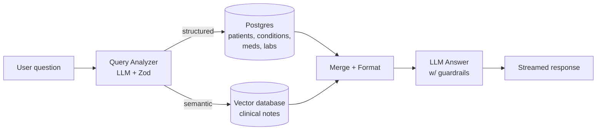

# RAG & AI Agents — Day-by-Day Curriculum

A text-based, self-paced path through building a production-grade medical RAG system. Designed for working professionals and students: **one digestible unit per day, with a clear finish line.**

## How this works

- **6 days on, 1 day off.** After every 6th day, take a rest day. The rest day is not optional decoration — spaced repetition needs the gap. Use it to let concepts settle (or to catch up if a day ran long).
- **Every day follows the same pattern:** **Concept → Implementation → Your Turn.** You read a little, you build along, then you build alone.
- **Every 6-day block ends with a deliverable.** On the last day of each block you record a short video (2–3 minutes, phone camera is fine): teach back a concept, defend a decision you made, or walk through what you built. Teaching is how you find out what you only *think* you understand. Submit via the Typeform link on those days. <!-- PLACEHOLDER: replace all Typeform links with real form URLs -->
- **Solutions are always provided** — collapsed under a `<details>` block so you can't read them by accident. Fight for at least 20 minutes before opening one.
- **Common mistakes are documented per day.** Read them *before* the Your Turn section — they're collected from real student submissions.
- **Why-this-not-that.** Where a real alternative exists, we show the approach we rejected and the reason. We only do this when the alternative is genuinely viable — no strawmen, no option overload.

## Setup

Work on the **`student`** branch — it has working infrastructure plus the skeletons and failing tests you'll complete:

```bash
git clone <repo-url> && cd medical-rag
git checkout student
npm install
cp .env.example .env   # fill in keys as each day requires them
```

You do **not** need every API key on Day 1. Each day lists what it needs.

## The system you're building



A hybrid RAG system over ~1,278 synthetic patients (Synthea Coherent dataset). You'll build it in this order:

1. **The two retrieval engines** — Postgres for structured data, a vector database for ~144,000 clinical notes
2. **Document preparation** — chunking, boundaries, and metadata (taught on an open-source corpus that actually needs it)
3. **The LLM layer** — a query analyzer that routes questions, an agent that answers them
4. **Exposure** — your RAG becomes a tool AI assistants can call, with tracing and human-in-the-loop actions
5. **The production gates** — auth, PII handling, adversarial inputs, evals: what separates a demo from a system

## Day index

**Days 1–6 — Foundations**
1. [What RAG actually is (and why your LLM needs it)](day-01.md)
2. [Setup: accounts, keys, and a running app](day-02.md)
3. [Meet the data: FHIR bundles and 1,278 synthetic patients](day-03.md)
4. [Postgres + Prisma: the structured half](day-04.md)
5. [The SQL half of hybrid RAG](day-05.md)
6. [Build day: your first end-to-end feature](day-06.md) 🎥

*Rest day.*

**Days 7–12 — Chunking (the Bible lab)**
7. [Why chunking exists — and why our medical notes don't need it](day-07.md)
8. [Bible lab I: naive chunking and where it breaks](day-08.md)
9. [Bible lab II: boundaries and overlap](day-09.md)
10. [Metadata: the part everyone skips](day-10.md)
11. [The five chunking failure modes, measured](day-11.md)
12. [Your turn: chunk a document you've never seen](day-12.md) 🎥

*Rest day.*

**Days 13–18 — Embeddings & vector search**
13. [Embeddings: meaning as geometry](day-13.md)
14. [Pinecone: your first vector index](day-14.md)
15. [Semantic search over clinical notes](day-15.md)
16. [Hybrid queries: SQL filters meet vector search](day-16.md)
17. [When cosine similarity lies: reranking](day-17.md)
18. [Build day: your retrieval eval set](day-18.md) 🎥

*Rest day.*

**Days 19–24 — Query understanding & agents**
19. [Structured outputs: making LLMs return data, not prose](day-19.md)
20. [The query analyzer: intent and entities](day-20.md)
21. [Orchestration: three paths through one system](day-21.md)
22. [The chat agent: streaming, prompts, and tone](day-22.md)
23. [Failure day: hallucination bait and ambiguous queries](day-23.md)
24. [Build day: eval your analyzer](day-24.md) 🎥

*Rest day.*

**Days 25–30 — MCP, observability, human-in-the-loop**
25. [MCP: your RAG as a tool for AI assistants](day-25.md)
26. [Wiring MCP into Claude Desktop and Cursor](day-26.md)
27. [Securing MCP: API keys and scopes](day-27.md)
28. [Observability: tracing with LangSmith](day-28.md)
29. [Human-in-the-loop: the scheduling flow](day-29.md)
30. [Build day: a new tool, with an audit trail](day-30.md) 🎥

*Rest day.*

**Days 31–36 — Production gates & capstone**
31. [The upload API: additive, idempotent ingestion](day-31.md)
32. [RBAC I: sessions, login, and the auth guard](day-32.md)
33. [RBAC II: role-shaped responses and PII](day-33.md)
34. [Adversarial day: the poisoned document](day-34.md)
35. [Evals as the spine: no metric, no decision](day-35.md)
36. [Capstone: ship it, then write the postmortem](day-36.md) 🎥

🎥 = deliverable day (video submission)

## A note on AI-assisted coding

Use Claude/Cursor/Copilot freely — that's how the job works now. But the weekly videos exist precisely because a model can write your code and **cannot** fake your understanding of why you wrote it that way. If you can't explain a block's key decision on camera in two minutes, you haven't finished that block.
