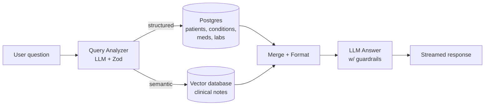

# RAG & AI Agents — Day-by-Day Curriculum

A text-based, self-paced path through building a production-grade medical RAG system. Designed for working professionals and students: **one digestible unit per day, with a clear finish line.**

## How this works

- **6 days on, 1 day off.** After every 6th day, take a rest day. The rest day is not optional decoration — spaced repetition needs the gap. Use it to let concepts settle (or to catch up if a day ran long).
- **Every day follows the same pattern:** **Concept → Implementation → Your Turn.** You read a little, you build along, then you build alone.
- **Every 6-day block ends with a deliverable.** On the last day of each block you record a short video (2–3 minutes, phone camera is fine): teach back a concept, defend a decision you made, or walk through what you built. Teaching is how you find out what you only *think* you understand. Submit via the Typeform link on those days. <!-- PLACEHOLDER: replace all Typeform links with real form URLs -->
- **Solutions are always provided** — collapsed under a `<details>` block so you can't read them by accident. Fight for at least 20 minutes before opening one.
- **Common mistakes are documented per day.** Read them *before* the Your Turn section — they're collected from real student submissions.
- **Why-this-not-that.** Where a real alternative exists, we show the approach we rejected and the reason. We only do this when the alternative is genuinely viable — no strawmen, no option overload.

## Setup

Work on the **`student`** branch — it has working infrastructure plus the skeletons and failing tests you'll complete:

```bash
git clone <repo-url> && cd medical-rag
git checkout student
npm install
cp .env.example .env   # fill in keys as each day requires them
```

You do **not** need every API key on Day 1. Each day lists what it needs.

## What you're building, and why

**The problem.** A clinic's data lives in two incompatible shapes. *Structured* facts — diagnoses, medications, lab values, demographics — sit in database rows. *Unstructured* detail — the story of each visit — lives in free-text clinical notes. Neither half answers questions well alone:

- SQL can count diabetics, but can't find a note that says "short of breath climbing stairs" when the user asks about *dyspnea* — same meaning, zero shared words.
- Keyword search over notes finds "dyspnea," but can't count, filter by lab value, or join across patients.
- And an LLM by itself knows neither — it has never seen your patients, so it will confidently invent them.

**What you're building** is the system that fixes this: a hybrid RAG assistant that routes each question to the right engine — exact SQL for structured questions, semantic vector search for meaning-based ones, both together for hybrid ones — and answers in plain English, grounded in the actual records (and refusing what isn't there).

By the end, a clinic worker can ask, in plain language:

| Question | What the system does |
|---|---|
| "How many patients have hypertension?" | counts rows in Postgres |
| "Which patients have had a stroke?" | filters structured conditions |
| "What do the notes say about smoking?" | semantic search over clinical notes |
| "What do the notes say about sleep for patients with depression?" | filters by condition, *then* searches their notes (hybrid) |
| "Summarize this patient's health history" | pulls the structured record + recent notes |
| "Schedule a follow-up for a patient next Tuesday" | proposes an action a human confirms |

…and it does this **safely**: only authorized roles see identifying details, every access is auditable, and the whole thing is measured — because a medical assistant that's confidently wrong is worse than no assistant at all.

> **A note on the data and HIPAA.** Every patient here is *synthetic* — generated by [Synthea](https://synthetichealth.github.io/synthea/), statistically realistic but representing no real person, so there is zero protected health information (PHI) and nothing to breach while you learn. That is deliberate: it lets you practice the exact safeguards a real deployment needs — PII obscuring, role-based access, audit logging, refusing to overshare — on data that is safe to break. A system like this pointed at *real* records would fall under **HIPAA** (the US health-privacy law), and the production gates in the final block are where those safeguards get built.

## The system you're building



A hybrid RAG system over ~1,278 synthetic patients (Synthea Coherent dataset). You'll build it in this order:

1. **The two retrieval engines** — Postgres for structured data, a vector database for ~144,000 clinical notes
2. **Document preparation** — chunking, boundaries, and metadata (taught on an open-source corpus that actually needs it)
3. **The LLM layer** — a query analyzer that routes questions, an agent that answers them
4. **Exposure** — your RAG becomes a tool AI assistants can call, with tracing and human-in-the-loop actions
5. **The production gates** — auth, PII handling, adversarial inputs, evals: what separates a demo from a system

## Week index

**Five live weeks.** The premise: you've joined a company that *already has* its
data in a database. Your job is to make it **searchable by meaning** and build an
**agent** on top. So the structured/SQL side is a **given** — the database comes
**pre-loaded** (you copy it), and no live session is spent uploading it. The
energy goes to the vector store, the agent, and shipping it safely.

**Day Zero — Foundations (optional pre-work)**
- [Foundations: LLMs and vector math](day-00.md) — do this *before* Week 1 if "embedding," "vector," or "cosine similarity" are new to you.

**Week 1 — The vector store: why, and how**
The database is already loaded. The question of the week: the company has all this
data — how do we make the *notes* searchable by **meaning**, not just keywords?
- The problem: why SQL/keyword search isn't enough — `LIKE '%shortness of breath%'` finds nothing in a note that says *"dyspnea on exertion."* Same fact, zero shared words.
- What a vector is, and semantic similarity — the idea that fixes it
- The **vectorize script**: read the notes from the database → embed → upsert to the vector store. *This is how you service existing data for semantic search.*
- Implement and run **vector search** over the notes
- Chunking, introduced: our notes are self-contained little pieces (no chunking needed) — but the **Bible** is the opposite kind of text. That contrast sets up the homework.
- 🎥 deliverable
- 📝 **Homework (Bible, side project — part 1):** research chunking strategies, propose one, and record a short video explaining what chunking *is*.

**Week 2 — Agentic / hybrid search**
An agent that answers real questions by using **both** engines — exact SQL for facts, vector search for meaning — and picking the right one.
- 🎥 deliverable
- 📝 **Homework (Bible, side project — part 2):** actually chunk the text and load it, using `scripts/bible/`.

**Week 3 — MCP + human-in-the-loop**
Expose the system as a tool other AI assistants can call; add human-approved actions (scheduling).
- 🎥 deliverable

**Week 4 — Agents, evals & observability**
Deeper agent behavior — and how you *measure* and *trace* a non-deterministic system so "it feels better" becomes a number.
- 🎥 deliverable

**Week 5 — Privacy & data**
The production gates: PII handling, role-based access, showing identifying details only to those allowed to see them.
- 🎥 deliverable

🎥 = weekly video deliverable · 📝 = homework (self-paced side project)

> **Restructure in progress (2026-07-05, rev 2).** The five-week groupings above
> are the new target. The `day-NN.md` files and slide decks still carry the old
> 6-week / 36-day structure and are being reconciled to this shape. See
> `AUTHORING.md` for the migration tracker.

## A note on AI-assisted coding

Use Claude/Cursor/Copilot freely — that's how the job works now. But the weekly videos exist precisely because a model can write your code and **cannot** fake your understanding of why you wrote it that way. If you can't explain a block's key decision on camera in two minutes, you haven't finished that block.
