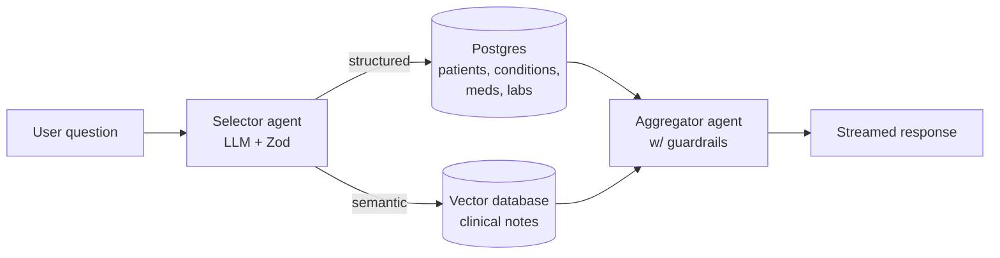

# RAG & AI Agents — Day-by-Day Curriculum

A text-based, self-paced path through building a production-grade medical RAG system. Designed for working professionals and students: **one digestible unit per day, with a clear finish line.**

## How this works

- **6 days on, 1 day off.** After every 6th day, take a rest day. The rest day is not optional decoration — spaced repetition needs the gap. Use it to let concepts settle (or to catch up if a day ran long).
- **Every day follows the same pattern:** **Concept → Implementation → Your Turn.** You read a little, you build along, then you build alone.
- **Every 6-day block ends with a deliverable.** On the last day of each block you record a short video (2–3 minutes, phone camera is fine): teach back a concept, defend a decision you made, or walk through what you built. Teaching is how you find out what you only *think* you understand. Submit via the Typeform link on those days. <!-- PLACEHOLDER: replace all Typeform links with real form URLs -->
- **Solutions are always provided** — collapsed under a `<details>` block so you can't read them by accident. Fight for at least 20 minutes before opening one.
- **Common mistakes are documented per day.** Read them *before* the Your Turn section — they're collected from real student submissions.
- **Why-this-not-that.** Where a real alternative exists, we show the approach we rejected and the reason. We only do this when the alternative is genuinely viable — no strawmen, no option overload.

## Setup

Work on the **`student`** branch — it has working infrastructure plus the skeletons and failing tests you'll complete:

```bash
git clone <repo-url> && cd medical-rag
git checkout student
npm install
cp .env.example .env   # fill in keys as each day requires them
```

You do **not** need every API key on Day 1. Each day lists what it needs.

## What you're building, and why

**The problem.** A clinic's data lives in two incompatible shapes. *Structured* facts — diagnoses, medications, lab values, demographics — sit in database rows. *Unstructured* detail — the story of each visit: the symptoms in the patient's words, why they came in, what the clinician observed — lives in free-text clinical notes, and was never turned into columns you can query. The database is a given; making that second half reachable is what you're here to build. Neither half answers questions well alone:

- SQL can count diabetics, but can't find a note that says "short of breath climbing stairs" when the user asks about *dyspnea* — same meaning, zero shared words.
- Keyword search over notes finds "dyspnea," but can't count, filter by lab value, or join across patients.
- And an LLM by itself knows neither — it has never seen your patients, so it will confidently invent them.

**What you're building** is the system that fixes this: a hybrid RAG assistant that routes each question to the right engine — exact SQL for structured questions, semantic vector search for meaning-based ones, both together for hybrid ones — and answers in plain English, grounded in the actual records (and refusing what isn't there).

By the end, a clinic worker can ask, in plain language:

| Question | What the system does |
|---|---|
| "How many patients have hypertension?" | counts rows in Postgres |
| "Which patients have had a stroke?" | filters structured conditions |
| "What do the notes say about smoking?" | semantic search over clinical notes |
| "What do the notes say about sleep for patients with depression?" | filters by condition, *then* searches their notes (hybrid) |
| "Summarize this patient's health history" | pulls the structured record + recent notes |
| "Schedule a follow-up for a patient next Tuesday" | proposes an action a human confirms |

…and it does this **safely**: only authorized roles see identifying details, every access is auditable, and the whole thing is measured — because a medical assistant that's confidently wrong is worse than no assistant at all.

> **A note on the data and HIPAA.** Every patient here is *synthetic* — generated by [Synthea](https://synthetichealth.github.io/synthea/), statistically realistic but representing no real person, so there is zero protected health information (PHI) and nothing to breach while you learn. That is deliberate: it lets you practice the exact safeguards a real deployment needs — PII obscuring, role-based access, audit logging, refusing to overshare — on data that is safe to break. A system like this pointed at *real* records would fall under **HIPAA** (the US health-privacy law), and the production gates in the final block are where those safeguards get built.

## The system you're building



A hybrid RAG system over ~200 synthetic patients (Synthea Coherent dataset). You'll build it in this order:

1. **The two retrieval engines** — Postgres for structured data, a vector database for ~21,000 clinical notes
2. **Document preparation** — chunking, boundaries, and metadata (taught on an open-source corpus that actually needs it)
3. **The LLM layer** — a query analyzer that routes questions, an agent that answers them
4. **Exposure** — your RAG becomes a tool AI assistants can call, with tracing and human-in-the-loop actions
5. **The production gates** — auth, PII handling, adversarial inputs, evals: what separates a demo from a system

## Week index

**Five live weeks.** The premise: you've joined a company that *already has* its
data in a database. Your job is to make it **searchable by meaning** and build an
**agent** on top. So the structured/SQL side is a **given** — the database comes
**pre-loaded** (you copy it), and no live session is spent uploading it. The
energy goes to the vector store, the agent, and shipping it safely.

**Day Zero — Foundations (optional pre-work)**
- [Foundations: LLMs and vector math](day-00.md) — do this *before* Week 1 if "embedding," "vector," or "cosine similarity" are new to you.

**Week 1 — The vector store**
The company has all this data — how do we make the *notes* searchable by **meaning**, not just keywords?
1. [What RAG is — and why keyword search isn't enough](w1-01-what-rag-is.md)
2. [Setup: connect to the pre-loaded database](w1-02-setup.md)
3. [Meet the data](w1-03-meet-the-data.md)
4. [Embeddings: meaning as geometry](w1-04-embeddings.md)
5. [Similarity by hand: be the vector database](w1-05-similarity-by-hand.md)
6. [The vectorize script: database → vector store](w1-06-vectorize.md)
7. [Chunking, introduced (and why our notes don't need it)](w1-08-chunking-intro.md) 🎥
- 📝 [**Required** — Bible chunking: chunk + store](homework-bible-chunking.md)

**Week 2 — Retrieval, reranking & your first agent**
Search the notes for real, make the ranking earn its keep — then meet the LLM as a typed component and build the agent that routes.
1. [Semantic search + metadata](w2-01-semantic-search.md)
2. [When cosine lies: reranking](w2-02-reranking.md) 🎥
3. [Structured outputs: the LLM as a typed function](w2-03-structured-outputs.md)
4. [The selector: your first agent](w2-04-selector.md)

**Week 3 — The agent layer**
The full pipeline: specialists that retrieve, an aggregator that answers — then trace it, and attack it.
1. [The SQL agent: text-to-SQL](w3-01-sql-agent.md)
2. [Orchestration: router + parallel agents + aggregator](w3-02-orchestration.md)
3. [Hybrid queries: facts narrow, meaning ranks](w3-03-hybrid-queries.md)
4. [The chat agent + the grounding contract](w3-04-chat-agent.md)
5. [Observability: tracing with LangSmith](w3-05-observability.md)
6. [Failure day: bait, and refusing it](w3-06-failure-day.md) 🎥

**Week 4 — MCP, PII & human-in-the-loop**
Your RAG becomes infrastructure other AIs call — exposed safely, extended deliberately, gated where it acts, and showing identifying detail only where it belongs (no login — the channel is the permission).
1. [MCP: your RAG as a tool for AI assistants](w4-01-mcp-intro.md)
2. [Wiring MCP into Claude Desktop and Cursor](w4-02-wiring-mcp.md)
3. [Securing MCP: API keys and scopes](w4-03-securing-mcp.md)
4. [Build: add a new tool](w4-04-new-tool.md) 🎥
5. [Human-in-the-loop: propose, approve, execute](w4-05-human-in-the-loop.md)
6. [PII de-identification and the channel access model](w4-06-pii.md)

**Week 5 — Evals & adversaries**
Measure the non-deterministic system so "it feels better" becomes a number — then poison it on purpose, and write up what you built.
1. [Retrieval evals: hit@5](w5-01-retrieval-evals.md)
2. [Selector evals: exact match](w5-02-selector-evals.md)
3. [Evals as the spine: no metric, no decision](w5-03-evals-as-spine.md) 🎥
- 📝 [**Required** — The poisoned document (indirect prompt injection)](homework-poisoned-docs.md) — done in the Week 5 session
4. [Wrap-up: what you built, and where to go next](w5-04-wrap-up.md) 🎥

🎥 = weekly video deliverable · 📝 = required project

## A note on AI-assisted coding

Use Claude/Cursor/Copilot freely — that's how the job works now. But the weekly videos exist precisely because a model can write your code and **cannot** fake your understanding of why you wrote it that way. If you can't explain a block's key decision on camera in two minutes, you haven't finished that block.
