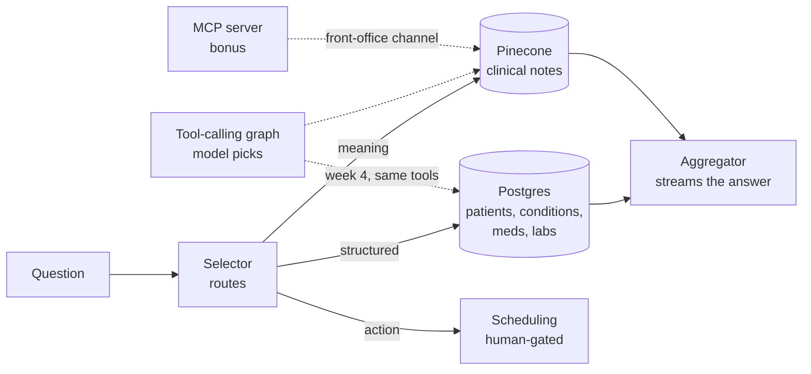

# RAG & AI Agents — the live course

Six Saturday sessions. Students build a hybrid RAG system over synthetic medical
records: a vector store they populate themselves, an agent pipeline that routes
questions to the right engine, human-gated scheduling, a tool-calling agent that
takes over that routing — and a capstone on data they choose.

**This is the course of record.** Weeks 1–3 document what was actually taught in
cohort 3 (2026-07-11 → 2026-08-15), reconstructed from the session recordings and
the `#cohort-3` Slack channel where every assignment was posted, and corrected
against the code as it stands for cohort 4.

**Week 4 changed for cohort 4.** Cohort 3 taught MCP there and most of the room
never got a server connected — the session collapsed into environment debugging.
It's now [tool calling with LangGraph](student/week-4-tool-calling.md): the same
idea (a model choosing tools), no subprocess or protocol, and it runs inside the
repo students already have working. MCP survives as
[bonus material](student/bonus-mcp.md), failure catalogue intact. That session has
not been delivered yet, and its guide says so.

## The two versions

| Version | Who it's for | Where |
|---|---|---|
| **Student session guides** | Students — what we built, the homework, the code, the reading | [`student/`](student/) |
| **Instructor runbooks** | Whoever is teaching — the arc, the timings, where it breaks | [`instructor/`](instructor/) |

Neither ever ships to the canonical student-facing branch. `curriculum/` lives on
`instructor` only; student-facing content reaches students through the delivery
platform and Slack, not by reading the repo. (See [`AUTHORING.md`](AUTHORING.md).)

## The six sessions

| # | Saturday | Session | Homework |
|---|---|---|---|
| 0 | — (pre-work) | [Before we start](student/week-0-prework.md) | Watch 3B1B ×2 + "What is a GPT"; accounts + keys |
| 1 | 07-11 | [The vector store](student/week-1-vector-store.md) | Chunk the Bible, store it with metadata, justify your dimensions 🎥 |
| 2 | 07-18 | [Retrieval & reranking](student/week-2-retrieval-reranking.md) | Rerank on your own index; read *Building Effective Agents* 🎥 |
| 3 | 07-25 | [The agent pipeline](student/week-3-agent-pipeline.md) | Ship the whole app; collect 10 query/response pairs; tool-calling 🎥 |
| 4 | — | [Tool calling with LangGraph](student/week-4-tool-calling.md) 🆕 | Build the graph; run the week-3 log through both routes; the capstone plan doc |
| 5 | 08-08 | [Capstone build](student/week-5-capstone-build.md) | Build it |
| 6 | 08-15 | [Demo day](student/week-6-demo-day.md) | 5-minute presentation 🎥 |

Plus two optional bonus tracks, neither a scheduled session:
[voice AI](student/bonus-voice-ai.md) (Retell, ~$25) and
[MCP](student/bonus-mcp.md) (cohort 3's week 4).

🎥 = video deliverable, posted in Slack.

## What students build

```mermaid
flowchart LR
    U[Question] --> S[Selector<br/>routes]
    S -->|structured| Q[(Postgres<br/>patients, conditions,<br/>meds, labs)]
    S -->|meaning| V[(Pinecone<br/>clinical notes)]
    S -->|action| H[Scheduling<br/>human-gated]
    Q --> A[Aggregator<br/>streams the answer]
    V --> A
    G[Tool-calling graph<br/>model picks] -.week 4, same tools.-> Q
    G -.-> V
    M[MCP server<br/>bonus] -.front-office channel.-> V
```

Postgres is the system of record and arrives **pre-loaded** — students connect to
it read-only and never run an ingest. Pinecone is a derived index they build
themselves in session 1. That split is the spine of the whole course: *the company
already has its data; your job is to make it searchable by meaning and put an
agent on top.*

## How the course actually runs

- **Saturdays, ~2 hours, live on Zoom**, recorded and posted to Slack the same day.
- **Homework is posted in Slack**, in the channel, as a message — not in a syllabus.
  Sessions 1–4 each end with one; session 4's is a build *and* the capstone plan
  document, which is the one with a hard deadline (week 5 is wasted without it).
- **Office hours Thursdays.** Questions submitted async via Typeform for anyone who
  can't attend; recordings posted after.
- **Videos are the deliverable.** Students record 2–5 minutes explaining a concept
  or defending a decision, and post it in the channel where everyone can see it.
  Cohort 3 posted these publicly rather than privately, deliberately — students
  learn from watching each other reason.
- **Guest speakers** roughly monthly, during the office-hours slot.

### Why the videos matter more than the code

Every student uses AI to write code; that's assumed and fine. The video is the
part a model can't fake. If a student can't explain in two minutes why they chunked
the way they did, they haven't finished the assignment — no matter what runs.

## A note on the self-paced material

There is a separate 24-lesson self-paced track in [`archive/`](archive/). It was
written before cohort 3 ran, and partway through cohort 3 it was explicitly
demoted to **bonus material** — students were told to do only the homework posted
in Slack.

It's kept because the deep-dives are genuinely good (embeddings, chunking failure
modes, evals, PII, poisoned documents) and several go further than the live
sessions had time for. It is **not** the course of record, it does not match the
six-session shape, and its assignments contradict the ones students were actually
given. Mine it for explanation; don't hand it out as the syllabus.

## The data

Synthea Coherent — statistically realistic, **fully synthetic, zero PHI**. The
shared database is a ~200-patient subset with ~21,000 SOAP-style clinical notes.
Students connect read-only; nobody creates or seeds it.

That's deliberate: it lets students practice the exact safeguards a real
deployment needs — de-identification, channel-scoped access, refusing to
overshare — on data that is safe to break.
