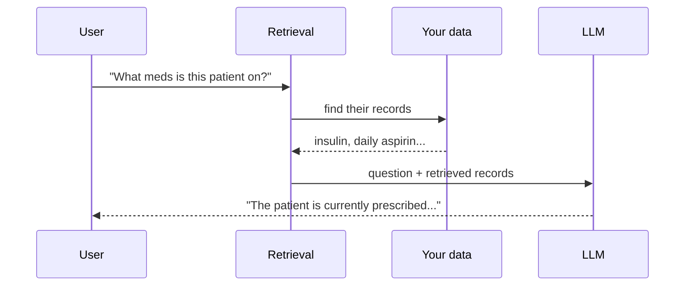
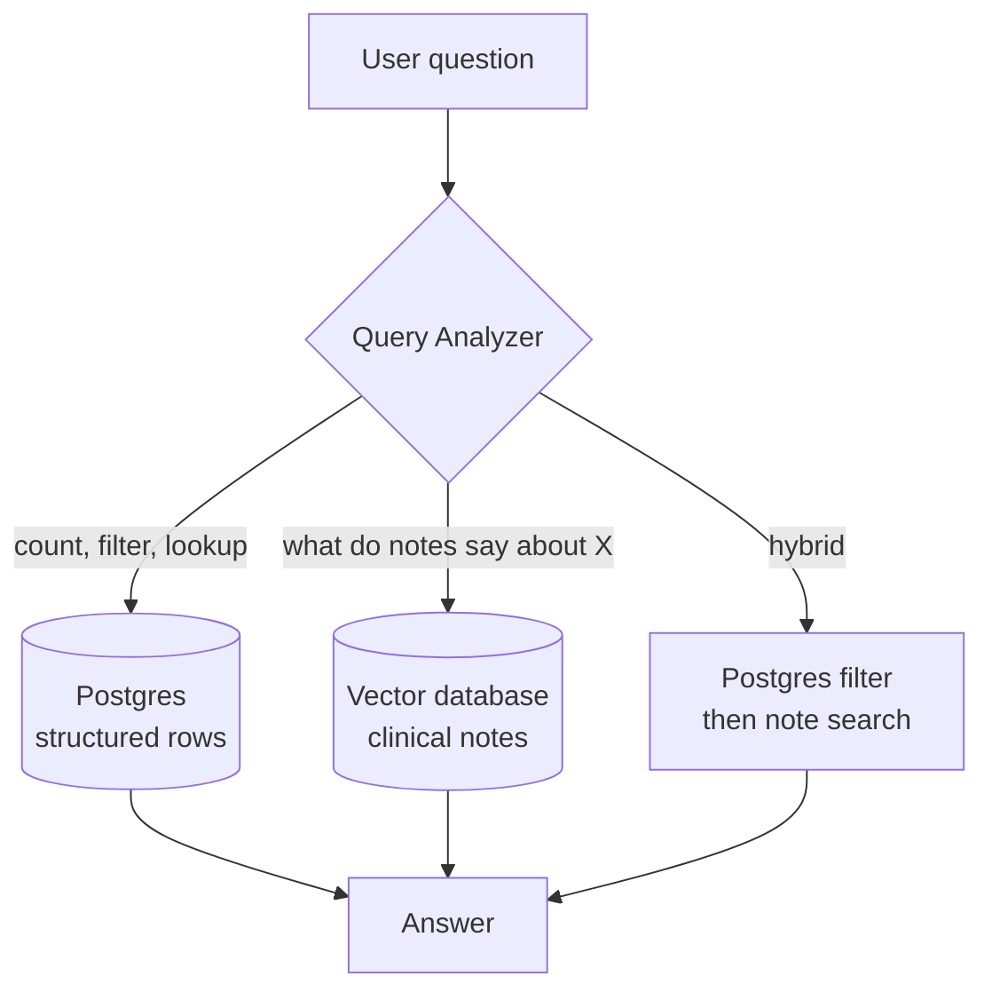

# Day 1 — What RAG Actually Is (and Why Your LLM Needs It)

**Needs: nothing installed — just a browser**

## Today you will

- Understand the one problem RAG exists to solve
- Trace a query through the system you'll build in this course
- Identify the two *kinds* of questions a medical records system must answer — and why one database can't serve both

## Concept

### The problem

Ask GPT-4 or Claude: *"What medications is this patient taking?"*

It has no idea. Not because it's bad at medicine — because **your patients' records were never in its training data**, and never will be. Your company's documents, your patients' charts, yesterday's support tickets: none of it is in the model.

The fix is almost embarrassingly simple: **fetch the relevant records at question time and paste them into the prompt.** The model doesn't need to *know* your data — it needs to *read* it, right before answering. The data stays live (a new lab result is queryable the moment it's saved), and every answer can point at the exact record it came from.

RAG — **Retrieval-Augmented Generation** — is just that idea, taken seriously: *find the right context, then let the model read it before answering.*



The hard part of RAG is not the G. Generation is one API call. The hard part is the R — **retrieval is a search problem**, and search problems are where engineering lives.

### Two kinds of questions

Look at these queries a clinic might ask:

1. *"How many patients have type 2 diabetes?"*
2. *"Find patients whose notes mention trouble sleeping."*

Query 1 is a **structured** question. There is an exact answer, computable with a `COUNT(*)`. Keyword or similarity search would be a terrible tool here — "how many" is not a search problem, it's a counting problem.

Query 2 is a **semantic** question. No SQL `WHERE` clause matches "trouble sleeping" against a note that says *"patient reports difficulty falling asleep, wakes frequently."* No shared keywords — same meaning. Answering it takes a search that understands *meaning*, not just letters. How that works under the hood comes later in the course; for now, just hold on to the distinction.

Most real questions are one of these — or a **hybrid** of both: *"What do the notes say about sleep for patients with depression?"* (structured filter first, then meaning-based search within the filtered set).

That's why the system you're building has two storage engines:



> **Why not just one database?** "Patients over 65 with high blood pressure, diagnosed after 2020" is a *relational* query — joins, aggregates, exact numeric comparisons. Forcing that through a search engine is fighting your tools. Conversely, Postgres can't find "shortness of breath" in a note that says "dyspnea." Use each engine for what it's for. You'll feel this distinction in your hands once you build both halves.

### The system, concretely

Over this course you'll build, on real-shaped but fully synthetic data (1,278 patients, ~144,000 clinical notes):

- **The two retrieval engines** — Postgres for structure, a vector database for meaning
- **The LLM layer** — a query analyzer that routes questions, an agent that answers them
- **Exposure** — your RAG becomes a tool Claude and Cursor can call, with tracing
- **The production gates** — auth, PII handling, adversarial inputs, evals: what separates a demo from a system

## Implementation

No code today — but real work. Read one raw clinical note, because every architecture decision in this course flows from knowing the data. Here's what's inside every patient file — a SOAP-style note:

```
1926-06-19

# Chief Complaint
No complaints.

# History of Present Illness
Patient is a 7 month-old non-hispanic white male.

# Social History
Patient has never smoked.

# Allergies
No Known Allergies.

# Medications
No Active Medications.
```

Notice two things you'll exploit later:

- It has **structure** (headed sections) — that will matter when we prepare documents for search
- It's **short** (~450 characters on average) — that single number will end up deciding a major architecture choice, and it's a measurement, not a vibe

### Common mistakes

- **"RAG is dead, context windows are huge now."** A 1M-token window doesn't fix this. Our corpus is ~65M characters of notes alone; it doesn't fit. Even when data fits, stuffing it all in costs real money per query and *degrades* answer quality (models reason worse over haystacks). Retrieval is selection, and selection is the point.
- **Thinking search replaces databases.** Meaning-based search answers "what is *similar* to this?" It cannot answer "how many," "most recent," or "exactly which." Half this course is knowing which question you're holding.
- **Skipping the data exploration.** Every bad retrieval decision we'll see later comes from not having read one's own documents first.

## Your turn

Spend **no more than 30 minutes** here. Write down — actually write, in a notes file you'll keep for the whole course — answers to these:

1. **Five queries** a doctor or front-office worker might ask this system. Label each: `structured`, `semantic`, or `hybrid`.
2. For one of your `semantic` queries: write two phrasings that *mean the same thing but share zero keywords* (like "shortness of breath" vs "dyspnea"). You'll test these against your own system later.
3. One question this system should **refuse** to answer. (Keep it — it becomes a guardrail test later.)

## Check yourself

You're done when you can answer these without scrolling up:

- Why can't an LLM answer questions about your data out of the box — and what does RAG do about it?
- What makes a query *hybrid*? Give an example that isn't the one above.

<details>
<summary>Solution / discussion</summary>

**Example query labels:**

| Query | Type | Why |
|---|---|---|
| "How many patients take insulin?" | structured | exact count over medication rows |
| "List patients on blood pressure medication" | structured | filter over medication rows |
| "Patients describing chest pain at night" | semantic | meaning-match over note text |
| "Do any diabetics mention medication side effects in their notes?" | hybrid | condition filter (SQL) → note search |
| "Summarize this patient's health history" | hybrid | SQL row lookup + their recent notes |

**Why the model can't do this alone:** your data isn't in it, and even if you somehow got it in, facts must be *current* (new labs today), *attributable* (which note said this?), and *deletable* (patient data rights). Retrieval gives you all three; a frozen model gives you none.

**A refusal example:** "What dosage of ibuprofen should I give this patient?" — the system retrieves records; it must not practice medicine. We encode this in the system prompt later and test it with adversarial queries.

</details>

## Further reading

- [3Blue1Brown — But what is a GPT? Visual intro to transformers](https://www.youtube.com/watch?v=yMQPQuz5WpA) — the best high-level picture of what an LLM actually *is* under the hood. You don't need this to build the system, but if "the model predicts the next token" has always been a black box, 27 minutes here fixes that.
- [The original RAG paper (Lewis et al.)](https://arxiv.org/abs/2005.11401) — skim the abstract; the ideas aged well
