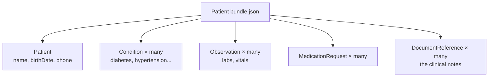

# Day 3 — Meet the Data: FHIR Bundles and 1,278 Synthetic Patients

**Needs: the dataset downloaded locally (instructions below)**

## Today you will

- Get the patient dataset onto your machine
- Understand the shape of a FHIR bundle and find the parts that matter for retrieval
- Decode a clinical note from its raw stored form by hand

## Concept

You can't build good retrieval over data you haven't read. Today is reading.

The dataset is **Synthea Coherent** — 1,278 *synthetic* patients. Synthetic is the point: it's statistically realistic (real conditions, real medication patterns, real messiness) but contains zero actual humans, so there's no privacy risk while you learn. Later, when you build PII handling, you'll appreciate practicing on data that's safe to break.

Each patient is one JSON file in a format called **FHIR** (Fast Healthcare Interoperability Resources) — the industry standard for health data exchange. A patient file is a **bundle**: a list of *resources*, each a typed record.



A single real patient file from this set contains, for example: 1 Patient, 12 Conditions, 307 Observations, 44 MedicationRequests, and 35 DocumentReferences (the notes). There are ~18 resource *types* in all — but you only care about five, because those five map cleanly to the two retrieval engines:

| Resource | Goes to | Becomes |
|---|---|---|
| Patient | Postgres | a `patients` row |
| Condition | Postgres | a `conditions` row |
| Observation | Postgres | an `observations` row (labs, vitals) |
| MedicationRequest | Postgres | a `medications` row |
| DocumentReference | the vector database | a searchable clinical note |

Everything else (Claims, ExplanationOfBenefit, ImagingStudy…) is billing and imaging noise you'll ignore. **Knowing what to throw away is a real skill** — most of a production ingestion pipeline is deciding what *not* to keep.

### The note is hidden

Open a DocumentReference and the note text isn't there in plain sight. It's **base64-encoded** inside `content[0].attachment.data`:

```json
{
  "resourceType": "DocumentReference",
  "type": { "coding": [{ "display": "History and physical note" }] },
  "date": "1926-06-19T...",
  "content": [{ "attachment": { "data": "CjE5MjYtMDYtMTkKCiMgQ2hpZWY..." } }]
}
```

That `data` string decodes to the SOAP note you saw on Day 1. Why base64? FHIR attachments can be *any* file (a PDF, an image, text), so the standard stores them as encoded bytes. For us it means one decode step during ingestion — and it's a thing you'll handle in code, not by hand, except today.

## Implementation

### 1. Get the data

The dataset is large (full Coherent set is ~9 GB) and is **not in the repo** — it's gitignored. It's publicly hosted by MITRE on AWS. Download the FHIR portion and unzip it into `data/coherent/`:

```bash
# Public, no credentials needed (synthetic data)
mkdir -p data/coherent
# Download via the MITRE Synthea downloads page (link below) or AWS S3:
#   s3://synthea-open-data/coherent/
```

You only need the `fhir/` folder of JSON bundles for this course. Your instructor may give you a **smaller subset** (~150 patients in `data/subset/`) to save time and disk — that's fine and preferred for learning.

> **Why a subset?** 1,278 patients embed into ~144,000 notes — that's real money and an hour of compute to process. A 150-patient subset exercises every code path you'll write at a fraction of the cost. You scale up only once the pipeline is proven. (This is itself a lesson: develop on a slice, validate, then run the full set.)

### 2. Look at one patient

```bash
ls data/coherent/fhir | head
```

Pick a file and open it in your editor. Search (Cmd/Ctrl-F) for `"resourceType"` and skim what types appear. Find a `Patient` resource and read its `name`, `birthDate`, `telecom` (phone), and `address`.

### 3. Decode a note by hand (once)

Find a `DocumentReference`, copy the long `data` string, and decode it:

```bash
echo 'PASTE_THE_BASE64_STRING' | base64 --decode
```

Read what comes out. That structured, sectioned text is what your vector search will operate on later.

### Common mistakes

- **Trying to commit the data.** It's gitignored on purpose — 9 GB doesn't belong in git. If `git status` shows data files, your gitignore got changed.
- **Assuming every patient has the same resources.** Counts vary wildly — one patient has 5 notes, another has 90. Your ingestion code must handle "zero of X" gracefully.
- **Reading `name` as a string.** FHIR `name` is an *array of objects* with `given` (array) and `family`. A patient can have multiple names. You'll take the first.
- **Synthea name quirk.** Names carry digit suffixes — `Frami345`, `Abe604`. That's a generator artifact; ingestion strips the digits. Don't be thrown by it.

## Your turn

Spend **no more than 30 minutes** here.

1. Open three different patient files. In your notes, record for each: how many Conditions, how many DocumentReferences.
2. Decode one clinical note and paste the readable text into your notes. Mark its section headers (Chief Complaint, etc.).
3. Answer in writing: *which* of the five kept resource types would you query for "patients on a statin," and which for "patients whose notes mention dizziness"? Why each?

## Check yourself

- Why is a DocumentReference's text base64-encoded instead of stored as plain text?
- Two patients have very different file sizes. Name two reasons that's expected, not a bug.

<details>
<summary>Solution / discussion</summary>

**"Patients on a statin"** → `MedicationRequest` rows in Postgres. It's an exact, structured filter on the medication name. **"Notes mention dizziness"** → the vector database, because "dizziness" might appear as "lightheadedness," "vertigo," or "feeling faint" — a meaning match, not a keyword match.

**Base64** because FHIR `attachment.data` is designed to hold *arbitrary* files (PDF, image, text) as encoded bytes — a uniform container regardless of content type. Text is just one case.

**Different file sizes are expected** because (1) sicker / older patients accumulate more encounters → more observations, conditions, and notes; and (2) Synthea randomizes life trajectories, so two patients simply have different medical histories. Variance is the data being realistic, not broken — and it's exactly why ingestion must tolerate "0 to 90 notes per patient."

</details>

## Further reading (optional)

- [Synthea Coherent Data Set — MITRE downloads](https://synthea.mitre.org/downloads) — the source and a one-page description
- [Synthea Coherent on AWS Open Data](https://registry.opendata.aws/synthea-coherent-data/) — S3 access details
