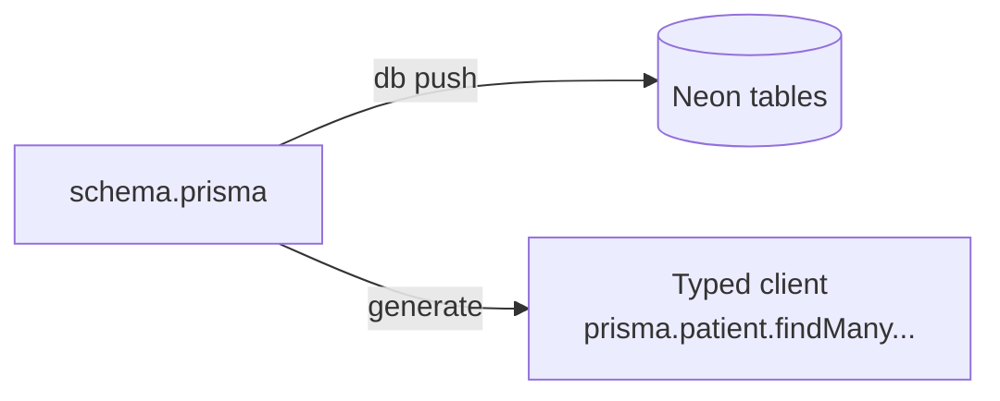

# Day 4 — Postgres + Prisma: The Structured Half

**Needs: your Neon `DATABASE_URL` in `.env`, the dataset downloaded**

## Today you will

- Create the database tables from the schema and push them to Neon
- Load the structured half of the data (patients, conditions, meds, labs) into Postgres
- Query your own database to confirm the data landed

## Concept

Half of hybrid RAG is boring, reliable, exact: a relational database. Today you stand it up.

The shape of the data is defined once, in `prisma/schema.prisma`, using **Prisma** — an ORM that turns a schema file into both your database tables *and* a fully typed client for querying them. One source of truth, two outputs:



The schema is already written for you (this isn't a SQL-DDL course). Open `prisma/schema.prisma` and read the four models that matter:

- `Patient` — `id`, `firstName`, `lastName`, `birthDate`, `deathDate`, `phone`, `city`, `state`
- `Condition` — `display` (e.g. "Type 2 Diabetes Mellitus"), `clinicalStatus`, `onsetDate`, linked to a patient
- `Observation` — `display` (e.g. "Hemoglobin A1c"), `valueNumber`, `unit` — labs and vitals
- `Medication` — `display`, `status`, `dosage`

Two design choices worth noticing:

1. **The FHIR id is the primary key.** No separate auto-generated id. This means re-running ingestion *updates* a patient rather than duplicating them — re-import is safe. (You'll rely on that property when you build the upload API later.)
2. **`deathDate` is nullable, and null means alive.** A column's *absence of value* carries meaning. ~823 of these patients have a death date. That single nullable column powers queries like "living patients over 80" without a separate `isAlive` flag.

> **Why Postgres and not just throw everything in the vector database?** Vector databases can store metadata, so it's tempting to use one store. But "count patients by condition," "labs above a threshold," "most recent encounter" are *relational* operations — aggregates, ranges, ordering, joins. Postgres does them in milliseconds with exact answers. The vector database is for meaning; Postgres is for facts. Using both is not over-engineering — it's using each tool for its job.

## Implementation

### 1. Generate the client and create the tables

```bash
npm run db:generate     # builds the typed Prisma client from the schema
npm run db:push         # creates the tables in your Neon database
```

If `db:push` complains that the database already has conflicting tables (from a prior run), you can reset it — **this wipes all data**, which is fine on a learning database:

```bash
npx prisma db push --force-reset
```

### 2. Load the structured data

The ingestion script reads the FHIR bundles, extracts the four structured resource types, and inserts them in batches. Run it against your data (or the subset), skipping the vector half for now:

```bash
npm run ingest -- data/subset --skip-vectors
# or a tiny smoke test first:
npm run ingest -- --limit 20 --skip-vectors
```

`--skip-vectors` loads *only* Postgres — you haven't built the vector side yet, and you don't need it to be there today.

You'll see batch progress and a summary of rows inserted per table.

### 3. See your data

Prisma ships a database browser:

```bash
npm run db:studio
```

It opens a UI at `localhost:5555`. Click into `patients`, `conditions`, `observations`, `medications` and confirm rows exist.


<!-- TODO: capture screenshot -->

### Common mistakes

- **Forgetting `--skip-vectors`.** Without it, the script tries to embed notes and will fail or cost money before you've set up the vector index. Today is Postgres only.
- **`db:push` before `db:generate`.** Generate first (builds the client), then push (builds the tables). The npm scripts do exactly one thing each.
- **Expecting `data/subset` to exist.** If your instructor didn't provide it, point the script at `data/coherent/fhir` with `--limit 50` instead.
- **`P1001: can't reach database`.** Your `DATABASE_URL` is wrong or your network blocks it. Re-copy the string from Neon, quotes and `?sslmode=require` included.

## Your turn

Spend **no more than 30 minutes** here.

1. Get rows into all four tables; confirm in Prisma Studio.
2. In Studio, find one patient and note: how many conditions and medications they have.
3. In your notes, write the answer: if you run `npm run ingest` a second time on the same data, why don't you get duplicate patients? (Hint: re-read the two design choices above.)

## Check yourself

```bash
npm run db:studio   # patients, conditions, observations, medications all have rows
```

- What does `--skip-vectors` skip, and why is that the right call today?
- Why does re-running ingestion *not* duplicate patients?

<details>
<summary>Solution / discussion</summary>

**`--skip-vectors`** skips the embedding-and-upsert step that sends clinical notes to the vector database. Right today because (a) you haven't created the vector index yet and (b) embedding costs money and time you don't need to spend to validate the Postgres half.

**Re-running doesn't duplicate** because the FHIR id is the primary key. Inserting a row whose id already exists is an upsert/skip, not a new row — the database rejects duplicate primary keys, and the ingestion uses that to make re-import idempotent. If the schema used an auto-generated id instead, every run would pile up fresh copies.

</details>

## Further reading (optional)

- [Prisma: `db push` vs migrations](https://www.prisma.io/docs/orm/prisma-migrate/workflows/prototyping-your-schema) — why this course uses `db push` for a learning DB
