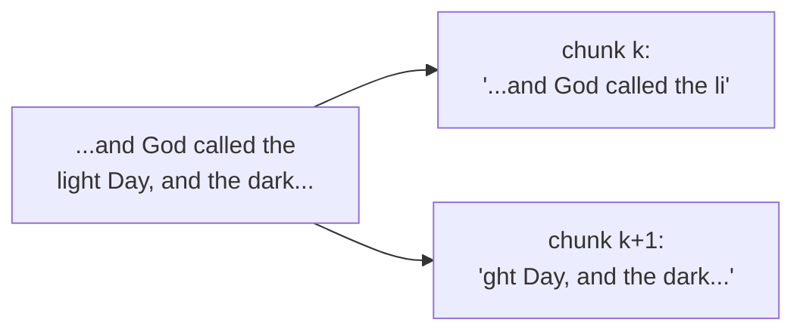

# Day 8 — Bible Lab I: Naive Chunking and Where It Breaks

**Needs: `data/bible/kjv.txt` from yesterday**

## Today you will

- Run the simplest possible chunker — fixed-size windows — over the whole Bible
- Read what it produces and catalog the damage
- Meet the audit script that turns "this looks bad" into numbers

## Concept

The simplest chunking strategy: pick a size, slice the text every N characters. No parsing, no structure, three lines of logic. It's what you get from any tutorial's first example, and it's genuinely the right *starting point* — not because it's good, but because its failures teach you what "good" has to mean.



A fixed window doesn't know what a word is, let alone a verse. Wherever character 500 falls — mid-word, mid-sentence, mid-thought — that's the cut.

Why does that matter for retrieval? Because the piece is what gets matched **and** what gets read. A chunk that starts mid-word is harder to match (its opening is garbage). A chunk that ends mid-sentence delivers a thought with the ending torn off — and the model answering from it will happily guess the missing half. Broken pieces don't just rank worse; they *mislead*.

## Implementation

The lab scripts live in `scripts/bible/`. Run the naive chunker:

```bash
npm run bible:fixed
```

Real output from this corpus:

```
Corpus: 4,307,701 characters
Chunks: 8,616 (size=500, overlap=0)
```

It prints a few sample chunks. Here is the actual start of chunk 1000:

> `uses of the cities of the Levites are their possession among the children of Israel. 25:34 But the field of the suburbs of their cities may not be sold...`

`uses of the cities` — the slicer cut the word **"houses"** in half. Chunk 999 ends with `ho`, chunk 1000 begins with `uses`. Neither side owns the word.

Now measure instead of squint:

```bash
npm run bible:audit -- data/bible/chunks-fixed.jsonl
```

```
chunks:               8,616
size min/median/max:  201 / 500 / 500 chars
starts mid-word:      7,634 (88.6%)
ends mid-sentence:    8,339 (96.8%)
has metadata:         0 (0.0%)
```

Sit with those numbers: **88.6% of chunks begin mid-word. 96.8% end mid-sentence.** Nearly every piece in the store is damaged at one edge or both. And `metadata: 0%` — a problem you can't see yet, whose bill arrives in two days.

Open `scripts/bible/audit.ts` and read how the checks work. They're deliberately simple heuristics (a chunk starting with a lowercase letter probably starts mid-word; a chunk not ending in punctuation probably ends mid-sentence) — crude, but crude beats blind.

### Common mistakes

- **"I'll just pick a better size."** Run it yourself with `npm run bible:fixed -- --size 800` — the percentages barely move. The flaw isn't the number; it's that *character positions don't align with meaning*, at any size.
- **Judging chunks by the first three.** Chunk 0 looks fine (it starts at the start). The damage lives in the middle 8,000. Always sample widely — that's why the script prints chunk 1000 and 5000, not 0, 1, 2.
- **Treating the audit as ground truth.** "Ends without punctuation" is a proxy for "ends mid-sentence," not a proof. Heuristic metrics earn trust by being checked against samples — read ten flagged chunks and confirm the flag is honest.

## Your turn

Spend **no more than 45 minutes** here.

1. Run `npm run bible:fixed` and the audit. Reproduce the numbers above.
2. Read **ten consecutive chunks** from somewhere in the middle of `data/bible/chunks-fixed.jsonl` (it's one JSON object per line — `sed -n '4000,4009p'` works). For each, note: does it start clean? End clean? Could you tell someone *where in the Bible* it's from?
3. Try `--size 200` and `--size 2000`, audit both, and record how the mid-word/mid-sentence percentages respond. Write one sentence on what that tells you.

## Check yourself

- Why does a mid-word *start* hurt matching, while a mid-sentence *end* hurts the answer built from the chunk?
- The audit says 0% of chunks are under 100 characters — so naive chunking produces uniform sizes. Why is uniformity *not* the same as quality?

<details>
<summary>Solution / discussion</summary>

**Size experiments (actual numbers will be close to):** at `--size 200` you get ~21,500 chunks; at `--size 2000` about 2,150. The mid-word start rate stays in the 85–90% band at every size, because the probability that an arbitrary character offset lands on a word boundary doesn't improve with window length. **The knob you were given doesn't control the thing that's broken.** That's the day's core finding: fixed-size chunking has no parameter for "respect meaning."

**Ten-chunk reading:** typical findings — most start mid-word or mid-clause; pronouns dangle (`he`, `them`, `it` with antecedents in the previous chunk); and *none* can answer "where is this from?" because the slicer threw book and chapter away. You can't cite, you can't filter, you can't deduplicate.

**Uniformity vs quality:** every chunk being exactly 500 characters means the *sizes* are tidy while the *contents* are arbitrary. Quality lives at the boundaries, and uniform size guarantees boundaries land without regard to them.

</details>

## Further reading (optional)

- [Pinecone: Chunking strategies](https://www.pinecone.io/learn/chunking-strategies/) — the "fixed-size chunking" section will now read very differently
