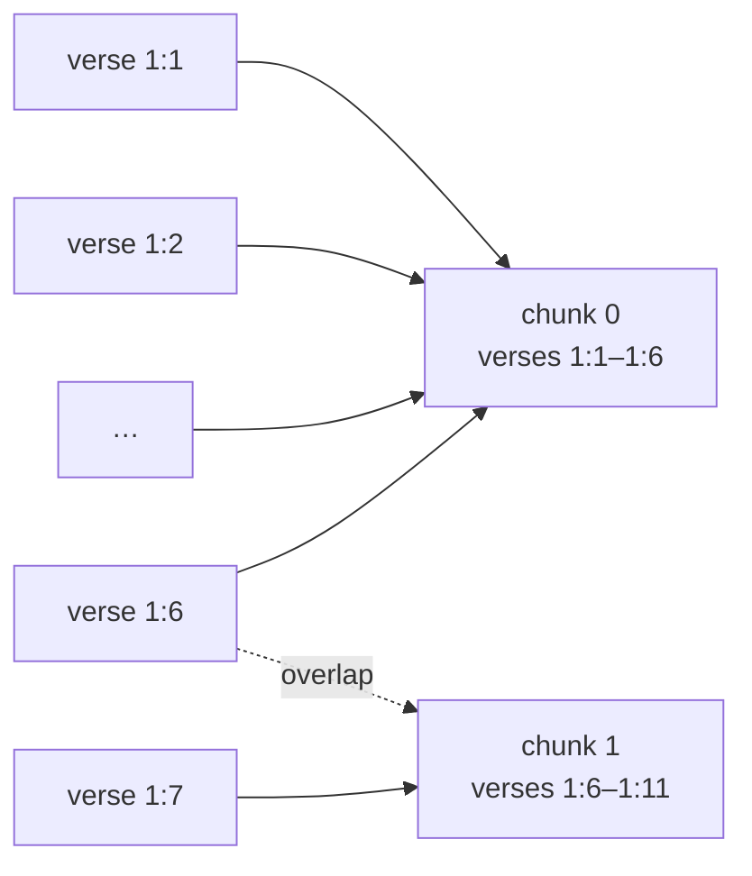

# Day 9 — Bible Lab II: Boundaries and Overlap

**Needs: yesterday's lab output for comparison**

## Today you will

- Chunk the same corpus along its *structure* instead of by character count
- Understand overlap: what it buys, what it costs
- Compare both chunkers with the audit and watch the failure rates collapse

## Concept

Yesterday's lesson was that character positions don't align with meaning. Today's is the fix: **let the document tell you where it bends.**

The Bible arrives pre-jointed. Every verse is marked (`1:1`, `1:2`, …), every book is titled. A verse is a complete thought; a book is a hard topic boundary. So instead of cutting every 500 characters, we *pack whole verses* into chunks:

- keep adding verses until the chunk reaches a target size (~500 chars)
- **never split a verse** — if adding one overshoots the target, that's fine
- **never cross a book boundary** — Malachi's ending and Matthew's beginning don't belong in one piece



### Overlap

Notice the dotted line: verse 1:6 ends chunk 0 **and** begins chunk 1. That's **overlap**, and it solves a real problem: content near a boundary. A question about "the firmament dividing the waters" might need verses 1:6–1:7 together — if 1:6 is the last verse of one chunk and 1:7 the first of the next, *neither chunk contains the full thought*. Repeating a verse at the seam means whichever chunk gets retrieved, the seam content is present.

The cost is real too: overlap duplicates text, so you store more chunks (more storage, more processing) and near-duplicate chunks can crowd each other in results. Overlap is a dial, not a virtue — we'll set it to 1 verse and let the audit tell us what we bought.

> **What we rejected: recursive character splitting.** The most common general-purpose chunker (the default in many frameworks) splits on a cascade of separators — paragraphs, then sentences, then words — falling through when pieces are still too big. It's a fine *generic* tool, and the right choice when a corpus has no reliable structure. We rejected it here because this corpus has something better than generic separators: explicit, meaningful, machine-readable boundaries (verses, books). When the document declares its own joints, cutting anywhere else is a self-inflicted wound. Rule of thumb: **use the strongest structure the corpus actually has.**

## Implementation

### 1. Look at the parser first

Open `scripts/bible/parse.ts`. It strips the Gutenberg header, walks paragraphs, and produces typed verse records:

```typescript
type Verse = {
  book: string;     // "The First Book of Moses: Called Genesis"
  chapter: number;  // 1
  verse: number;    // 1
  text: string;     // "In the beginning God created..."
};
```

Real-world wart worth reading: some paragraphs in the source *don't* start with a verse marker (they're continuations of the previous verse), and several thousand verses run together on shared lines. The parser handles both — and validates: it recovers **31,081 verses across exactly 66 books** (canonical count: 31,102; the gap is a handful of merged continuations). Parsing real text is never as clean as the format suggests. **Check your parser against known totals when totals are known.**

### 2. Run it

```bash
npm run bible:smart
```

```
Verses: 31,081
Chunks: 9,737 (target=500, overlapVerses=1)
```

Sample output — note every chunk now knows its address:

```
--- chunk 5000 [The Book of Psalms 48:10-49:1] ---
48:10 According to thy name, O God, so is thy praise unto the ends of the earth...
```

### 3. Audit and compare

```bash
npm run bible:audit -- data/bible/chunks-smart.jsonl
```

| metric | fixed (yesterday) | structure-aware (today) |
|---|---|---|
| chunks | 8,616 | 9,737 |
| size min / median / max | 201 / 500 / 500 | 379 / 594 / **1,675** |
| starts mid-word | **88.6%** | **0.0%** |
| ends mid-sentence | **96.8%** | **3.5%** |
| has metadata | 0% | 100% |

Read the trade honestly. We bought boundary integrity (88.6% → 0) and citability (every chunk carries book/chapter/verse). We paid with **size variance**: the max chunk is 1,675 characters, more than triple the target. Why? The longest verse in the Bible (Esther 8:9) is 1,509 characters by itself — and the no-splitting rule means it ships whole. The residual 3.5% mid-sentence endings are verses that genuinely end without punctuation in the source. Perfection isn't on the menu; *measured improvement* is.

### Common mistakes

- **Treating the target size as a guarantee.** It's a threshold, not a cap — chunks run past it by up to one verse. If your downstream system has a *hard* size limit, you must handle the long tail explicitly.
- **Overlapping across book boundaries.** The last verse of Malachi must not "overlap into" Matthew — they're different documents in every sense that matters. Boundary rules outrank overlap rules; check the order of those checks in `chunk-smart.ts`.
- **Cranking overlap up because more context feels safer.** Try `--overlap-verses 5` and watch the chunk count balloon with near-duplicates. Overlap is insurance; you don't insure a house for ten times its value.

## Your turn

Spend **no more than 45 minutes** here.

1. Run the smart chunker and reproduce the comparison table against your own audit output.
2. Sweep the overlap dial: `--overlap-verses 0`, `2`, `5`. Record the chunk count at each setting and write one sentence on the cost curve.
3. Read chunk 5000's *neighbors* (4999, 5001) in `data/bible/chunks-smart.jsonl`. Find the overlapping verse at each seam. Does the seam land somewhere a question could plausibly straddle?

## Check yourself

- Why is a 1,675-character chunk acceptable here when the target is 500?
- Your corpus is markdown documentation with `#` headings. What's the "verse" and what's the "book"?

<details>
<summary>Solution / discussion</summary>

**Overlap sweep (approximate):** `0` → ~8,400 chunks; `1` → 9,737; `2` → ~11,300; `5` → ~17,000+. Each step duplicates one more verse per seam, so growth is roughly linear in overlap — and at 5, around half your stored text is copies. The curve makes the trade visible: the first verse of overlap buys seam coverage; the fifth buys mostly redundancy.

**Why the 1,675-char chunk is fine:** the alternative is splitting Esther 8:9 mid-verse — reintroducing yesterday's failure mode to satisfy a number nobody downstream actually requires. The target exists to keep chunks *retrievable-sized on average*; integrity of the unit outranks it. (If a hard cap existed, the fix would be sentence-level splitting *inside* that one verse — structure-aware all the way down.)

**Markdown mapping:** headings are the joints — a `##` section is a reasonable "verse" (complete thought), a top-level `#` document or page is the "book" (hard boundary). The transferable rule: identify the smallest unit that's self-contained, and the largest unit you must never blend across. Every structured format has both.

</details>

## Further reading (optional)

- [Pinecone: Chunking strategies](https://www.pinecone.io/learn/chunking-strategies/) — compare their "document structure-based" section with what you just built
