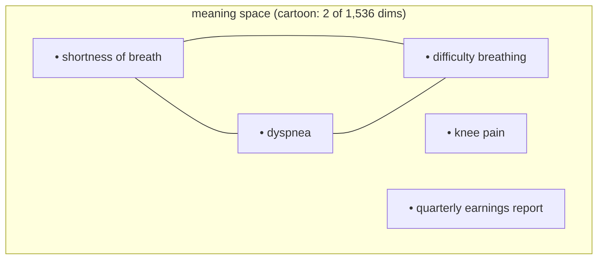

# Day 13 — Embeddings: Meaning as Geometry

**Needs: `OPENAI_API_KEY` in `.env` (a few cents of usage today)**

## Today you will

- Finally learn what "meaning-based search" has been this whole time: **embeddings**
- Turn text into vectors with the same function the production pipeline uses, and measure similarity yourself
- Catch the first case of an embedding _lying_ — with your own numbers

## Concept

Since the start of this course we've been saying "a search that understands meaning." Today the curtain comes up. The mechanism is called an **embedding**, and the idea fits in one sentence:

**An embedding turns a piece of text into a list of numbers, such that texts with similar meaning get nearby lists.**

That's it. The model we use (`text-embedding-3-small`) reads your text and outputs **1,536 numbers** — a point in a 1,536-dimensional space. You can't picture 1,536 dimensions; nobody can. Picture 2 instead:



"Dyspnea" and "shortness of breath" share **zero keywords**, but the model — trained on oceans of text where those phrases appear in interchangeable contexts — places them close together. "Knee pain" lands in the medical neighborhood but farther off. "Quarterly earnings" is in another zip code.

Search, then, is geometry: embed the query, embed the documents (once, ahead of time), and **rank documents by distance to the query**. The standard distance measure is **cosine similarity** — roughly, "do these two vectors point the same way?" — scoring 1.0 for identical direction down to 0 (and below) for unrelated. Cosine is the **dot product** of the two vectors divided by their lengths; with the unit-length vectors these models produce, the dot product alone gives the same ranking. (You'll feel that equivalence in your hands when you build a search by hand next.)

This single idea is why your Day 1 prediction works: a search for "trouble breathing" _can_ find a note that only says "dyspnea." No synonym dictionary. No `CONTITION_MAPPINGS` table maintained by hand. The geometry _is_ the synonym dictionary, learned from data.

## Implementation

The production wrapper already exists — `createEmbedding` in `lib/openai.ts`. Read it: it's ten lines around one API call. Today you use it raw.

Make a scratch script:

```typescript
import 'dotenv/config';
import { createEmbeddings } from './lib/openai';

// Cosine similarity: dot product over the product of lengths
function cosine(a: number[], b: number[]): number {
	let dot = 0,
		na = 0,
		nb = 0;
	for (let i = 0; i < a.length; i++) {
		dot += a[i] * b[i];
		na += a[i] * a[i];
		nb += b[i] * b[i];
	}
	return dot / (Math.sqrt(na) * Math.sqrt(nb));
}

async function main() {
	const phrases = [
		'shortness of breath',
		'dyspnea',
		'difficulty breathing',
		'knee pain',
		'quarterly earnings report',
	];
	const e = await createEmbeddings(phrases);
	console.log('dimensions:', e[0].length);
	console.log('SOB vs dyspnea:   ', cosine(e[0], e[1]).toFixed(3));
	console.log('SOB vs difficulty:', cosine(e[0], e[2]).toFixed(3));
	console.log('SOB vs knee pain: ', cosine(e[0], e[3]).toFixed(3));
	console.log('SOB vs earnings:  ', cosine(e[0], e[4]).toFixed(3));
}
main();
```

Run it (`npx ts-node --compiler-options '{"module":"CommonJS"}' scratch.ts`). Real output from this exact script:

```
dimensions: 1536
SOB vs dyspnea:    0.701
SOB vs difficulty: 0.743
SOB vs knee pain:  0.327
SOB vs earnings:   0.163
```

Read the ladder: synonyms ~0.70–0.74, same-domain-different-topic ~0.33, unrelated ~0.16. The zero-shared-keywords pair scored 0.701. **That number is the entire reason the second half of this system exists.**

### Now watch it lie

Re-run with full sentences instead of bare phrases:

```typescript
const phrases = [
	'the patient reports shortness of breath',
	'dyspnea on exertion',
	'the patient reports knee pain',
];
```

Real output:

```
SOB-sentence vs dyspnea:       0.597
SOB-sentence vs knee-sentence: 0.622   ← !!
```

The knee-pain sentence beats the dyspnea phrase. Why? The two sentences share the template _"the patient reports …"_ — and the embedding honestly reflects that they're similar **as texts**: same framing, same style, same opening. Embeddings measure _overall_ textual similarity, in which meaning dominates but phrasing, register, and boilerplate all leave fingerprints. Two documents wrapped in the same boilerplate look alike to the geometry.

Hold onto this. It's not a bug to fix today — it's the honest limitation that two upcoming pieces of the system (filtering _before_ the geometry, and a second opinion _after_ it) exist to handle.

### Common mistakes

- **Treating cosine scores as absolute truth.** Is 0.62 "a good match"? Unanswerable in isolation. Scores are only meaningful _relative to other candidates for the same query_. Never hardcode a threshold off vibes; you'll see the principled way to evaluate at the end of this block.
- **Comparing embeddings from different models.** A vector from `text-embedding-3-small` and one from any other model live in unrelated spaces. Mixing them produces garbage similarities with no error message. One index, one model, forever — or re-embed everything.
- **Embedding queries and documents with different preprocessing.** If documents got lowercased/cleaned and queries don't (or vice versa), you've quietly introduced the template effect against yourself. Symmetry in, symmetry out.

## Your turn

Spend **no more than 45 minutes** here.

1. Pull out your Day 1 notes — the synonym pair you wrote that "means the same thing but shares zero keywords." Embed both. Did the geometry agree with you? Record the number.
2. Build a five-phrase ladder of your own: two synonyms, one same-domain neighbor, one distant cousin, one absurdity. Predict the _order_ before running. Score 5 pairs and check your predicted ranking.
3. Reproduce the lie: find your own pair where shared _phrasing_ beats shared _meaning_. (Hint: wrap two unrelated facts in identical boilerplate.)

## Check yourself

- In one sentence each: what does an embedding produce, and what does cosine similarity measure?
- Why is "is 0.6 a good score?" a malformed question?

<details>
<summary>Solution / discussion</summary>

**The lie, reproduced generically:** wrap anything in shared boilerplate — `"As per company policy, employees must submit expense reports"` vs `"As per company policy, employees must wear safety goggles"` will typically out-score a true paraphrase of the expense rule written in different words. Boilerplate is signal to the geometry, noise to you.

**Why this rarely sinks the medical system in practice:** within _one_ corpus, the boilerplate is roughly constant — every clinical note opens with the same SOAP scaffolding, so the template fingerprint cancels out and _relative_ ranking is driven by the parts that differ. The danger zone is mixed corpora (notes + billing + emails in one index) or comparing scores across queries. Knowing where the failure lives is the skill.

**"Is 0.6 good?" is malformed** because cosine similarity has no absolute calibration: it depends on the model, the text lengths, the domain, even the boilerplate. The only well-formed question is "did the _right_ document outrank the _wrong_ ones for this query?" — which is a retrieval-quality question, and answering it properly is where this block is headed.

</details>

## Further reading

The single best visual intuition for the linear algebra under today's work — worth the time even if math isn't your thing, because Grant Sanderson makes vectors *move*:

- [3Blue1Brown — Vectors, what even are they? (Essence of Linear Algebra, Ch. 1)](https://www.youtube.com/watch?v=fNk_zzaMoSs) — what a vector *is*, the picture behind "a point in 1,536-dimensional space"
- [3Blue1Brown — Dot products and duality (Ch. 9)](https://www.youtube.com/watch?v=LyGKycYT2v0) — the geometric meaning of the dot product that powers cosine similarity
- [OpenAI: embeddings guide](https://developers.openai.com/api/docs/guides/embeddings) — the official docs for the API you used today
