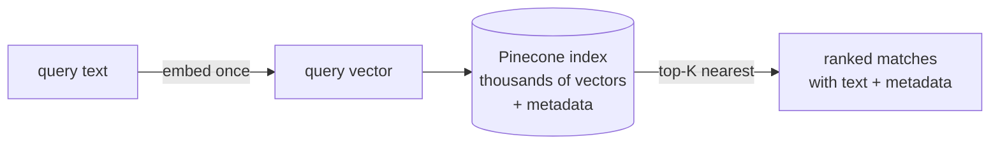

# Day 14 — Pinecone: Your First Vector Index

**Needs: `PINECONE_API_KEY` in `.env`; the Bible chunks from the chunking block**

## Today you will

- Create the index that will eventually hold the medical notes
- Load it with a corpus you already know intimately — the Bible chunks — and search it
- Understand what a vector database does that Postgres doesn't

## Concept

Yesterday you computed similarity between five phrases by embedding all five and comparing every pair. Now scale that thought: a real query needs the best matches among **tens of thousands** of stored documents. Embedding the query is one API call — fine. But comparing it against 144,000 stored vectors, per query? You need those 144,000 embeddings computed *once*, stored, and searchable *fast*.

That's the whole job description of a **vector database**:

1. **Store** vectors with their text and metadata
2. **Search** by similarity — give it a query vector, get back the top-K nearest neighbors, quickly
3. **Filter** — restrict the search by metadata (you built the case for this in the chunking block)



> **Why a dedicated vector database and not Postgres-with-an-extension?** Postgres has pgvector, and for many projects it's a fine answer — one database, one bill. We chose a managed vector store because it isolates a genuinely different workload (approximate nearest-neighbor search has its own indexing, scaling, and tuning) and keeps our Postgres schema boring. The honest tradeoff: one more service, one more key, one more thing to mock in tests. If you rebuild this system solo later, pgvector is a legitimate fork in the road — what doesn't change is everything else you're learning this week.

### Index configuration is a commitment

An index is created with two parameters that **cannot change later**:

- **Dimensions: 1536** — must match the embedding model exactly (`text-embedding-3-small` outputs 1,536 numbers; a 1,536-dim index physically cannot store a vector of any other length)
- **Metric: cosine** — the similarity measure you computed by hand yesterday, now run by the database

Wrong dimension count = recreate the index. New embedding model = recreate the index *and re-embed every document*. This is why yesterday's "one index, one model, forever" warning was a warning.

## Implementation

### 1. Create the index

The repo has a helper that creates it if missing — `ensureIndexExists()` in `lib/pinecone.ts`. Read it first (note the dimension and metric), then run it from a scratch script:

```typescript
import 'dotenv/config';
import { ensureIndexExists } from './lib/pinecone';

ensureIndexExists().then(() => console.log('done'));
```

Then look at the index in the [Pinecone console](https://app.pinecone.io) — confirm name `medical-notes`, dimension 1536, metric cosine.


<!-- TODO(brian): capture from logged-in Pinecone console -->

### 2. Load a corpus you already understand

Before risking the medical data, load the corpus where you can *judge* search quality by eye: your structure-aware Bible chunks. You know their shape, their metadata, their seams — perfect test cargo.

```typescript
import 'dotenv/config';
import * as fs from 'fs';
import { upsertChunks, MedicalChunk } from './lib/pinecone';

async function main() {
  const chunks: MedicalChunk[] = fs
    .readFileSync('data/bible/chunks-smart.jsonl', 'utf-8')
    .split('\n')
    .filter(Boolean)
    .slice(0, 2000) // first ~2,000 chunks: plenty to search, cheap to embed
    .map((line) => {
      const c = JSON.parse(line);
      return {
        id: String(c.id),
        content: c.text,
        metadata: {
          resourceType: 'BibleChunk',
          source: 'kjv',
          chunkIndex: c.id,
          book: c.metadata.book,
          reference: c.metadata.reference,
        },
      };
    });

  console.log(`upserting ${chunks.length} chunks...`);
  const n = await upsertChunks(chunks);
  console.log(`done: ${n}`);
}
main();
```

Read `upsertChunks` in `lib/pinecone.ts` while it runs (a couple of minutes): it embeds in batches of 100 and stores each vector with its text and metadata. This is the exact function the medical ingest uses — you're just feeding it scripture.

### 3. Search it

```typescript
import 'dotenv/config';
import { searchChunks } from './lib/pinecone';

async function main() {
  for (const q of ['love thy neighbour', 'the creation of the world', 'forgiveness of sins']) {
    const results = await searchChunks(q, 3);
    console.log(`\n=== ${q}`);
    for (const r of results) {
      console.log(`${r.score.toFixed(3)}  [${r.metadata.reference}]  ${r.content.slice(0, 80)}…`);
    }
  }
}
main();
```

Judge the results like you judged chunks: did "the creation of the world" surface Genesis 1? Does each hit carry a citation you can verify against the source? That round trip — query → match → reference → source text — is the metadata payoff, live.

### Common mistakes

- **Forgetting that upsert embeds.** `upsertChunks` calls the OpenAI API for every chunk — that's where the time and money go, not Pinecone. 2,000 chunks ≈ a minute or two and a few cents. Don't feed it all 9,737 to "be thorough"; today is about understanding, not coverage.
- **Searching immediately after upserting and panicking at missing results.** The index is *eventually* consistent — freshly upserted vectors can take a few seconds to become searchable. Wait, retry, then debug.
- **Creating the index by hand in the console with default settings.** Console defaults may not be 1536/cosine. Use `ensureIndexExists()` — config-as-code is reproducible; clicks are not.

## Your turn

Spend **no more than 45 minutes** here.

1. Load the chunks, run the three searches above, and verify one result against `data/bible/kjv.txt` using its `reference`.
2. Search for a *story* you know without using any of its words — e.g. describe a famous parable in modern English. Did the geometry find it? Record the query, the top hit, and the score.
3. Search for something the corpus **cannot** answer ("how do I file my taxes"). Look at the scores of the "best" matches and compare them to your good queries' scores. Write one sentence about what a retrieval system should *do* with that observation.

## Check yourself

- What two index parameters are permanent, and what breaks if each is wrong?
- Where does the cost and latency of `upsertChunks` actually come from?

<details>
<summary>Solution / discussion</summary>

**The no-words search (typical result):** describing the prodigal son as "a young man wastes his inheritance and his father welcomes him home" reliably surfaces Luke 15 chunks — zero shared vocabulary with "prodigal." This is yesterday's 0.701 effect operating at corpus scale, and it's the moment most students believe.

**The unanswerable query:** "how do I file my taxes" still returns *something* — vector search always returns the K nearest neighbors, however far away they are. The scores are visibly lower than your good queries' scores, but **not zero**, and (per yesterday) there's no universal threshold that separates "real match" from "best of a bad lot." The observation to write down: *the retrieval layer cannot tell the system "nothing matched" — something downstream has to decide that.* Where and how that decision gets made is a question this course returns to twice more, with better tools each time.

**Permanent parameters:** dimensions (vectors of the wrong length are rejected outright) and metric (changes what "nearest" means — silently different rankings, no error). Both are why index config lives in code.

</details>

## Further reading (optional)

- [Pinecone: what is a vector database?](https://www.pinecone.io/learn/vector-database/) — the architecture under today's two function calls
