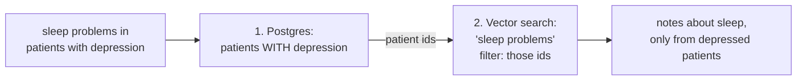

# Day 16 — Hybrid Queries: SQL Filters Meet Vector Search

**Needs: both engines loaded — Postgres rows and the note index**

## Today you will

- Wire the two retrieval engines together for the first time
- Build the hybrid pattern by hand: structured filter → semantic search inside the filtered set
- Learn why the *order* of the two steps is not a style choice

## Concept

From the very first day, the interesting queries were the hybrids: *"What do the notes say about sleep problems for patients with depression?"* Neither engine can answer it alone:

- **Postgres alone:** finds the depression patients perfectly, then hits a wall — `LIKE '%sleep%'` over note text misses "insomnia," "wakes frequently," "poor sleep hygiene"
- **Vector search alone:** finds sleep-related notes beautifully — for *anyone*, including patients who've never had a depression diagnosis

The hybrid pattern runs them in sequence, each doing what it's for:



Step 1 is yesterday's `getPatientIdsByConditions` (built in the SQL block — with the synonym mappings). Step 2 is yesterday's `patientIds` filter — which you may have wondered about when you built it. This is what it was for.

### Why SQL first, vectors second — and not the reverse?

Imagine flipping it: vector-search "sleep problems" globally, then keep only depression patients. Two failures:

1. **The math fails quietly.** Top-50 sleep notes, filtered to depression patients, might leave 3 — or 0 — depending on luck. To *guarantee* 10 results you'd have to over-fetch by an unknowable factor.
2. **The filter is exact; the search is fuzzy.** "Has a depression diagnosis" is a fact with a true/false answer — that's a `WHERE` clause, not a similarity score. Run the exact step first and the fuzzy step operates inside a *correct* universe.

General rule worth keeping: **exact filters narrow the world; semantic search ranks what's left.** When both kinds of constraint appear in one question, that's the order.

## Implementation

Build the hybrid by hand in a scratch script — no framework, just yesterday's two functions in sequence:

```typescript
import 'dotenv/config';
import { getPatientIdsByConditions } from './lib/sql-queries';
import { searchClinicalNotes } from './lib/vector-search';

async function hybrid(conditions: string[], semanticQuery: string) {
  // Step 1: exact — who has the condition?
  const patientIds = await getPatientIdsByConditions(conditions);
  console.log(`patients with ${conditions.join('+')}: ${patientIds.length}`);

  if (patientIds.length === 0) return [];

  // Step 2: fuzzy — rank their notes against the question
  return searchClinicalNotes(semanticQuery, { topK: 10, patientIds });
}

async function main() {
  const results = await hybrid(['depression'], 'trouble sleeping, insomnia, poor sleep');
  for (const r of results) {
    console.log(`${r.score.toFixed(3)} ${r.patientName} (${r.date}) — ${r.contentPreview.slice(0, 90)}…`);
  }
}
main();
```

Run it. Then run the two **control experiments** — this is the important part:

1. **Vector-only control:** the same semantic query with no `patientIds`. Compare the names in the results — how many of the global top-10 are *not* depression patients?
2. **SQL-only control:** look at what you'd show a user with just step 1 — a list of patients, no sleep information at all.

The hybrid's value is exactly the gap between it and each control. Don't take the day's word for it; measure the gap.

### Common mistakes

- **Skipping the empty-filter check.** If no patients match the condition, step 2 with `patientIds: []` doesn't mean "no patients" to the filter-builder you wrote yesterday — it means *no filter*, searching everyone. Re-read your own `if (patientIds && patientIds.length > 0)` and trace what an empty array does. This is the #1 hybrid bug, and it's a privacy bug, not a relevance bug.
- **Putting the semantic part into SQL or the exact part into the vector query.** "Depression" in the vector query *and* the SQL filter feels like belt-and-suspenders; actually it skews the ranking toward notes that *mention* depression rather than notes about sleep. Each constraint goes to the engine built for it, once.
- **Large id lists.** A condition matching thousands of patients makes a giant `$in` filter — legal, but slow and a sign the structured step isn't narrowing much. If step 1 returns half the database, ask whether the question really has a structured component at all.

## Your turn

Spend **no more than 45 minutes** here.

1. Run the depression/sleep hybrid plus both controls. Record: how many of the vector-only top-10 were outside the depression cohort?
2. Build two more hybrids from your own Day 1 query list (you labeled some `hybrid` — cash them in). For each: conditions, semantic query, and the top-3 results.
3. Write the one-sentence rule for *where each constraint goes*, in your own words, in your notes. You'll reuse it when the system starts routing queries automatically.

## Check yourself

- Why does the exact step run first? Give both the math reason and the correctness reason.
- A colleague's hybrid for "anxiety patients mentioning chest pain" returns notes from patients with no anxiety diagnosis. List the two most likely bugs, in the order you'd check them.

<details>
<summary>Solution / discussion</summary>

**Typical control numbers on the subset:** the vector-only top-10 for a sleep query usually includes 5–8 patients *outside* the depression cohort — the geometry doesn't know diagnoses exist. That count *is* the hybrid's value, quantified in thirty seconds. (If your number differs, fine — it's your corpus. The habit of producing the number is the point.)

**The colleague's bug list:**
1. **Empty/missing filter** — `getPatientIdsByConditions(['anxiety'])` returned `[]` (mapping miss? typo?) and the filter-builder treated the empty array as "no filter." Check by logging `patientIds.length` before step 2.
2. **Post-filtering or no filtering** — the `patientIds` never made it into `index.query` (passed in the wrong options key, or filtered in JS afterward). Check by logging the actual filter object.

Both bugs produce *plausible-looking results* — sleep notes are sleep notes — which is what makes hybrid bugs nastier than crashes. The fix for "plausible but wrong" is never staring harder; it's controls and counts, like today's.

**The one-sentence rule, one version:** *facts go to the database, meaning goes to the geometry, and facts run first.*

</details>

## Further reading (optional)

- [Pinecone: metadata filtering](https://docs.pinecone.io/guides/index-data/indexing-overview#metadata) — same link as yesterday, new eyes: the filter is the hybrid hinge
