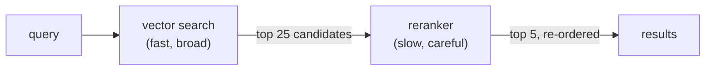

# Day 17 — When Cosine Similarity Lies: Reranking

**Needs: `COHERE_API_KEY` in `.env` (free trial tier is enough); the loaded note index**

## Today you will

- Revisit the lie you caught on the embeddings day and understand *why* it happens
- Add a second-opinion stage — a reranker — on top of your search
- Set up the question that only tomorrow can answer: did it actually help?

## Concept

Remember the day the geometry lied: *"the patient reports knee pain"* out-scored *"dyspnea on exertion"* as a match for *"the patient reports shortness of breath"* — 0.622 vs 0.597 — because the two sentences share a template. The root cause is structural, and it's worth saying precisely:

**An embedding summarizes each text *separately*, before any query exists.** Your note was compressed into 1,536 numbers last week, with no idea what would be asked of it. At query time, all the system can do is compare two pre-made summaries. Anything lost in compression — emphasis, role of each phrase, what's boilerplate vs what's signal — is lost forever.

A **reranker** is a different kind of model with the one luxury embeddings can't have: it reads **the query and the document together, at query time**, and scores how well *this* document answers *this* query. No pre-compression. Boilerplate that matches boilerplate impresses it much less.

So why not rerank everything and skip embeddings? Cost and speed. Reading query+document together means one model call *per candidate per query* — you cannot do that across 144,000 notes. The standard architecture is a funnel:



Cheap-and-broad finds candidates; expensive-and-careful orders them. You'll meet this funnel shape again and again in retrieval systems — it's the same logic as a recruiter skimming 200 resumes and carefully interviewing 6.

## Implementation

The reranker wrapper already exists — `rerankResults` in `lib/reranker.ts`. Read all twenty lines:

- It sends the query plus the candidates' text to Cohere's `rerank-english-v3.0`
- It returns the candidates re-ordered, with new scores
- **If the call fails, it returns the original order** — a deliberate design choice: degraded search beats no search. Note that this also means a missing API key fails *silently* into a no-op. Check your `.env` before concluding reranking "does nothing."

Wire the funnel in a scratch script:

```typescript
import 'dotenv/config';
import { searchChunks } from './lib/pinecone';
import { rerankResults } from './lib/reranker';

async function main() {
  const query = 'patient struggling to breathe at night';

  // Stage 1: broad — over-fetch deliberately
  const candidates = await searchChunks(query, 25);

  // Stage 2: careful — rerank, keep the best 5
  const reranked = await rerankResults(query, candidates, 5);

  console.log('=== vector order (top 5 of 25)');
  for (const r of candidates.slice(0, 5)) {
    console.log(`${r.score.toFixed(3)}  ${r.content.slice(0, 90)}…`);
  }
  console.log('\n=== reranked order');
  for (const r of reranked) {
    console.log(`${r.score.toFixed(3)}  ${r.content.slice(0, 90)}…`);
  }
}
main();
```

Run it on several queries. Three things to notice:

1. **The over-fetch is the point.** Stage 1 pulls 25, not 5 — the reranker can only promote what's in the candidate pool. A great note ranked #19 by cosine is *invisible* unless the funnel mouth is wide enough to include it.
2. **The scores are from a different universe.** Cohere's relevance scores are not cosine similarities; comparing a 0.91 rerank score to a 0.58 cosine score is meaningless. Within one list, order is what matters.
3. **The order changes — sometimes.** On some queries the top 5 barely moves; on others a #14 jumps to #1. Which brings us to the honest question.

### Did it help, though?

Be very careful here. You just watched the order change and it *felt* like an improvement. But "the order changed" and "the results got better" are different claims — and the second one needs ground truth: which notes are *actually* relevant to the query? Nothing you've built so far knows that.

This is the course's spine rule arriving at its first big decision: **no metric, no decision.** A reranker adds latency (one extra model call per query) and cost (per-candidate pricing) and a vendor dependency. Whether it pays for itself **on your corpus, for your queries** is an empirical question. Today you built the machinery; tomorrow you build the measuring instrument — and then *you* get to find out, with a number, whether reranking earns its place in your system. Plenty of real systems measure and conclude it doesn't. Plenty conclude it's the single best upgrade available. Yours is one eval away from knowing which kind it is.

### Common mistakes

- **Reranking the same K you keep.** Fetch 5, rerank 5 → the same 5 results, shuffled. The reranker's power is *promotion from depth*; without over-fetching there's no depth to promote from.
- **Comparing rerank scores to cosine scores.** Different models, different scales, different meanings. The only valid comparisons are within one ranked list.
- **Concluding anything from today.** Watching three queries change order is an anecdote, not an eval. Resist the conclusion until tomorrow's instrument exists — this restraint is precisely the discipline that separates measured systems from vibes-driven ones.
- **Not noticing the silent fallback.** No Cohere key → original order returned, no error. If reranked and original lists are always *identical*, suspect the key before the model.

## Your turn

Spend **no more than 45 minutes** here.

1. Run the funnel on five queries against the note index (use `searchClinicalNotes` results as input if you prefer — anything with `content` works). For each, record: did the top-3 change? Did anything jump from below #10?
2. Find one query where reranking visibly *rescued* a result — a clearly-relevant note that cosine buried. Save the query; it's a candidate for tomorrow's eval set.
3. Find one query where the two orders are essentially identical. Also save it. (An eval set needs cases where the intervention *shouldn't* matter, or it can't detect over-claiming.)

## Check yourself

- Why can a reranker judge relevance better than cosine similarity? One sentence, mentioning *when* each model sees the query.
- Why does the funnel over-fetch, and what's the tradeoff in choosing 25 vs 100 candidates?

<details>
<summary>Solution / discussion</summary>

**The one sentence:** an embedding compresses each document *before the query exists*, so matching compares two blind summaries; a reranker reads query and document *together* and scores the actual pairing.

**Over-fetch tradeoff:** wider funnels (100) give the reranker more chances to rescue buried gems, but cost more (per-candidate pricing) and add latency; narrower funnels (10) are cheap but can't fix what they never see. The right width depends on how often cosine buries relevant documents *in your corpus* — which is (say it together) a measurable question. Common production starting point: rerank 3–5× the K you intend to keep.

**Why both kinds of saved query matter for an eval:** the rescue case tests whether reranking helps where it should; the no-change case tests whether your eval can tell "helped" from "did something." An instrument that only contains cases favoring the intervention isn't an instrument — it's a sales deck.

</details>

## Further reading (optional)

- [Cohere: rerank documentation](https://docs.cohere.com/docs/rerank-overview) — the model behind today's second opinion
- [Anthropic: Contextual Retrieval](https://www.anthropic.com/news/contextual-retrieval) — note the headline numbers combine contextual chunks *with* reranking; production retrieval is a stack of these techniques, each one measured
