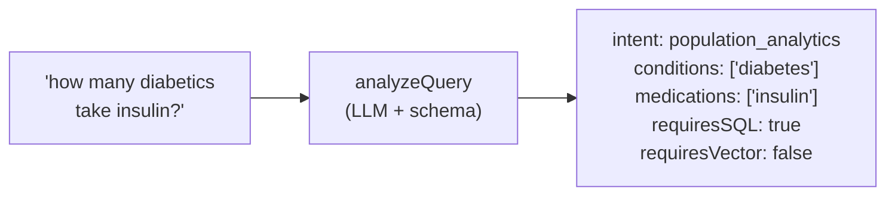

# Day 20 — The Query Analyzer: Intent and Entities

**Needs: yesterday's pattern fresh in mind; `OPENAI_API_KEY`**

## Today you will

- Implement `analyzeQuery` — the brain that decides which retrieval engine answers each question
- Write your first production system prompt and few-shot examples
- Watch your Day 1 query taxonomy become executable code

## Concept

Since the first day of this course, you've been classifying queries by hand: *structured*, *semantic*, *hybrid*. Then you built the engines: SQL functions for structured, vector search for semantic, the two chained for hybrid. One piece is missing — the thing that does the classifying **automatically, per query, at runtime**.

That piece is the query analyzer, and it's yesterday's pattern pointed at a harder target. Instead of extracting urgency from an email, it extracts *retrieval strategy* from a question:



Open `lib/query-analyzer.ts`. The schema is **already written** — read it top to bottom before anything else. Notice:

- `intent` is a 7-value enum — your three Day 1 labels, refined (`patient_lookup`, `patient_summary`, `structured_query`, `clinical_note_search`, `population_analytics`, `hybrid_query`, `general_question`)
- `entities` extracts the *parameters* each engine needs: patient names, conditions, lab names, numeric filters (`A1c > 9` becomes `{field, operator, value}`)
- `semanticQuery` is an optimized rephrasing for vector search — the analyzer can *expand* "trouble sleeping" with synonyms before the geometry sees it
- `requiresSQL` / `requiresVector` are the two booleans the router will branch on

What's *not* written: the `SYSTEM_PROMPT`, the `FEW_SHOT_EXAMPLES`, and the body of `analyzeQuery`. That's today.

### Prompting a classifier is its own genre

A system prompt for a *component* reads nothing like a chatbot personality. It's a spec: what the system is, what each intent means, what the booleans control, and the judgment calls written down. Three principles:

1. **Define every enum value with a boundary case.** The model knows English; it doesn't know *your* line between `patient_summary` and `patient_lookup`. Tell it.
2. **Examples beat rules.** A handful of (query → exact JSON) pairs — *few-shot examples* — anchor format and judgment better than paragraphs of instruction. Cover the confusable pairs, not the obvious cases.
3. **Forbid invention, explicitly.** Extractors drift toward helpfulness: a query mentioning no condition gets `conditions: ["diabetes"]` anyway because diabetes is *common*. The prompt must say: extract only what is present.

## Implementation

### 1. Write the system prompt

In `lib/query-analyzer.ts`, replace the TODO. Structure that works: one paragraph of context (medical records system, two retrieval engines and what each is for) → the intent guide (one line per enum value) → the rules (when each boolean is true; normalize condition names; expand `semanticQuery` with clinical synonyms; **do not invent entities**).

### 2. Write the few-shot examples

Five is plenty if they're the *right* five. Make each one a (query → full JSON) pair, and spend them on the boundaries:

- a count question (analytics, SQL only)
- a numeric-filter question ("A1c over 9" → `numericFilters`)
- a pure notes question (vector only, with an expanded `semanticQuery`)
- a **hybrid** (the one the model gets wrong most often — show it the condition going to SQL *and* the rephrased topic going to vector)
- a named-patient question

### 3. Implement `analyzeQuery`

Yesterday's four steps, verbatim — `responses.parse`, `zodTextFormat(QueryAnalysisSchema, 'queryAnalysis')`, `temperature: 0`, final `QueryAnalysisSchema.parse`. The system content is your prompt plus the examples.

### 4. Interrogate it

```typescript
import 'dotenv/config';
import { analyzeQuery } from './lib/query-analyzer';

const queries = [
  'How many patients have high blood pressure?',
  'Find patients whose notes mention dizziness after standing up',
  'What do the notes say about sleep for patients with depression?',
  'Tell me about the patient named Smith',
  'What is the capital of France?',
];

async function main() {
  for (const q of queries) {
    const a = await analyzeQuery(q);
    console.log(`\n${q}\n  → ${a.intent} | SQL:${a.requiresSQL} Vector:${a.requiresVector}`,
      a.semanticQuery ? `\n  semantic: "${a.semanticQuery}"` : '');
  }
}
main();
```

Check each against your own judgment. The France question should land in `general_question` with both booleans false — your system knowing *what it isn't for* is a feature you're building right now.

### Common mistakes

- **Few-shot examples that violate the schema.** An example with `"intent": "lookup"` (not in the enum) or a missing required field teaches the model to fight the constraint. Every example must be schema-perfect — paste them through `QueryAnalysisSchema.parse` in a scratch file if unsure.
- **Spending examples on easy cases.** "How many patients have diabetes" was never going to be misclassified. The hybrid/semantic boundary and the summary/lookup boundary are where examples earn their tokens.
- **Letting `semanticQuery` echo the input.** If the analyzer's rephrasing is identical to the user's words, it's adding latency and nothing else. The prompt should push expansion: synonyms, clinical phrasings a note might use.
- **Skipping `temperature: 0`.** A classifier that classifies the same query differently on Tuesday is not a component, it's a coin.

## Your turn

Spend **no more than 60 minutes** here (including the implementation above).

1. Finish prompt, examples, and `analyzeQuery`; run the interrogation battery clean.
2. Pull out your Day 1 list of five labeled queries. Run them. Does the analyzer agree with your labels? Where it disagrees — *who's right?* (Sometimes it's you. Update your notes either way.)
3. Hunt one misclassification: craft queries near the boundaries until one routes wrong. Fix it by **adding one few-shot example**, not by lengthening the rules. Confirm the fix didn't break the battery.

## Check yourself

- Why do the booleans (`requiresSQL`, `requiresVector`) exist separately from `intent`, when intent seems to imply them?
- A query mentions no condition, but the analyzer returns `conditions: ["hypertension"]`. Name the failure mode and the two places you'd fix it.

<details>
<summary>Solution / discussion</summary>

**Booleans vs intent:** intent is for *humans and logging* (seven readable categories); the booleans are for *code* (two branch points). Deriving booleans from intent in code would weld a 7-way mapping into the router — every new intent means touching the router. Letting the analyzer set them directly keeps the router two `if`s, and lets edge cases (an analytics question that *also* needs notes) set both without inventing an eighth intent. Redundancy at the schema level buys simplicity at the code level.

**The invented condition** is entity hallucination — the extractor "helpfully" filling a field the text doesn't support (yesterday's required-field lesson wearing medical scrubs). Fix one: the prompt — an explicit "extract only entities present in the query" plus a few-shot example showing a condition-free query yielding an empty `entities`. Fix two: the schema — `.describe('Medical conditions mentioned')` sharpened to `.describe('Medical conditions explicitly mentioned in the query — empty if none are named')`. Descriptions are prompting; use both layers.

**On "who's right" in disagreement:** a common one — students label "summarize Smith's health" as `semantic`; the analyzer says `patient_summary` with `requiresSQL: true`. The analyzer is right: the structured row (conditions, meds, labs) is the backbone of a summary; notes are garnish. Building the classifier sharpens the *builder's* taxonomy too.

</details>

## Further reading (optional)

- [OpenAI: structured outputs guide](https://developers.openai.com/api/docs/guides/structured-outputs) — same mechanics, now with stakes
