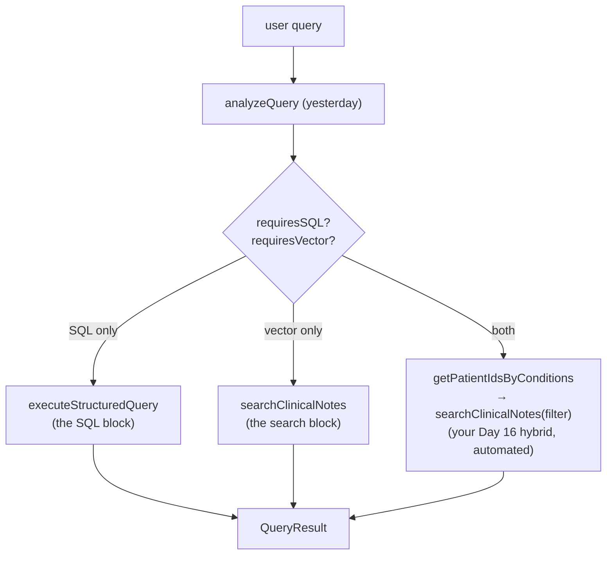

# Day 21 — Orchestration: Three Paths Through One System

**Needs: a working `analyzeQuery` from yesterday; both engines loaded**

## Today you will

- Read the router that turns the analyzer's output into actual retrieval — it's already written
- Trace real queries down all three paths and verify the routing with your own eyes
- Learn the debugging loop for LLM-routed systems: behavior bug → prompt fix → re-run

## Concept

Today is mostly a **reading day**, and that's deliberate. The orchestration layer — `lib/query-executor.ts` — is complete, and reading working orchestration code teaches more than re-typing it. You built every part it calls; now see how thin the glue actually is.

`executeQuery` is the whole runtime in one function:



Open the file and read `executeQuery` top to bottom. Things to notice as you go:

- **The router is two booleans and three branches.** All the intelligence lives in the analyzer; the router just dispatches. This is good design under test: a dumb router is a router that can't be wrong in interesting ways.
- **The hybrid branch is your Day 16 scratch script, productionized.** Condition entities → patient ids → filtered vector search, with the same empty-result guard you discovered the hard way. Compare it to what you wrote by hand; the differences (using `semanticQuery` instead of the raw query, falling back when no conditions were extracted) are each worth ten seconds of thought.
- **`formatResultsForLLM`** — the second half of the file. Retrieval returns structured objects; the LLM needs *text*. This function renders patients, conditions, observations, and note previews into readable context. Read it asking one question: *what information survives the rendering, and what gets dropped?* (Top 10 patients only; 5 notes; previews truncated. Every one of those numbers is a silent editorial decision about what the LLM gets to see.)

### The debugging loop

Here's what changes when a system routes via LLM: **bugs move.** When a query produces a wrong answer, the cause is now usually *upstream of all your deterministic code* — the analyzer misclassified, mis-extracted, or wrote a weak `semanticQuery`. The loop becomes:

```
symptom (wrong results) → inspect the analysis (intent? entities? booleans?)
  → if analysis is wrong: fix the PROMPT (usually: add one few-shot example)
  → if analysis is right: NOW suspect the deterministic code
→ re-run the battery
```

Engineers who skip the "inspect the analysis" step end up "fixing" working SQL for hours. The analysis object is your first stack frame — always read it first.

## Implementation

Trace all three paths with real queries:

```typescript
import 'dotenv/config';
import { executeQuery, formatResultsForLLM } from './lib/query-executor';

async function trace(q: string) {
  const result = await executeQuery(q);
  console.log(`\n=== ${q}`);
  console.log('analysis:', result.analysis.intent,
    `SQL:${result.analysis.requiresSQL} Vector:${result.analysis.requiresVector}`);
  console.log('sqlResults:', result.sqlResults ? result.sqlResults.type : 'none');
  console.log('vectorResults:', result.vectorResults?.length ?? 0, 'notes');
  console.log('--- rendered for LLM (first 400 chars) ---');
  console.log(formatResultsForLLM(result).slice(0, 400));
}

async function main() {
  await trace('How many patients have high blood pressure?');       // path 1: SQL
  await trace('notes mentioning chest pain at night');               // path 2: vector
  await trace('what do notes say about sleep for depressed patients'); // path 3: hybrid
}
main();
```

For each: confirm the booleans chose the path you expected, the right engine(s) ran, and the rendered context contains what an LLM would need to answer. You are looking at the exact text the model will receive — this view is where most "why did it answer that?" mysteries resolve.

### Common mistakes

- **Debugging the SQL when the analysis is wrong.** The loop above, violated. If `requiresVector` came back false for a notes question, no amount of staring at Pinecone will help.
- **Treating `formatResultsForLLM`'s limits as facts of nature.** Top-10 patients, 5 notes, truncated previews — those are *choices*, and when an answer is mysteriously incomplete, "the relevant data was rendered out" belongs on your suspect list.
- **Testing only happy paths.** Trace a query where the condition matches *zero* patients, and one where entities come back empty. The branches you didn't trace are the ones that page you later.

## Your turn

Spend **no more than 45 minutes** here.

1. Run the three-path trace; confirm routing and read every rendered context in full.
2. Run your full Day 1 query list through `executeQuery`. For each: which path, and did the result match the label you assigned it before any of this existed?
3. Find one query whose *analysis* is right but whose *rendered context* would mislead the LLM (data dropped, preview truncated mid-fact, wrong 10 patients shown). Write down what you'd change — don't change it yet; you'll want this note when the full chat loop exists tomorrow.

## Check yourself

- In the debugging loop, what's the first artifact you inspect, and what are the two fix-paths from there?
- Why is "the router is dumb" praise rather than criticism?

<details>
<summary>Solution / discussion</summary>

**First artifact: the analysis object** — intent, entities, booleans, `semanticQuery`. Right analysis → suspect the deterministic code (engines, rendering). Wrong analysis → fix the prompt, usually with one targeted few-shot example, then re-run your battery so the fix can't silently regress something else. (That re-run habit gets industrialized on this block's build day.)

**Dumb router as virtue:** every line of conditional cleverness in the router is logic the analyzer *also* encodes, which means two places to disagree. Keeping all judgment in one component (the prompt — visible, versionable, testable) and all dispatch in another (three branches — trivially correct by inspection) is separation of concerns applied to an LLM system. When something's wrong, you always know which layer to interrogate.

**Common find on exercise 3:** a patient-summary query renders 50 observations chronologically, and the truncation cuts the *recent* labs — the ones the question was about. The render order silently decided which facts the LLM can see. "What does the model actually receive?" is a question you now know to ask with `console.log`, and later you'll have a proper tool aimed at exactly it.

</details>

## Further reading (optional)

- Re-read `lib/query-executor.ts` once more, fast — this file is the system's table of contents, and you'll be back in it on every remaining block of the course
