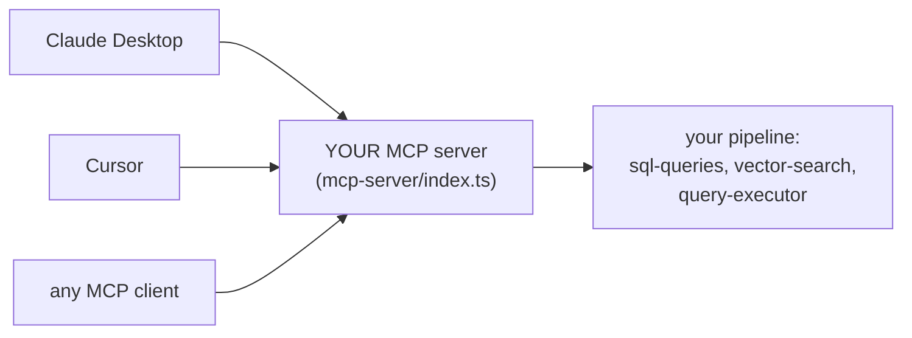

# Day 25 — MCP: Your RAG as a Tool for AI Assistants

**Needs: the working pipeline; nothing new to install (the SDK is already a dependency)**

## Today you will

- Understand what the Model Context Protocol is and the problem it standardizes away
- Implement your system's first MCP tools — thin wrappers around functions you already built
- Test them from the command line before any AI touches them

## Concept

Everything you've built answers questions through *your* chat UI. But the people you'd build this for already live in other AI tools — Claude Desktop, Cursor, a dozen assistants. Do you build an integration for each one?

**MCP — the Model Context Protocol** — is the industry's answer: an open standard for connecting AI applications to external systems. The analogy the spec itself uses: *USB-C for AI*. You implement one **MCP server** that exposes your system as **tools**; any MCP **client** (Claude Desktop, Cursor, and a growing list) can then discover and call them.



A **tool** in MCP is a named capability with a typed schema: name, description, parameters. The client's LLM reads the descriptions and *decides* when to call which tool — exactly like your query analyzer decides between engines, except now the deciding model belongs to someone else. That inversion has a consequence worth sitting with:

**Your tool descriptions are prompts for a model you don't control.** A vague description ("search stuff") means the client model calls your tool at the wrong times with the wrong arguments — and you can't fix it by editing the client's prompt, because you don't own it. The description *is* your interface.

> **Why MCP and not a REST API?** You have API routes already — Cursor can't use them. A REST endpoint needs a human to read docs and write integration code per client. MCP's contract is machine-readable at the protocol level: the client *discovers* your tools, schemas and all, at connect time. REST serves programmers; MCP serves models. The honest cost: a young protocol, fast-moving SDKs, and a transport (today: stdio — the client literally launches your server as a subprocess and talks over stdin/stdout) that will feel unusual the first time.

## Implementation

### 1. Read the skeleton

Open `mcp-server/index.ts`. The scaffolding is built: an `McpServer` is created, connected over a stdio transport, and three tools are registered — `search_patients`, `query_notes`, `get_patient` — each with a zod parameter schema and a TODO body.

Look at how a tool is declared:

```typescript
server.tool(
  'query_notes',
  'Search clinical notes using semantic search',
  {
    query: z.string().describe('Semantic search query (e.g., "chest pain", "breathing problems")'),
    patientId: z.string().optional().describe('Optional: limit to specific patient'),
    topK: z.number().optional().default(5).describe('Number of results to return'),
  },
  async ({ query, patientId, topK }) => { /* TODO */ }
);
```

Zod again — the same schema-as-contract idea from the structured-outputs day, pointed the other direction: then, a schema constrained what a model *produced*; now it constrains what a model *sends you*.

### 2. Implement the three tool bodies

Each body is a few lines, because the hard parts already exist in `lib/`:

- `search_patients` → your judgment call: route through `executeQuery` (full analyzer) or hit `findPatientsByConditions`/`findPatientByName` directly for predictability. Either is defensible; pick one and know why.
- `query_notes` → `searchClinicalNotes(query, { topK, patientIds: patientId ? [patientId] : undefined })`
- `get_patient` → `getPatientSummary(patientId)`

One MCP-specific requirement: tools return `{ content: [{ type: 'text', text: '...' }] }` — *text*, for a model to read. Format results the way `formatResultsForLLM` taught you: compact, labeled, citable. A tool that dumps raw JSON works; a tool that returns well-shaped text works *better*, because the consumer is a language model.

### 3. Smoke-test without a client

The server speaks JSON-RPC over stdio, so you can talk to it with a pipe — no AI required:

```bash
echo '{"jsonrpc":"2.0","id":1,"method":"tools/list","params":{}}' | npx ts-node mcp-server/index.ts
```

You should get back a JSON listing of your three tools with their schemas — proof the contract is discoverable. (The official `npx @modelcontextprotocol/inspector` gives you a friendlier UI for the same thing; the pipe version teaches you what's actually moving.)

### Common mistakes

- **Tool descriptions written for humans.** "Gets patient data" tells a model nothing about *when to choose this tool over the other two*. Write descriptions like analyzer few-shots: what it's for, what it's not for, an example argument.
- **`console.log` in a stdio server.** Stdout *is the protocol channel* — a stray log line corrupts the JSON-RPC stream and the client disconnects with a cryptic error. Use `console.error` (stderr) for debugging; the skeleton already does.
- **Three tools that all do everything.** If `search_patients` also searches notes, the client model can't learn the division of labor — overlapping tools produce erratic tool choice. Sharp boundaries; one job each.
- **Forgetting the server has no session.** Each tool call arrives bare — no conversation history, no "the patient we discussed." Stateless by design; the *client* carries context and passes ids explicitly.

## Your turn

Spend **no more than 60 minutes** here (including the implementation above).

1. Implement all three tool bodies; confirm `tools/list` shows them and a `tools/call` round-trip returns formatted text (the inspector makes this painless).
2. Rewrite each tool description as if it were a few-shot example — then have a colleague (or an AI assistant in a fresh session) read *only* the three descriptions and predict which tool handles: "is anyone on insulin?", "notes about dizziness for patient X", "tell me about patient Y". Wrong predictions = description bugs.
3. In your notes: which one of your existing `lib/` functions would make the *worst* MCP tool, and why? (Think about what a remote model can and can't be trusted to call.)

## Check yourself

- What does the client model read to decide which of your tools to call — and what's the implication for how you write it?
- Why must a stdio MCP server never write logs to stdout?

<details>
<summary>Solution / discussion</summary>

**Tool-choice inputs:** the name, the description, and the parameter schemas (including every `.describe()`). That whole surface is a prompt to a foreign model — version it, review it, and test it like one. The colleague-prediction exercise is a real technique: tool descriptions have *evals* too, and "can a fresh model route correctly from descriptions alone" is the metric.

**The worst-tool question** has a few good answers: anything destructive or stateful (`deleteAllChunks` — a remote model should never hold that trigger), anything requiring multi-step context the protocol doesn't carry, or anything returning unbounded output (`getPatientSummary` with all observations un-truncated floods the client's context window). The pattern behind all three: **a tool grants an external model agency; grant the minimum that serves the use case.** Which raises a question today's server pointedly does not answer: the tools expose real patient data to *whoever connects*. Hold that thought for two days.

**stdout discipline:** stdio transport means the protocol and your process share a pipe. Anything non-JSON-RPC on stdout is, to the client, protocol corruption. It's the same lesson as metadata-vs-text from the chunking block — channels have contracts.

</details>

## Further reading (optional)

- [modelcontextprotocol.io](https://modelcontextprotocol.io/) — the spec and its ecosystem; skim "Architecture" to see what the SDK handled for you today
