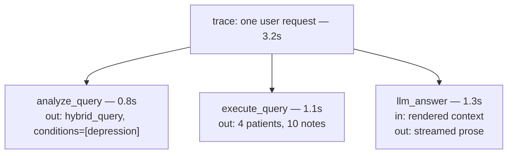

# Day 28 — Observability: Tracing with LangSmith

**Needs: a free LangSmith account (smith.langchain.com); `LANGSMITH_API_KEY` + `LANGSMITH_PROJECT` in `.env`**

## Today you will

- Implement the `traced` wrapper so every pipeline step reports what it did, with timings
- See an entire request — analyzer, retrieval, rendering, answer — as one inspectable trace
- Answer questions you've been answering with `console.log` since the orchestration day, properly

## Concept

Remember the debugging loop from the orchestration day: *symptom → inspect the analysis → fix prompt or fix code.* And remember its tooling: `console.log`, scattered and deleted, re-added next bug. Fine for one developer mid-build. It does not survive production, where the question isn't "why did *my* query do that just now" but **"why did query #4,217 yesterday return nonsense, how slow are we, and what is it costing?"**

**Observability** for an LLM pipeline means recording, for every request, a **trace**: the tree of steps that ran, with each step's inputs, outputs, duration, and errors.



Why this matters *more* for LLM systems than ordinary services: classic bugs reproduce — same input, same bug, attach a debugger. LLM-pipeline failures are *statistical and silent*: the analyzer misroutes 4% of queries, retrieval quietly returns weak matches, the renderer truncates the one fact that mattered. You can't attach a debugger to yesterday. **A trace is a debugger for the past.**

One trace field pays for the whole setup by itself: **what did the model actually receive?** On the orchestration day you printed rendered context to answer that, once, by hand. The trace stores it for every request, forever, searchable. Most "the AI hallucinated!" reports die in thirty seconds once you can read the exact context the model was handed — half the time the answer was wrong because the *context* was wrong, and that's a retrieval bug wearing the LLM's hat.

## Implementation

### 1. Implement `traced`

Open `lib/langsmith.ts`. The client, project config, and `isLangSmithEnabled()` are provided; `traced` currently just runs the function — that pass-through is why your agent has worked all along. Make it real. The contract, per the TODOs in the file:

- If LangSmith isn't enabled (no key set), run the function directly — **observability must never break the pipeline it observes**
- Create a `RunTree` with the name, run type, and inputs; post it
- Execute the function; end the run with its outputs; post the update
- On error: end the run with the error, post, **and re-throw** — tracing records failures, it doesn't swallow them

Note what's *already instrumented*: `lib/agent.ts` wrapped `executeQuery` in `traced(...)` the day you met it. The call sites were waiting; you're lighting up existing wiring.

### 2. Generate and read traces

Run the app, have a few conversations — including one battery query from your failure battery and one hybrid. Then open your project in LangSmith and read a trace end to end.


<!-- TODO(brian): capture from logged-in LangSmith project with a real trace open -->

Find, for one hybrid query:

- The analysis the analyzer produced (intent? entities? — the first stack frame, now permanent)
- The retrieved patient count and note count
- **The exact rendered context** — the model's actual input
- The duration of each step, and which step dominates

### 3. Widen the net

`traced` is generic — wrap more of the pipeline and watch the trace tree grow. Good candidates: `analyzeQuery` inside the analyzer (runType `'llm'`), `searchClinicalNotes` (runType `'retriever'`). One wrap each; the goal is a trace where every box in your Day 1 architecture diagram reports for duty.

### Common mistakes

- **Tracing that can crash the request.** If LangSmith is down or the key is bad and your wrapper throws, observability just took production with it. Failure-isolate: catch tracing errors, `console.error` them, return the function's result anyway.
- **Swallowing errors instead of re-throwing.** If `traced` catches the function's error and returns `undefined`, every downstream bug becomes "why is this undefined" instead of the real stack trace. Record, then re-throw.
- **Tracing secrets.** Inputs and outputs go to a third-party service. The query text and rendered context — yes, that's the point. API keys, connection strings, anything from `.env` — never. Audit what your `inputs` objects contain before you ship the wrapper.
- **Reading timings off one trace.** A single 3.2s trace tells you nothing about whether 3.2s is normal — latency questions need the project-level aggregates, not an anecdote. (Where have you heard "one run is an anecdote" before? It's evals all the way down.)

## Your turn

Spend **no more than 60 minutes** here.

1. Implement `traced`; verify the no-key fallback by unsetting the env var and confirming the app still works untraced.
2. Trace five queries including a failure-battery case; do the step-2 read-through for one hybrid.
3. Use traces to answer three questions in your notes, *with numbers*: Which pipeline step is slowest on average? What did the model receive for your battery case — and was it what you assumed? How many LLM calls does one chat turn actually make (count them in the trace — the answer surprises most students)?

## Check yourself

- Why must `traced` re-throw, and why must it never throw its *own* errors?
- A user reports a wrong answer from three days ago. List your steps, in order, with tracing in place.

<details>
<summary>Solution / discussion</summary>

A reference implementation shape:

```typescript
export async function traced<T>(
  name: string,
  fn: () => Promise<T>,
  options?: { runType?: 'llm' | 'chain' | 'tool' | 'retriever'; inputs?: Record<string, unknown>; metadata?: Record<string, unknown> }
): Promise<T> {
  if (!isLangSmithEnabled()) return fn();

  const run = new RunTree({
    name,
    run_type: options?.runType ?? 'chain',
    inputs: options?.inputs ?? {},
    extra: { metadata: options?.metadata },
    project_name: LANGSMITH_PROJECT,
  });

  try {
    await run.postRun();
  } catch (e) {
    console.error('tracing unavailable:', e);
    return fn(); // observability never takes down the pipeline
  }

  try {
    const result = await fn();
    await run.end({ outputs: { result } });
    await run.patchRun();
    return result;
  } catch (error) {
    await run.end({ error: String(error) });
    await run.patchRun();
    throw error; // record, then re-throw
  }
}
```

**The two error rules are one principle** seen from both sides: tracing is a *witness*, not a participant. It must report the crime (re-throw the function's error after recording) and must never commit one (its own failures degrade to console noise, never to request failures).

**The three-day-old bug, in order:** find the trace (search by time/user/query text) → read the analysis (misroute? bad entities?) → read the rendered context (was the truth in there?) → read the answer against the context (did the model ignore good context, or faithfully use bad context?). Each step exonerates or convicts one pipeline stage — without tracing, that's four guesses; with it, four lookups. The "count the LLM calls" exercise usually lands on 2 per turn (analyzer + answerer) — and seeing it *in the trace* is what makes cost conversations concrete later.

</details>

## Further reading (optional)

- [LangSmith docs: observability](https://docs.langchain.com/langsmith/observability) — project-level views (latency percentiles, token usage) that single traces can't show
