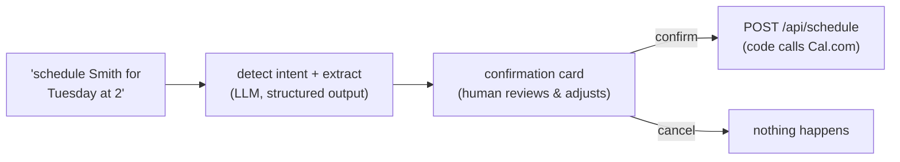

# Day 29 — Human-in-the-Loop: The Scheduling Flow

**Needs: a free Cal.com account (`CAL_API_KEY`, `CAL_EVENT_TYPE_ID` in `.env`); the traced pipeline**

## Today you will

- Give the system its first ability to *act* on the world — booking real appointments
- Build the human-in-the-loop pattern: AI proposes, human approves, code executes
- Wire intent detection (structured outputs again), the confirmation flow, and the audited action

## Concept

Everything so far *reads*. Today the system gets its first *write*: booking an appointment on a real calendar. And the moment an AI system can act, a design question outranks all others:

**Does the AI act, or does the AI propose?**

The pattern you'll build — **human-in-the-loop (HITL)** — answers: propose. The model detects that the user wants to schedule, extracts the details, and *suggests* the action; a human reviews the actual parameters and clicks confirm; only then does deterministic code call the calendar API.

Why a human gate here, when no gate guards your *search* tools? Weigh any action on two axes: **reversibility** and **cost of being wrong**. A bad search result costs a shrug and a rephrase. A hallucinated appointment books a real slot, emails a real (synthetic, today) patient, and silently corrupts a clinic's day. Low-stakes-reversible → automate freely; consequential-irreversible → human gate. You already *saw* this pattern from the other side: Claude Desktop asked your approval before every MCP tool call. Today you build the gate yourself.

Notice also *where the boundary sits*: the LLM's authority ends at **proposing structured parameters**. The thing that talks to Cal.com is ordinary code, triggered by a human click, with the human-approved values. The model never holds the trigger.

## Implementation

Three pieces, in dependency order. (The chat UI's confirmation card is already built — it appears when your agent returns a `schedulingAction`.)

### 1. Intent detection — `lib/scheduling.ts`

The skeleton wants a zod schema and a `detectSchedulingIntent(query)` — and you already know this entire pattern from the structured-outputs day. The schema: `isSchedulingRequest` (boolean), `patientName` (nullable — *do not invent a patient*), suggested date/time (nullable), `reason` (nullable). The function: `responses.parse` + `zodTextFormat`, `temperature: 0`, final `.parse`.

One genuinely new wrinkle: **"next Tuesday" needs today's date** — the model doesn't reliably know it. Pass the current date in the system prompt and demand resolved `YYYY-MM-DD` output. (You met this exact trap in the structured-outputs solution discussion; now it's load-bearing.)

### 2. The agent hands off — `lib/agent.ts`

Those scheduling TODOs you've been stepping around since the agent day: now. Uncomment and complete the flow per the comments — detect first; if it's a scheduling request, use the scheduling system prompt and return the `schedulingAction` object alongside the stream. The UI takes it from there: card, editable fields, confirm button.

### 3. The action — `lib/calendar.ts` and `app/api/schedule/route.ts`

`scheduleAppointment` is a TODO around one Cal.com API call (`POST ${CAL_API_BASE}/bookings?apiKey=...` — the file's comments spell out the payload). The route handler receives the *confirmed* values from the UI and has TODOs for: validation, the config check (503 when Cal.com isn't configured), **a `traced(...)` wrapper** — yesterday's instrument, recording every consequential action with `metadata: { action: 'human_confirmed_scheduling' }` — and the booking call.

Then run the whole loop in the chat UI: *"schedule Abe for next Tuesday at 2pm"* → card appears with extracted values → adjust the time → confirm → check your Cal.com dashboard for the real booking → find the trace.

### Common mistakes

- **Letting the model's output reach the API directly.** If the confirm button posts the *model's* extraction rather than the *card's current values*, the human gate is decoration — the user's edits vanish and the model effectively booked. The card state, not the model output, is the source of truth.
- **Defaulting instead of asking.** No patient name extracted? The wrong move is scheduling for a guessed patient; the right move is `patientName: null` and a card (or follow-up) that demands a human fill it. Nullable schema fields are how the model says "I don't know" — honor them end to end.
- **Skipping the trace on the write path.** Reads get traced for debugging; *writes* get traced for accountability. "Which appointments did the system book last week, triggered by whom?" must be answerable — that's yesterday's lesson applied to today's stakes, and it's a warm-up for the build day.
- **Date math in the model.** If your eval of `detectSchedulingIntent` shows flaky dates, resist prompt-tinkering toward calendar arithmetic. Extract *relative* intent if needed ("tuesday", "next week") and resolve in code — deterministic work belongs in deterministic layers.

## Your turn

Spend **no more than 60 minutes** here.

1. Complete all three pieces; book a real appointment through the full loop; verify it on the Cal.com dashboard *and* in LangSmith.
2. Probe the gate: try to schedule with no patient name; with a date in the past; while mid-conversation about a *different* patient (does it grab the wrong name from history?). Record behaviors in your failure battery — these are new bait categories for a system that can act.
3. In your notes: list two more actions this system might someday take (refill request? referral letter?) and, for each, place it on the reversibility/cost grid — gate, or no gate?

## Check yourself

- State the HITL boundary in one sentence: what is the LLM allowed to produce, and what is it never allowed to touch?
- Why does the schedule route validate `patientName` and `dateTime` again, when the UI already required them?

Solution / discussion

**The boundary:** the LLM produces a *proposal* — structured, nullable-where-unknown parameters for a human to review; it never holds the trigger that causes the external effect. (MCP taught you the same shape from the client side; the confirmation card is your version of Claude Desktop's approval prompt.)

**Re-validation at the route:** the route is an HTTP endpoint, and the UI is only its *polite* caller — anything that can POST can hit it with missing or malformed fields. Validation at the boundary belongs to the boundary; trusting upstream callers is how "the UI validates it" becomes a postmortem sentence. (The course returns to exactly this point, harder, when the API grows real authentication in the final block.)

**The history-contamination probe** (scheduling while discussing another patient) is the subtle one — extraction over conversation history can grab a *contextually present but wrong* name with full confidence. If you caught it: that's a few-shot example for the scheduling prompt *and* a permanent battery case. If you didn't catch it — it's in the battery now, which is the entire point of keeping one.

**The reversibility grid** for the two futures: a refill *request* that a pharmacist reviews is a proposal already — light gate. A referral letter sent under a clinician's name is consequential and reputational — hard gate, probably with sign-off stronger than one click. The grid generalizes: the question is never "can the model do it," it's "what does wrong cost, and who absorbs it."

## Further reading (optional)

- [Cal.com API documentation](https://cal.com/docs/api-reference) — the booking endpoint behind today's one consequential function call
