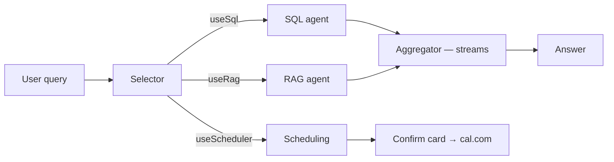

# Week 3 — The agent pipeline

**Session:** Saturday · [recording posted in Slack]
**Needs:** everything so far, plus `LANGSMITH_API_KEY`, `CAL_API_KEY`, `CAL_EVENT_TYPE_ID`

The longest session of the course, and the one where the app becomes an app.

## What we built



`app/api/chat/route.ts` **is** the orchestrator. Not a framework, not a graph
library — a route handler with some `if` statements. That's deliberate.

### 1. The anatomy of an agent

Before writing four of them, we named what they all have:

| Piece | What it answers |
|---|---|
| **System prompt** | what am I doing here |
| **Context** | what do I need to know to do it |
| **Model + settings** | which model, what temperature, token cap |
| **Structured output** | what shape do I hand back |
| **History** | what was already said |

An agent is an API call with those five things filled in. Everything else is
plumbing.

**History matters more than it looks.** The model remembers nothing between calls.
"How many patients have hypertension?" → "63." → "list them out" — that last
message is meaningless without the previous two. We pass `history.slice(-5)`
everywhere.

### 2. Why not just chain agents

The obvious design is agent → agent → agent → agent. Here's the arithmetic that
kills it: if each step is 90% reliable, four in a row is 0.9⁴ ≈ **66%**. And 90%
is generous — public agent benchmarks on complex end-to-end tasks sit around 50%.

So: **single responsibility per agent, minimum hops, parallel where possible.**
The selector decides; the specialists retrieve; the aggregator writes. Nobody does
two jobs.

### 3. The SQL agent — text-to-SQL, not a query builder

`lib/agents/sql.ts`. The LLM writes the SQL. We do not hand-code query builders,
and there is no `CONDITION_MAPPINGS` layer — that was deleted on purpose and
should not come back. When a query returns wrong results, you fix the *prompt*,
never add a per-question function.

Two things make it work:

**Schema.** The model needs to know the tables and columns exist. We pull them
programmatically rather than pasting a snapshot, so the prompt can't drift from
the actual database.

**Grounding.** The schema says a column exists; it doesn't say what's *in* it.
"Smoker" is stored as `Smokes tobacco daily`. "Heart attack" is stored as
`Myocardial Infarction`. So we feed real distinct values into the prompt. This is
the single highest-leverage thing in the whole SQL path.

Two guardrails, and they're the point:

- **`assertReadOnly`** — accepts a single `SELECT`. No DML, no DDL, no semicolons.
  An LLM writing SQL is an injection surface; treat it like one. In production
  you'd also point `DATABASE_URL` at a read-only role.
- **Grounding**, above — a correct query against misunderstood values is still a
  wrong answer.

It worked well in class. `How many patients over 100 are in our system?` produced
a correct date-interval query on the first try — and when someone pointed out it
should exclude deceased patients, the follow-up question got it right *using the
conversation history*.

### 4. The RAG agent and the aggregator

The **RAG agent** (`lib/agents/rag.ts`) is barely an agent — it runs the search
from week 2 and renders the results as text. That's fine. Not everything needs an
LLM.

The **aggregator** (`lib/agents/aggregator.ts`) is the only component that
streams. It takes the query, the history, and whatever text the specialists
produced, and writes one grounded answer:

```ts
system: `Use the information provided to answer the user's question.
NEVER INVENT OR INFER MEDICAL INFORMATION. ONLY ANSWER FROM THE PROVIDED INFORMATION.
If you do not have the information to answer the question, say so plainly.`
```

We wrapped the payload in `<user-question>`, `<conversation-history>`, and
`<retrieved-data>` tags. That's a boundary marker for the model, not magic — it
won't rescue a bad prompt, but it makes "what is data vs. what is instruction"
unambiguous.

> **Model choice bit us here.** `gpt-4` has an 8K context window, and patients with
> many notes silently blew past it. Switching the aggregator to **`gpt-4o`** fixed
> it. If your app works for most patients and mysteriously fails on a few, this is
> your first suspect.

### 5. Human-in-the-loop scheduling

The system can book a real appointment. It never books one by itself.

`lib/scheduling.ts` extracts structure from the request — patient name, date, time,
reason — resolving *"tomorrow"* and *"next Tuesday"* against today's date, and
resolving *"him"* against the conversation history. Then the route short-circuits:
if `plan.useScheduler`, skip retrieval entirely and stream back a response with
the action smuggled in a header:

```ts
return streamText({ ... }).toTextStreamResponse({
  headers: { 'X-Scheduling-Action': encodeURIComponent(JSON.stringify(schedulingAction)) },
});
```

The header exists because the response is a *stream* of text. Structured data has
nowhere else to ride. The front end reads that header, renders a confirm card
with editable date and time, and **nothing happens until a human clicks the
button** — which posts to `/api/schedule` and calls cal.com.

That's the pattern: **propose → approve → execute.** Booking an appointment is
low-stakes; the habit is not. The more irreversible the action, the more this
matters.

### 6. Observability

We wired up [LangSmith](https://smith.langchain.com/) — three lines, wrapping the
OpenAI client — and suddenly every call in the pipeline is inspectable: what the
selector decided, what the SQL agent wrote, what tokens cost, what the user
actually asked.

Console logs cannot debug a non-deterministic system. You need the trace from
*before* you changed the prompt. Wire this early; it costs nothing.

## Homework

### 1. Get the app working — all of it

- **Finish the scheduler** if you didn't wrap it in class. *"Schedule him for
  Tuesday"* should detect the intent, pull the patient from the conversation, and
  pop the confirm card.
- **Extend vector search to use metadata** (bonus). The selector or a small
  extraction step can pull `firstName`, `race`, `gender` out of the question and
  pass them as a filter. This is where few-shot examples earn their keep — see
  the `FEW_SHOT` scaffold commented out in `lib/agents/selector.ts`. Uncomment it,
  add an example from a misroute you actually hit, and watch the routing change.
- **Polish the flow.** Chase the questions that route wrong or answer badly, and
  fix the prompts until the common cases feel solid.

By the end you should be able to open the app and get grounded answers to SQL
questions, note questions, hybrid questions, and general questions — and book an
appointment.

Working copies from the session are linked in Slack: chat route, page, aggregator,
rag, selector, sql, openai, scheduling.

### 2. Collect your query/response examples — do this AS you build

**This is the part that matters going forward.** Keep a running log of what you ask
and what comes back. **At least 10 pairs.** Any document is fine — Google Doc,
markdown, notepad. It does not need to be fancy. You can pull them straight out of
LangSmith.

**Log both good and bad. The bad ones are just as useful:**

```
Q: How many patients have hypertension?
A: 63
✅ good: exact number, and it's the RIGHT number

Q: Which patients have a history of heart disease?
A: [list of patients]
✅ good: mapped "heart disease" to the stored term and returned real people

Q: something that came back wrong / vague / hallucinated
A: the bad answer
❌ bad: why — wrong count, missed the filter, made something up
```

**Keep this list.** It becomes your eval set. It costs nothing to collect while
you're building and is painful to reconstruct later.

### 3. Video — tool calling (the required deliverable)

Short and light, a few minutes.

- **What is tool-calling?** In plain terms.
- **Why does it matter?**
- **How would you refactor THIS project to use it?** Right now *the code* decides
  what runs: the selector routes, the route calls the agents. With tool-calling,
  *the model* decides which tool to call. Sketch how ours would change.
- **Draw a small diagram.**

No right answer. I want your reasoning.

[OpenAI — Function calling](https://developers.openai.com/api/docs/guides/function-calling)

## When it breaks

- **Answers cut off or fail only for certain patients.** Aggregator context
  window — move to `gpt-4o`.
- **The scheduler books dead patients.** It will. The demo data has ~800 deceased
  patients and nothing stops you. Good catch, real lesson: the model has no idea
  what's *sensible*, only what's *asked*. A live-patients list is pinned in Slack.
- **`X-Scheduling-Action` never reaches the front end.** Check you're returning
  `.toTextStreamResponse({ headers })` and not a plain `NextResponse.json`.
- **The confirm button 404s.** cal.com v2 API — the docs link is in Slack, and the
  v1 shape will not work.
- **Everything routes to RAG.** Your selector's `.describe()` strings are too
  vague, or the system prompt never explains what SQL is *for*. Add few-shot
  examples before adding more prose.

## Check yourself

- Ask the app a SQL question, a notes question, a hybrid question, and a general
  question. All four should behave differently and correctly.
- Book an appointment end to end and see it in your cal.com dashboard.
- Open LangSmith and trace one query from selector to answer.
- You have 10+ logged pairs, including at least three bad ones.
