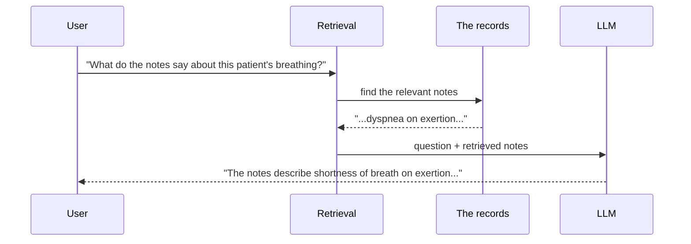
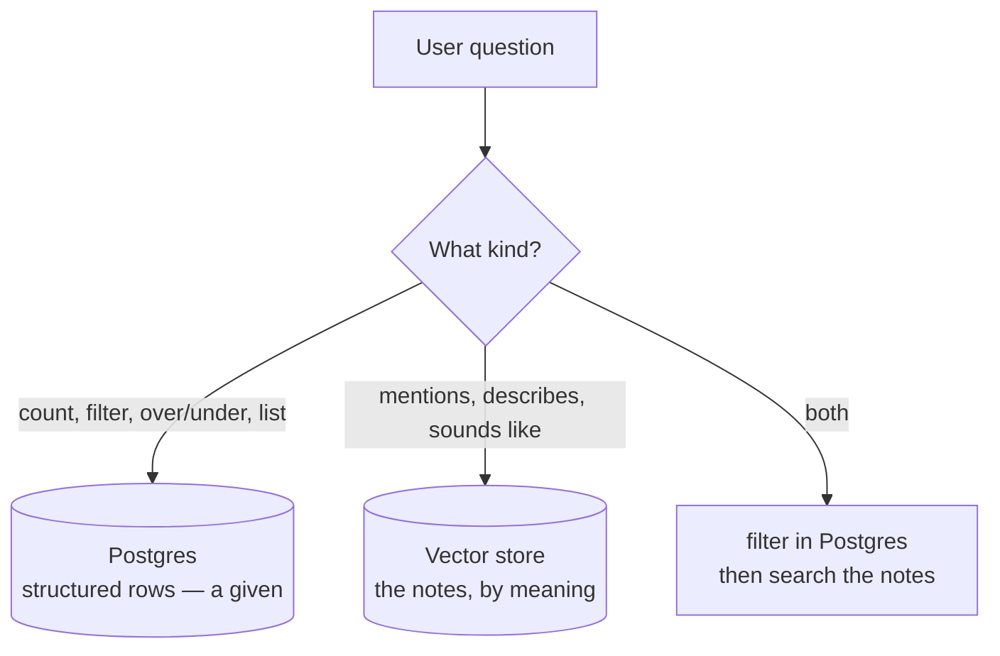

# What RAG Actually Is — and the One Thing Your Database Can't Do

**Needs: nothing installed — just a browser and a notes file**

## Today you will

- See what you're building this week — and why the database the company already has can't answer half its questions
- Understand the one problem RAG exists to solve
- Learn to tell a question the database answers exactly from one that needs *meaning*
- Write down the queries you'll test your own system against later

## What you're joining

You didn't build this company's data. It's already here — a Postgres database with **1,278 patients**: their conditions, medications, lab values, visit dates, and the free-text **clinical notes** a clinician wrote at every encounter. Roughly **143,946 notes** in all, about **113 per patient** on average. Nothing to ingest, nothing to seed. You connect to it and it's full.

Your job is the layer *on top*: make it possible to **ask in plain English and get an answer grounded in the actual records** — and a refusal, not a guess, when the answer isn't there.

The database already answers a whole class of questions beautifully:

- *"How many patients have diabetes?"* — a `COUNT`.
- *"List patients over 65 on blood pressure medication."* — a `WHERE` clause.

Those are exact, structured questions, and Postgres was built for them. We are **not** going to reteach that. It's a given.

The problem is the other half of the story. When these records were built, the *codeable* facts each got a column — a diabetes diagnosis, a prescription, a lab value. But the **narrative never did**: why the patient actually came in, the symptoms in their own words, what the clinician noticed and worried about. All of it was written down — it's sitting right there in the notes — but nobody ever turned it into something you can query. There is no "short of breath" column, and there was never going to be one. That half of the record is real, it's valuable, and right now it's unreachable. **Building the layer that reaches it is the whole reason this app exists**: you take the database the company already has and add semantic — and then hybrid — search on top, so the story in the notes finally answers questions too.

## Concept

### Why the LLM can't just answer

Ask GPT-4 or Claude *"what do this patient's notes say about their breathing?"* and it has nothing. Not because it's bad at medicine — because **your patients' records were never in its training data**, and never will be. Your company's charts, yesterday's encounters, this morning's lab result: none of it is in the model.

The fix is almost embarrassingly simple: **fetch the relevant records at question time and paste them into the prompt.** The model doesn't need to *know* your data — it needs to *read* it, right before answering. The data stays live (a note written today is answerable today), and every answer can point at the exact record it came from.

RAG — **Retrieval-Augmented Generation** — is just that idea taken seriously: *find the right context, then let the model read it before answering.*



The hard part of RAG is not the G. Generation is one API call. The hard part is the R — **retrieval is a search problem**, and search problems are where the engineering lives.

### The gap: letters vs meaning

Here's the query that breaks the database. A clinician asks:

> *"Which patients are short of breath?"*

The obvious move is to search the note text for those words:

```sql
SELECT * FROM notes WHERE content LIKE '%shortness of breath%';
```

**Zero rows.** Not because no patient is short of breath — but because the note a clinician actually wrote says *"dyspnea on exertion."* Same fact. Zero shared words. `LIKE` matches **letters**; the question was about **meaning**.

You can't patch this with more `OR` clauses. "Shortness of breath" is also "SOB," "winded climbing stairs," "difficulty breathing," "can't catch her breath." Nobody can enumerate every phrasing a human might write, and the moment you try, you've built a synonym dictionary you have to maintain by hand forever.

That is the one problem this week exists to solve: **search that matches meaning, not spelling.**

### Two kinds of questions

Hold these two side by side:

1. *"How many patients have type 2 diabetes?"*
2. *"Find patients whose notes mention trouble sleeping."*

Query 1 is a **structured** question. There's an exact answer — a `COUNT` over rows. A meaning-based search would be the wrong tool: it returns a *ranked list of similar things*, and "how many" is not a ranking, it's an integer.

Query 2 is a **semantic** question. No `WHERE` clause matches "trouble sleeping" against a note that says *"patient reports difficulty falling asleep, wakes frequently."* Same meaning, no shared keyword. Answering it needs a search that understands meaning.

Most real questions are one of these — or a **hybrid** of both: *"What do the notes say about sleep for patients with depression?"* (structured filter first, then meaning-based search within that set). The routing between them is a problem for later. This week is about building the meaning half and understanding exactly how it works.



> **Why not force it all through Postgres?** "Patients over 65 with high blood pressure diagnosed after 2020" is a *relational* query — joins, aggregates, exact comparisons. Forcing that through a search engine is fighting your tools. But Postgres genuinely cannot find "shortness of breath" in a note that says "dyspnea." Each engine does the job the other can't. You'll feel that split in your hands by the end of the week.

Every patient here is **synthetic** — statistically realistic, no real person — so you practice the exact safeguards a real clinical system needs on data that's safe to break.

## Implementation

No code today — but real work. Read one raw clinical note, because every decision this week flows from knowing the data. Here's the shape of every note in the store — a SOAP-style write-up:

```
1926-06-19

# Chief Complaint
No complaints.

# History of Present Illness
Patient is a 7 month-old non-hispanic white male.

# Social History
Patient has never smoked.

# Allergies
No Known Allergies.

# Medications
No Active Medications.
```

Notice two things you'll exploit this week:

- It has **structure** — headed sections, a date, one encounter's worth of narrative.
- It's **short** — about 450 characters on average. That single number decides a real architecture choice later this week, and it's a measurement, not a vibe.

### Common mistakes

- **"RAG is dead, context windows are huge now."** A 1M-token window doesn't fix this. The notes alone are tens of millions of characters; they don't fit. Even when data *fits*, stuffing it all in costs money per query and *degrades* answers (models reason worse over haystacks). Retrieval is selection, and selection is the point.
- **Thinking meaning-search replaces the database.** It answers "what is *similar* to this?" It cannot answer "how many," "most recent," or "exactly which." Half the skill is knowing which question you're holding.
- **Skipping the data.** Every bad retrieval decision later traces back to someone who never read their own documents.

## Your turn

Spend **no more than 30 minutes** here. Start a notes file you'll keep all course, and write down:

1. **Five queries** a clinician or front-desk worker might ask this system. Label each `structured`, `semantic`, or `hybrid`.
2. For one `semantic` query: two phrasings that *mean the same thing but share zero keywords* (like "shortness of breath" vs "dyspnea"). You'll run these against your own system later this week.
3. One question this system should **refuse** to answer. Keep it — it becomes a guardrail test later in the course.

## Check yourself

You're done when you can answer these without scrolling up:

- Why can't the LLM answer questions about this company's patients out of the box — and what does RAG do about it?
- The database has every note's full text. So why does `LIKE '%shortness of breath%'` return zero rows for a patient who is, in fact, short of breath?
- What makes a query *hybrid*? Give an example that isn't the one above.

<details>
<summary>Solution / discussion</summary>

**Example query labels:**

| Query | Type | Why |
|---|---|---|
| "How many patients take insulin?" | structured | exact count over medication rows |
| "List patients on blood pressure medication" | structured | filter over medication rows |
| "Patients describing chest pain at night" | semantic | meaning-match over note text |
| "Do any diabetics mention medication side effects in their notes?" | hybrid | condition filter (SQL) → note search |
| "Summarize this patient's health history" | hybrid | row lookup + their notes |

**Why `LIKE` fails:** it matches character sequences. "Dyspnea on exertion" and "shortness of breath" are the same clinical fact with no letters in common, so a literal search can't connect them. That gap — spelling vs meaning — is exactly what a vector store closes, and it's the whole subject of this week.

**A refusal example:** "What dosage of ibuprofen should I give this patient?" — the system retrieves records; it must not practice medicine. We encode that later and test it with adversarial queries.

</details>

## Further reading (optional)

- [3Blue1Brown — But what is a GPT?](https://www.youtube.com/watch?v=yMQPQuz5WpA) — the best high-level picture of what an LLM actually *is*. You don't need it to build the system, but if "the model predicts the next token" has always been a black box, 27 minutes here fixes that.
- [The original RAG paper (Lewis et al.)](https://arxiv.org/abs/2005.11401) — skim the abstract; the ideas aged well.
</content>
</invoke>
