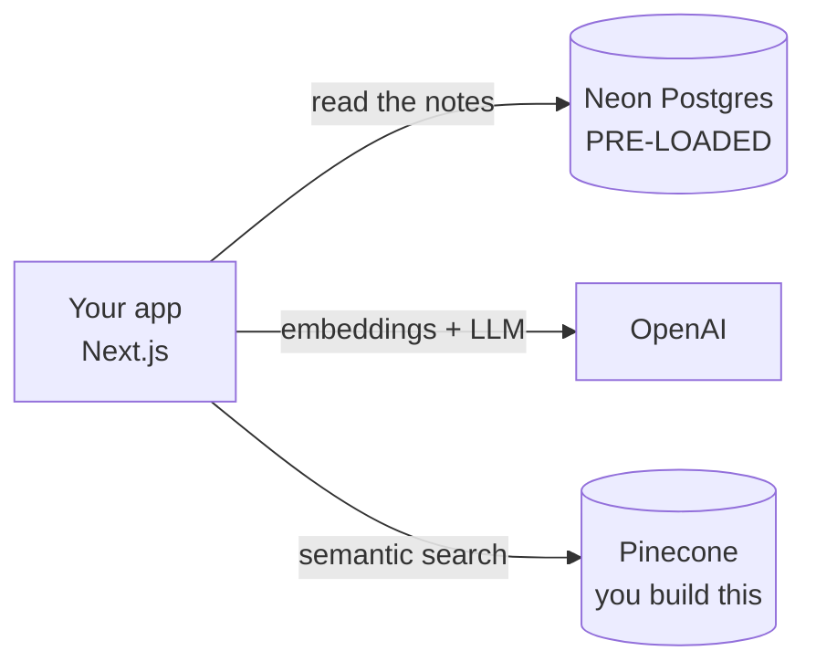
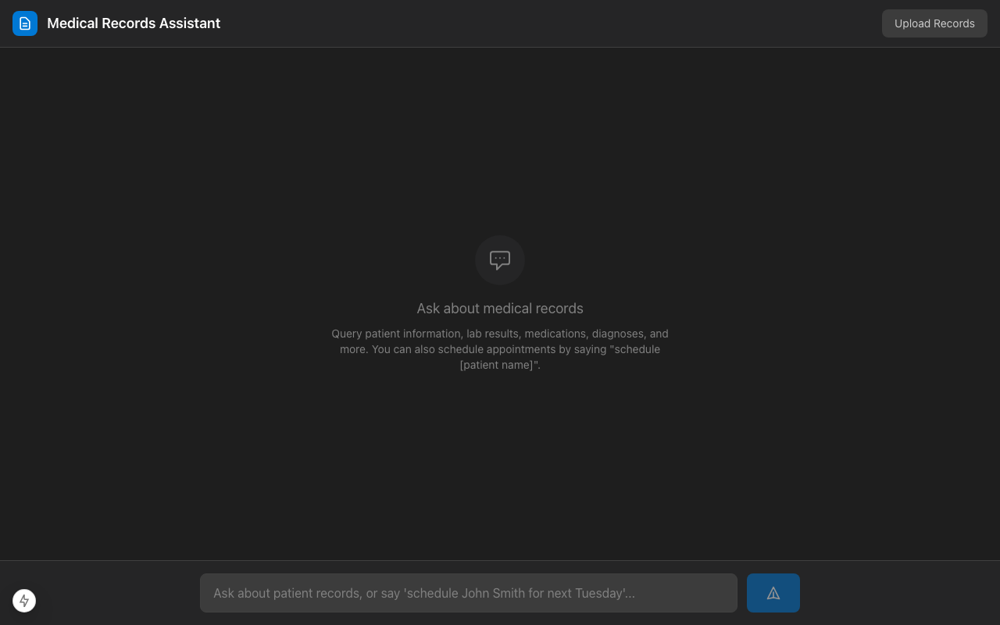

# Setup: Connect to the Data, Get Your Keys

**Needs: GitHub account, Node 20+, the connection string your instructor hands you, and sign-ups for OpenAI and Pinecone (both have free tiers)**

## Today you will

- Get the app running locally on the `student` branch
- Connect to the **pre-loaded** company database (read-only — you never modify it)
- Add your OpenAI and Pinecone keys, and confirm your environment is healthy

## Concept

A RAG system is not one program — it's your code plus a few hosted services it calls. Each hands you a secret key your code reads from a `.env` file.



Three services, three jobs:

| Service | Job | Who fills it |
|---|---|---|
| **Neon (Postgres)** | The system of record — patients, conditions, labs, meds, and all the notes | **Already loaded. You connect to it.** |
| **OpenAI** | Turns text into vectors (embeddings) and powers LLM answers | You, with a key |
| **Pinecone** | The vector store — the searchable-by-meaning index you'll build this week | You, with a key |

The big thing to internalize: **you are joining a company that already has its data.** Nobody creates or seeds the database. You're given a connection string to a database that's already full — 1,278 patients, ~143,946 notes — and you connect **read-only**. The layer you build this week (the vector store) sits on top of it.

> **Why `.env` and not hardcoding keys?** A key in source is a key in git history forever, readable by anyone with repo access. `.env` is gitignored — it never leaves your machine. A leaked OpenAI key means someone spends your money; a leaked database URL means someone reads the data. Treat `.env` like a password file, because it is one.

## Implementation

### 1. Get the code and install

```bash
git clone <repo-url> && cd medical-rag
git checkout student
npm install
```

### 2. Get your credentials

- **The database** — your instructor gives you a **connection string to the pre-loaded database** (a read-only role, or a per-student copy). You do **not** create or load anything. Paste the string, exactly as given, into `DATABASE_URL`. Read-only is expected — you never modify the source of truth.

- **OpenAI** — [platform.openai.com](https://platform.openai.com) → **API keys** → create one. It starts with `sk-`. Add a few dollars of credit; the whole course costs about the price of a coffee. You need this to turn notes into vectors.

- **Pinecone** — [pinecone.io](https://pinecone.io) → copy your API key. This is *your* vector store — you'll build it from the company's notes this week. The `vectorize` script creates the index for you on first run.

### 3. Fill in `.env`

```bash
cp .env.example .env
```

Open `.env` and paste each value in:

```
DATABASE_URL="postgresql://...the string your instructor gave you..."
OPENAI_API_KEY=sk-...your key...
PINECONE_API_KEY=...your key...
PINECONE_INDEX=medical-notes
```

### 4. Run it

```bash
npm run dev
```

Open the URL it prints (usually `http://localhost:3000`, occasionally `:3001` if something else holds `:3000`). You should see the **Medical Records Assistant** chat interface.


<!-- TODO: capture screenshot -->

It won't *answer* anything useful yet — the meaning-based search engine isn't built. A running, empty-handed app is exactly the right outcome for today.

### 5. Confirm the connection and the suite

Check the database is reachable and full:

```bash
npm run db:studio
```

Prisma Studio opens in the browser. Click into `patients` and `notes` — you should see thousands of rows you did nothing to create. That's the pre-loaded source of truth. (You're read-only; browsing is fine, don't edit.)

Then run the tests:

```bash
npm run test:run
```

You'll see a mix of passing and failing tests. **That is correct and intended** — the failures are the assignments waiting for you. What you're checking is that the suite *runs at all* (Node, install, and TypeScript are healthy).

### Common mistakes

- **Quoting `DATABASE_URL` wrong.** Keep it in double quotes exactly as given, `?sslmode=require` and all. A stray space or missing quote is the #1 setup error.
- **Trying to seed or migrate the database.** Don't run `db:push`, don't reset anything — the data is already there and you're read-only. If a command wants to *write* schema, you're on the wrong path.
- **Committing `.env`.** Run `git status` — if `.env` appears, stop. It's gitignored by default; if you see it, you renamed something.
- **Wrong Node version.** `node --version` below 20 and Next.js throws cryptic errors. `nvm install 20` if needed.
- **Pasting the OpenAI *project* ID instead of the key.** The key starts with `sk-`; the project ID (`proj_...`) is not it.

## Your turn

Spend **no more than 20 minutes** here.

1. Get `npm run dev` showing the chat UI and `npm run db:studio` showing real patient/note rows.
2. Record the test summary line (e.g. "24 failed | 148 passed") in your course notes. You'll watch that "failed" number shrink — it's your progress bar.
3. Run `git status` and confirm `.env` does **not** appear.

## Check yourself

```bash
npm run dev        # chat UI loads
npm run db:studio  # patients + notes tables are already full
npm run test:run   # suite runs to completion
git status         # .env is NOT listed
```

- Why does the app run but not answer meaning-based questions yet?
- You did nothing to create the patient rows — so where did they come from, and what's your relationship to them?

<details>
<summary>Solution / discussion</summary>

**The app runs but can't answer meaning questions** because the vector store — the searchable-by-meaning copy of the notes — doesn't exist yet. The database (structured rows *and* the full note text) is there; what's missing is the derived index you build this week and the search code on top of it.

**Where the rows came from:** the company's data was loaded into Postgres before you arrived; you connect to it read-only. This is the whole framing — the structured data is a *given*. Your work is the semantic-search layer that sits on top, which is why nothing here asks you to ingest or seed anything.

**If `.env` gets committed:** removing it in a later commit is not enough — it's still in history. Treat the key as compromised and **rotate it** (regenerate it in the dashboard). Rotation is the fix; deletion just hides it.

</details>

## Further reading (optional)

- [Neon docs: connection errors](https://neon.tech/docs/connect/connection-errors) — if your `DATABASE_URL` misbehaves.
</content>
