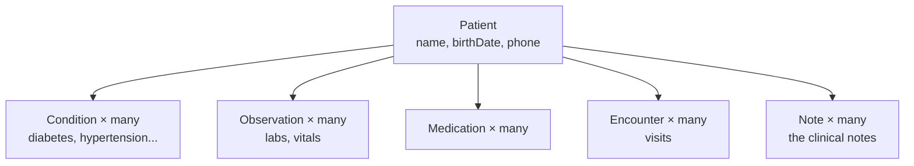

# Meet the Data: What's Already in the Database

**Needs: the connection working from the setup lesson (`npm run db:studio` opens)**

## Today you will

- Learn the shape of the data the company already has — the tables and how they relate
- See the one fact that drives every later decision: **one patient has *many* notes**
- Read a real clinical note straight out of the database

## Concept

You can't build good retrieval over data you haven't read. Today is reading — and the data is already sitting in Postgres, so there's nothing to load. You just look.

The database holds **1,278 synthetic patients**. Synthetic is the point: statistically realistic (real conditions, real medication patterns, real messiness) but zero actual humans, so there's no privacy risk while you learn. Later, when you build PII handling, you'll be glad you practiced on data that's safe to break.

Six tables carry everything you'll touch this course:



| Table | What it holds | Used for |
|---|---|---|
| `Patient` | one row per person — name, birth date, contact | lookups, filters |
| `Condition` | diagnoses (diabetes, high blood pressure…) | structured filters |
| `Observation` | labs and vitals (numbers) | structured filters |
| `Medication` | prescriptions | structured filters |
| `Encounter` | visits — date, type, status | structured filters |
| `Note` | the free-text clinical narrative, one per encounter | **meaning-based search — this week's subject** |

The first five are **structured rows**: exact values the database queries exactly. That half is a given — the company built it, you connect to it. The sixth, `Note`, is where the rest of the story lives. Everything the structured tables *didn't* capture — the symptoms in the patient's own words, why they came in, what the clinician observed — was written into these notes and never turned into a column. Its full content is right there in Postgres too (`note.content`) — but Postgres can only match it by *letters*. Turning it into something searchable by *meaning*, so that half of the record finally answers questions, is the week's work.

### One patient, many notes

The single most important fact about this data: **a patient is not one note — they're many.**

The average patient has about **113 notes** (143,946 notes ÷ 1,278 patients). The spread is wild: some patients have 2, one has **2,162**. Each note is one encounter — one visit, one date, one self-contained narrative.

That has consequences you'll feel all week:

- "Summarize *this patient's* health history" means gathering *their* notes out of ~144,000 — so every note had better be tagged with *which patient it belongs to*.
- A single patient's chart is dozens of separate pieces, not one document. When you make notes searchable, each note becomes its own searchable unit.

Hold onto the number 113. It comes back when you build search and when you decide (later this week) whether the notes need splitting.

## Implementation

### 1. Browse it

```bash
npm run db:studio
```

Prisma Studio opens. Click `patients`, then a single patient row, then follow the relation into their `notes`. Count them. Now pick a different patient and count again — the numbers won't match, and that's the data being realistic, not broken.

### 2. Read a note by hand

Open the `notes` table, click any row, and read the `content` field. That's a SOAP-style note — the same shape you saw earlier: a date, then headed sections (Chief Complaint, History of Present Illness, and so on). This exact text is what your meaning-based search will operate on.

### 3. Confirm the "many notes" fact yourself

A tiny script, if you'd rather see it in numbers than click around. Reads straight from the database (read-only):

```typescript
import 'dotenv/config';
import { PrismaClient } from '@prisma/client';

const prisma = new PrismaClient();

async function main() {
  const patients = await prisma.patient.count();
  const notes = await prisma.note.count();
  console.log(`patients: ${patients}`);
  console.log(`notes:    ${notes}`);
  console.log(`avg notes/patient: ${(notes / patients).toFixed(1)}`);
}
main().finally(() => prisma.$disconnect());
```

Run it:

```bash
npx ts-node --compiler-options '{"module":"CommonJS"}' meet-the-data.ts
```

You should see ~113 notes per patient.

### Common mistakes

- **Assuming every patient has the same records.** Counts vary wildly — one patient has 2 notes, another has hundreds. Any code you write must handle "0 of X" gracefully.
- **Thinking the note text isn't in Postgres.** It is — `note.content` holds the full note. Postgres just can't search it by *meaning*, which is the whole reason the vector store exists. Postgres is the source of truth for everything, text included.
- **Reading a patient as a single document.** A patient is a *collection* of notes across time. That's why the per-note patient tag matters so much.

## Your turn

Spend **no more than 30 minutes** here.

1. In Prisma Studio (or a script), find: the patient with the *most* notes and the one with the *fewest* you can spot. Record both counts in your notes.
2. Read three notes from three different patients. Mark the section headers you see. Do they all follow the same SOAP scaffolding?
3. Answer in writing: for *"patients on a blood pressure medication"*, which table would you query? For *"patients whose notes mention dizziness"*, which one — and why can't the first table answer the second question?

## Check yourself

- Where does a note's text physically live, and why can't the database search it by meaning?
- Two patients have very different record counts. Name two reasons that's expected, not a bug.
- Why does "one patient has many notes" force every note to carry a patient tag?

<details>
<summary>Solution / discussion</summary>

**"Blood pressure medication"** → the `Medication` table — an exact, structured filter on the drug. **"Notes mention dizziness"** → the notes, searched by meaning, because "dizziness" might be written as "lightheadedness," "vertigo," or "feeling faint." The medication table has no idea what a note says; the two questions live in different halves of the system.

**The note text lives in Postgres** (`note.content`) — Postgres holds everything, it's the source of truth. But it can only match text by letters (`LIKE`), so "shortness of breath" won't find "dyspnea." Meaning-based search is what the vector store adds.

**Different record counts are expected** because (1) sicker or older patients accumulate more encounters, and (2) the synthetic generator randomizes life trajectories. Variance is the data being realistic.

**Why every note needs a patient tag:** with ~144,000 notes pooled together, "summarize this patient" is only possible if each note remembers which patient it belongs to. Lose that tag and one patient's notes bleed into another's answers — a privacy problem, not just a relevance one.

</details>

## Further reading (optional)

- [Synthea Coherent Data Set — MITRE](https://synthea.mitre.org/downloads) — where this synthetic data originally comes from, if you're curious about the source.
</content>
