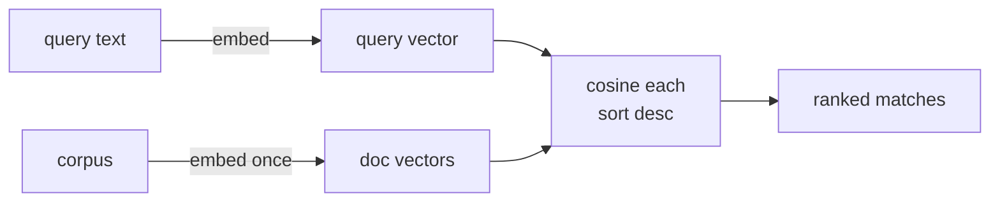

# Be the Vector Database — by Hand

**Needs: `OPENAI_API_KEY` in `.env` (a few cents)**

## Today you will

- Build a working meaning-based search in about ten lines — corpus to vectors to ranked results
- Prove the "dyspnea" match with your own arithmetic, so the vector store is never a black box
- Understand exactly what a real vector database does, and the only two things it adds over your loop

## Concept

Last lesson you scored similarity between a handful of phrases. Now do the thing a search engine does: given a **query**, find the best matches among a **stored corpus**, ranked.

That whole operation is embarrassingly small:

1. Embed every document **once** → a list of vectors.
2. Embed the query → one vector.
3. Score the query against every document with cosine.
4. Sort descending, take the top.

That's it. That loop is a **nearest-neighbor search**, and it is the entire core of a vector database. Everything else Pinecone sells you is wrapped around this.



## Implementation

### 1. Write the whole engine

`scripts/be-the-db.ts` — embeds a tiny corpus, embeds a query, ranks by cosine. No Pinecone, no database, just OpenAI embeddings and arithmetic:

```typescript
import 'dotenv/config';
import { createEmbeddings } from '../lib/openai';

// cosine similarity — the same function from the embeddings lesson
const cosine = (a: number[], b: number[]) => {
  const dot = a.reduce((s, x, i) => s + x * b[i], 0);
  const mag = (v: number[]) => Math.sqrt(v.reduce((s, x) => s + x * x, 0));
  return dot / (mag(a) * mag(b));
};

async function main() {
  const docs = ['dyspnea on exertion', 'broken ankle', 'well-controlled diabetes'];
  const q = 'patient is short of breath';

  // embed the query and all docs in one call; qv = first, dv = the rest
  const [qv, ...dv] = await createEmbeddings([q, ...docs]);

  docs
    .map((d, i) => ({ d, score: cosine(qv, dv[i]) }))
    .sort((a, b) => b.score - a.score)
    .forEach((r) => console.log(r.score.toFixed(3), r.d));
}
main();
```

Run it:

```bash
npx ts-node --compiler-options '{"module":"CommonJS"}' scripts/be-the-db.ts
```

Expected output (the *ranking and the gap* are the point, not the exact decimals):

```
0.7xx dyspnea on exertion      ← no shared words, still #1
0.2xx broken ankle
0.1xx well-controlled diabetes
```

Say it out loud: "short of breath" and "dyspnea on exertion" share **zero letters**, yet cosine puts them on top. That's meaning, not keywords — and it's exactly why `LIKE '%shortness of breath%'` returned zero rows in the first lesson. You just closed that gap in ten lines.

> **Cosine or dot product?** Same ranking here. Cosine is the dot product divided by both vectors' lengths — it measures the *angle* between them, ignoring magnitude. OpenAI's embeddings come back already unit-length, so `dot(a, b)` alone gives the identical ordering — which is why some vector databases default to a raw dot-product metric: fewer operations per comparison. We wrote the full cosine so nobody has to take that on faith. Pinecone's `cosine` metric does the normalization for you.

### 2. So why pay for Pinecone?

If search is just that loop, why not ship the loop? Two reasons, and only two:

1. **Persistence.** Your script re-embeds the corpus every single run. A database embeds once and *keeps* the vectors — you pay the embedding cost one time. Re-embedding ~21,000 notes on every query would be absurd.
2. **Speed at scale.** Your loop compares the query against *every* vector — fine for 3, hopeless for 21,090 (that's 21,090 cosine computations per query). A vector database builds an **index** — approximate nearest-neighbor search — that finds the closest vectors *without* checking every one, trading a sliver of accuracy for enormous speed.

Everything else (metadata filtering, the API, the dashboard) is convenience around those two. The *search* is the loop you just wrote — so when you call Pinecone later this week, you already know exactly what it's doing under the hood.

### Common mistakes

- **Thinking the database does something magic on a search.** It doesn't. It embeds the query and ranks by similarity — your loop, made persistent and fast. If you understand the loop, you understand vector search.
- **Re-embedding on every comparison.** In the by-hand version, embed the corpus *once* before the loop, not inside it. Each embed is an API call; embedding in a loop is slow and costs money.
- **Judging by the top hit alone.** Look at the *gap* to #2. A clear winner means the query discriminated well; a flat cluster of near-equal scores means it didn't — a lesson you'll meet again when you break the real search.

## Your turn

Spend **no more than 30 minutes** here.

1. Run the by-hand search. Then swap in a query that shares *words* with a wrong doc but *meaning* with a right one — e.g. add `'the patient stole a glance'` to `docs` and query `'do not take what belongs to someone else'`. Does meaning win over the shared word "take/stole"? Record the ranking.
2. Grow the corpus to 6–8 short clinical phrases of your own and query it with your synonym pair from the first lesson. Did the paraphrase surface the right entry with zero shared keywords?
3. Add a query the corpus *can't* answer ("how do I file my taxes"). Look at the top score. Is it zero? Write one sentence on what a real search should *do* with a best-match that's still weak.

## Check yourself

- In one sentence: what does a vector database actually *do* on a search, and what are the only two things it adds over the loop you wrote?
- Your "how do I file my taxes" query still returned a top result. Why — and what does that tell you about trusting "it returned something"?

<details>
<summary>Solution / discussion</summary>

**What a vector DB does + what it adds:** on a search it embeds the query, scores it against the stored vectors by similarity, and returns the top-K — exactly your by-hand loop. The only two additions: **persistence** (vectors stored once, not re-embedded per query) and **speed at scale** (an index that finds nearest neighbors without comparing against every vector). Say that and you understand vector search; the rest is API surface.

**The unanswerable query:** it still returns *something* — vector search always returns the K nearest neighbors, however far away they actually are. The top score is visibly lower than a good query's, but **not zero**, and there's no universal threshold that separates "real match" from "best of a bad lot." The takeaway to write down: *the search layer can't tell the system "nothing matched" — something downstream has to decide that.* This course returns to that problem with better tools later.

</details>

## Further reading (optional)

- [Pinecone: what is a vector database?](https://www.pinecone.io/learn/vector-database/) — the architecture under the two function calls you'll make next.
