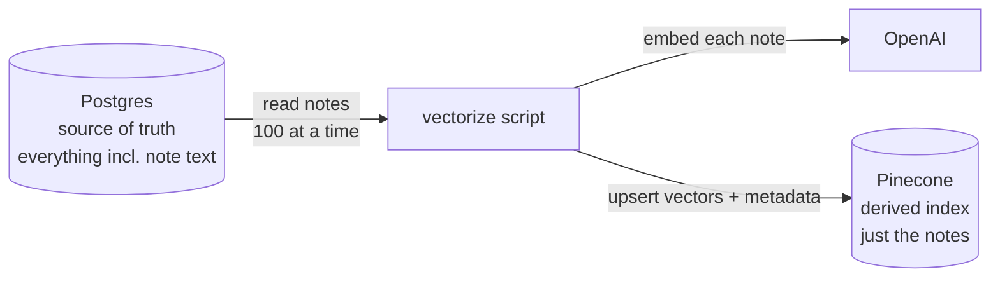

# The Vectorize Script: Postgres → Vector Store

**Needs: `DATABASE_URL` (the pre-loaded DB), `OPENAI_API_KEY`, `PINECONE_API_KEY` in `.env`**

## Today you will

- Turn the company's 21,090 clinical notes into a searchable-by-meaning index with one command
- Read a big table the way production code does — cursor pagination, never more than 100 rows in memory
- Choose the metadata each vector carries, the decision that determines what search can *filter on* later
- Understand why the vector store is a *derived* index — safe to rebuild, safe to re-run, safe to crash

## Concept

You've proven meaning-based search works on three phrases. Now do it for real, over what's already in Postgres: **200 patients, 21,090 notes** — about 105 notes per patient on average (the heaviest chart has 1,632), each note averaging ~938 characters.

Here's the mental model that survives the whole course:

**Postgres is the system of record — it holds everything, including the full note text. The vector store is a *derived* index built from it: the same notes, embedded, kept for fast meaning-based search.**



The vector store is not the truth and never is. If the two ever disagree, **Postgres wins and you rebuild the index.** That's what "derived" means — you can throw the vector store away and regenerate it from Postgres any time. This is the plain, unglamorous job at the heart of production RAG: *take data a company already has, and service it for search.*

### Reading 21,090 rows without holding 21,090 rows

Prisma does **not** paginate for you — `prisma.note.findMany()` with no arguments loads *every* row into memory. 21k notes would survive that; the ten-million-row table at your next job won't. So the script reads the way code that scales reads: **cursor pagination.**

1. Order by a stable column (`orderBy: { id: 'asc' }` — a cursor is meaningless over an unstable order).
2. `take` 100 rows.
3. Remember the last row's id — that's the **cursor**.
4. Next read: `cursor: { id }` plus `skip: 1` (start just *after* the row the cursor points at). Repeat until a page comes back empty.

Never more than 100 notes in memory, and each page gets embedded and upserted before the next is read — so progress ships as you go instead of one giant silent wait at the end.

### Metadata is the filterable payload — choose it deliberately

The note *text* is what gets matched by meaning. The **metadata** is everything a search can later *narrow by* — so choosing it is really the question: **who will filter on what?** This script tags each vector with:

- `patientId` — the big one: scope a search to one patient's chart.
- Demographics — `age`, `gender`, `race`, `city`, `state` ("diabetic patients *in Boston*").
- `currentMedications` — the patient's **active** prescriptions, as a string array.
- `source: 'postgres'` — where this vector was derived from.

Three of those choices are worth defending out loud:

- **Active medications only.** The include says `where: { status: 'active' }` — and the numbers say why: this dataset has **946 active** medication rows against **29,627 stopped** ones. Tag the stopped ones too and every patient drags decades of expired prescriptions into every vector — "patients on antibiotics" would match everyone who ever took one. Noise, not signal.
- **Age is computed at embed time** from `birthDate` — which means it's *frozen* at vectorize time and goes stale one birthday at a time until a rebuild refreshes it. Acceptable for a demographic filter; know the tradeoff you made.
- **Arrays filter with `$in`, but only exact-match.** Pinecone can filter `currentMedications` with `$in: [...]` — but it compares whole strings. The stored value is the full display name (e.g. `"Aspirin 81 MG Oral Tablet"`), so a filter for `"aspirin"` matches nothing. Metadata filtering is exact; *meaning* lives in the text. Two different tools.

## Implementation

### 1. Read the script

Open `scripts/vectorize.ts`. It's your by-hand loop, grown up. The read loop first:

```typescript
const PAGE_SIZE = 100;
let cursor: string | undefined;
let total = 0;

while (true) {
	const notes = await prisma.note.findMany({
		take,
		// The cursor points at the LAST row of the previous page; skip: 1
		// starts this page just after it.
		...(cursor ? { skip: 1, cursor: { id: cursor } } : {}),
		orderBy: { id: 'asc' }, // a cursor only works over a stable order
		include: {
			patient: {
				select: {
					firstName: true,
					lastName: true,
					birthDate: true,
					gender: true,
					race: true,
					state: true,
					city: true,
					// "current" meds = status 'active' (everything else is 'stopped')
					medications: {
						where: { status: 'active' },
						select: { display: true },
					},
				},
			},
		},
	});
	if (notes.length === 0) break;

	// …shape the page into chunks, upsert, advance the cursor…
	cursor = notes[notes.length - 1].id;
}
```

Then the shaping — each note becomes a `MedicalChunk`: the text to embed, plus the metadata payload:

```typescript
const chunks: MedicalChunk[] = notes.map((note) => {
	const age = note.patient.birthDate
		? Math.floor(
				(Date.now() - note.patient.birthDate.getTime()) /
					31557600000,
			)
		: undefined;

	return {
		id: note.id, // reuse the note id -> re-runs overwrite, never duplicate
		content: note.content, // what gets vectorized
		metadata: {
			patientId: note.patientId,
			firstName: note.patient.firstName ?? undefined,
			lastName: note.patient.lastName ?? undefined,
			age,
			gender: note.patient.gender ?? undefined,
			race: note.patient.race ?? undefined,
			city: note.patient.city ?? undefined,
			state: note.patient.state ?? undefined,
			source: 'postgres',
			currentMedications: note.patient.medications.map(
				(m) => m.display,
			),
		},
	};
});

total += await upsertChunks(chunks);
```

Three things worth stopping on:

- **`ensureIndexExists()`** runs before the loop (read it in `lib/pinecone.ts`) — it creates the index if it's missing: **dimension 1536, metric cosine**, the two permanent settings that must match the embedding model. On later runs it just confirms the index is there.
- **`upsertChunks`** (also in `lib/pinecone.ts`) is where the cost lives: it embeds each page's notes via OpenAI in **batches of 100**, upserts the vectors with their text and metadata, and takes a 250ms breather between batches to stay clear of rate limits. Reading it, you'll recognize your own loop.
- **`id: note.id`** — the note's own database id becomes the vector's id. This one line is what makes the whole script **idempotent**: re-running overwrites the same vectors in place instead of duplicating them.

### 2. Smoke test with `--limit`

`--limit` exists for exactly one purpose: a fast, cheap check that your keys, index, and database read all work before committing to the real thing.

```bash
npm run vectorize -- --limit 200
```

```
Vectorizing 200 of 21090 notes into Pinecone index "medical-notes" — 2 page(s) of 100 (embed + upsert per page)…
  page 1/2 — 100/200 notes (5s elapsed, ~0.1 min left)
  page 2/2 — 200/200 notes (9s elapsed, ~0.0 min left)
Done. Upserted 200 note vectors in 0.2 min.
```

Two pages, a few seconds, fractions of a cent. If this works, the full run will too.

### 3. The full run — we do this together in class

No `--limit` means all 21,090 notes: **~211 pages, about 10–15 minutes, and roughly $0.10 of embeddings.** That's the whole company corpus, made searchable by meaning, for a dime.

```bash
npm run vectorize
```

```
Vectorizing 21090 of 21090 notes into Pinecone index "medical-notes" — 211 page(s) of 100 (embed + upsert per page)…
  page 1/211 — 100/21090 notes (4s elapsed, ~14.0 min left)
  page 2/211 — 200/21090 notes (8s elapsed, ~13.9 min left)
  …
Done. Upserted 21090 note vectors in 13.1 min.
```

Notice the script's manners: it announces the plan (how many notes, how many pages) *before* the first slow page, and every page reports progress plus an ETA computed from the measured pace so far. A ten-minute script that prints nothing until the end is indistinguishable from a hung one — cheap `console.log` lines are the difference.

Storage check while it runs: 21k vectors land around **155 MB** — against Pinecone's 2 GB free tier, roughly **8× headroom**. Nothing about this project strains the free plan.

### 4. Idempotent — and crash-safe

Run the smoke test twice and watch the vector count in the Pinecone console: it does **not** grow. Each vector's id is the note's id, so a re-run *overwrites* the same vectors. Two consequences:

- **Rebuilds are a no-fear operation** — the derived-index promise made real.
- **A crashed run is safely re-runnable.** If your laptop sleeps at page 130 of 211, just run the command again: the first 130 pages get harmlessly overwritten and the rest get written. No cleanup, no dedupe, no partial-state archaeology.

> **The one drift hazard.** Idempotency covers re-adding and updating. It does *not* cover deletion: if a note were removed from Postgres, its stale vector would linger in Pinecone until a full rebuild or an explicit delete (`deleteAllChunks` exists in `lib/pinecone.ts`). Derived indexes drift when the source shrinks; you reconcile by rebuilding. Worth knowing, not worth worrying about today.

### 5. When the network flakes — and it will

A 211-page run makes hundreds of network calls, and somewhere in there the network *will* hiccup. `withPineconeRetry` in `lib/pinecone.ts` encodes what actually goes wrong:

- **The stale-socket failure.** While a batch is off embedding at OpenAI, the idle Pinecone connection times out — so the *first write afterward* fails with `ECONNRESET` or `fetch failed`. It's not an outage; the fix is simply "try again on a fresh connection." So attempt one retries **instantly and silently** — no scary log line for a non-event.
- **A real outage** looks like *repeated* failures — from attempt two on, the retry **warns and backs off**, up to ~45 seconds of total patience before giving up.
- **IPv4 first.** The top of `lib/pinecone.ts` calls `setDefaultResultOrder('ipv4first')` — on many home networks Node tries a broken IPv6 route first, which shows up as *endless* `ECONNRESET` against Pinecone. One line makes it disappear.

The lesson generalizes: at this scale, transient network failure is **normal input, not an exception** — production ingest code plans for it instead of crashing on it.

### Common mistakes

- **One giant `findMany`.** Prisma won't paginate for you — no arguments means *every* row in memory. It happens to survive 21k notes, which is exactly how the habit sneaks into a codebase that later meets a table it can't survive. Write the cursor loop.
- **Random vector ids.** Generate a fresh id per run and every run *adds* 21,090 new vectors instead of overwriting — a silently duplicated corpus that corrupts every search with near-identical copies. `id: note.id` is the whole idempotency story.
- **Searching the instant the upsert finishes.** Pinecone is *eventually* consistent; freshly upserted vectors can take a few seconds to become searchable. Wait, retry, then debug.
- **Killing the run at the first warning.** A "Pinecone hiccup, retrying" line is the retry *working*, not the script failing. And if a run genuinely dies, don't clean anything up — re-run it; idempotency has your back.

## Your turn

Spend **no more than 30 minutes** here.

1. Run the smoke test (`npm run vectorize -- --limit 200`), confirm the vector count in the [Pinecone console](https://app.pinecone.io), then run it a **second** time and confirm the count didn't grow. In your notes, one sentence on *why* — reference `note.id`.
2. Read `withPineconeRetry` in `lib/pinecone.ts`. Why is the very first retry silent with zero delay, while later retries warn and back off? One sentence for each behavior.
3. A metadata call of your own: the script tags active *medications* but not *conditions*. Would you add a `conditions` array to the metadata? Who would filter on it, and what's the noise cost? Three sentences, take a position.

```quiz
[
  {
    "q": "Why does the script read notes with a cursor loop instead of one big findMany()?",
    "options": [
      "Prisma requires a cursor for tables over 10,000 rows",
      "Prisma doesn't paginate for you — a bare findMany() loads every row into memory, a habit that survives 21k notes and dies at the ten-million-row table",
      "Cursor pagination is faster because Postgres caches each page",
      "Pinecone only accepts vectors in batches of 100, so the read must match"
    ],
    "answer": 1,
    "explain": "The cursor loop guarantees a bounded memory footprint (never more than 100 notes held) and incremental progress (each page embeds and upserts before the next read). And the orderBy is load-bearing: 'resume just after this row' only makes sense over a stable order."
  },
  {
    "q": "What single decision makes re-running vectorize safe — no duplicates, no cleanup after a crash?",
    "options": [
      "Pinecone automatically deduplicates vectors with identical content",
      "The script checks which notes are already in the index before embedding",
      "The --limit flag caps how many vectors a re-run can add",
      "Each vector's id is the note's own database id, so upserts overwrite the same vectors instead of adding new ones"
    ],
    "answer": 3,
    "explain": "Upserts key on vector id. Reuse note.id and a re-run overwrites in place — so a crash at page 130 needs no archaeology, just run it again. Generate a random id per run instead and every run silently adds 21,090 near-identical copies, corrupting every search."
  },
  {
    "q": "The metadata tags only ACTIVE medications (946 rows), not stopped ones (29,627). Why exclude the stopped ones?",
    "options": [
      "Pinecone metadata arrays have a hard size limit the stopped list would exceed",
      "Stopped medications are protected health information and can't be indexed",
      "Tag decades of expired prescriptions and 'patients on antibiotics' matches everyone who ever took one — noise, not signal",
      "Stopped medications aren't stored in Postgres, only active ones"
    ],
    "answer": 2,
    "explain": "Metadata choice is really the question 'who will filter on what?'. A filter that matches nearly everyone filters nothing. The stopped rows exist in Postgres (it's the system of record) — they just don't earn their place in the search payload."
  }
]
```

## Check yourself

- Why is the vector store called a *derived* index, and what happens if it disagrees with Postgres?
- What does the cursor-pagination loop guarantee that a single `findMany()` doesn't — and why must the query be ordered for the cursor to work?
- What single line makes re-running `vectorize` idempotent, and what would break if you generated a random id per vector instead?
- Where does the time and cost of a vectorize run actually come from?

<details>
<summary>Solution / discussion</summary>

**Derived index:** the vector store is built *from* Postgres and holds only a projection of it (the notes, embedded, plus metadata). Postgres holds everything and is the source of truth. If they disagree, Postgres is right and you rebuild the index from it — which is safe precisely because the script is idempotent.

**Cursor pagination:** the loop guarantees a bounded memory footprint — never more than 100 notes held at once, no matter how big the table gets — and incremental progress (each page is embedded and upserted before the next is read). A bare `findMany()` loads the entire table and does nothing until everything is in memory. The `orderBy: { id: 'asc' }` is load-bearing: a cursor means "resume just after this row," which is only well-defined if every read walks the rows in the same stable order.

**Idempotency line:** `id: note.id`. Pinecone upserts key on vector id, so reusing the note's id means a re-run *overwrites* the same vector. Generate a random id per run and every run would create *new* vectors — 21,090, then 42,180 — silently duplicating the corpus and corrupting every search with near-identical copies. It's also why a crashed run needs no cleanup: re-running overwrites the finished pages and completes the rest.

**Cost:** it's the OpenAI embedding calls inside `upsertChunks`, not Pinecone. 21,090 notes at ~938 characters each is roughly five million tokens of embedding — about **$0.10** — and the ~10–15 minutes is dominated by those embedding calls, batched 100 at a time. Pinecone's upserts (and its storage — ~155 MB of a 2 GB free tier) are the cheap part.

**The conditions question (your turn #3)** has no single right answer — that's the point. A defensible *yes*: conditions are the most-asked-about clinical facts ("patients with high blood pressure"), and filtering beats hoping the note text mentions the diagnosis. A defensible *no*: like medications, condition lists accumulate resolved history, and Pinecone's exact-match filtering on the stored display strings ("Essential hypertension") won't match the words users actually type — so it costs payload without reliably paying rent. What matters is that you *argued from who filters on what*, not habit.

</details>

## Further reading (optional)

- [Pinecone: indexing overview](https://docs.pinecone.io/guides/index-data/indexing-overview#metadata) — how vectors and their metadata are stored, which the next lesson puts to work.
