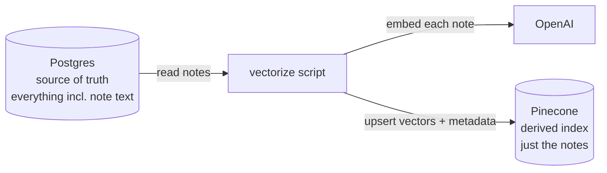

# The Vectorize Script: Postgres → Vector Store

**Needs: `DATABASE_URL` (the pre-loaded DB), `OPENAI_API_KEY`, `PINECONE_API_KEY` in `.env`**

## Today you will

- Turn the company's existing notes into a searchable-by-meaning index with one command
- Read the vectorize script and see it's exactly the by-hand loop, made persistent
- Understand why the vector store is a *derived* index — and why that makes it safe to rebuild

## Concept

You've proven meaning-based search works on three phrases. Now do it for real, over the notes that are already in Postgres.

Here's the mental model that survives the whole course:

**Postgres is the system of record — it holds everything, including the full note text. The vector store is a *derived* index built from it: the same notes, embedded, kept for fast meaning-based search.**



The vector store is not the truth and never is. If the two ever disagree, **Postgres wins and you rebuild the index.** That's what "derived" means — you can throw the vector store away and regenerate it from Postgres any time. This is the plain, unglamorous job at the heart of production RAG: *take data a company already has, and service it for search.*

## Implementation

### 1. Read the script

Open `scripts/vectorize.ts`. It's your by-hand loop, grown up. Three numbered steps:

```typescript
// 0. Make sure the vector index exists (creates it on first run).
await ensureIndexExists();

// 1. Read the notes from Postgres (the system of record).
const notes = await prisma.note.findMany({
  take: limit,
  include: { patient: { select: { firstName: true, lastName: true } } },
});

// 2. Shape each note for the vector store — the text plus the metadata
//    we want to filter on later (patient, type, date).
const chunks: MedicalChunk[] = notes.map((note) => ({
  id: note.id, // reuse the note's id as the vector id -> re-runs are idempotent
  content: note.content,
  metadata: {
    resourceType: 'Note',
    patientId: note.patientId,
    patientName: [note.patient.firstName, note.patient.lastName].filter(Boolean).join(' '),
    type: note.type ?? 'Clinical Note',
    date: note.date ? note.date.toISOString().slice(0, 10) : '',
    source: 'postgres',
    chunkIndex: 0, // notes are self-contained — one note = one vector
  },
}));

// 3. Embed + upsert. upsertChunks batches the OpenAI + Pinecone calls.
const upserted = await upsertChunks(chunks);
```

Three things worth stopping on:

- **`ensureIndexExists()`** (read it in `lib/pinecone.ts`) creates the index if it's missing — **dimension 1536, metric cosine**, the two permanent settings that must match the embedding model. On later runs it just confirms the index is there.
- **`upsertChunks`** (also in `lib/pinecone.ts`) is where the cost lives: it embeds each note in **batches of 100** via OpenAI, then upserts the vectors with their text and metadata. Reading it, you'll recognize your own loop.
- **`id: note.id`** — the note's own database id becomes the vector's id. This one line is what makes the whole script **idempotent**: re-running overwrites the same vectors in place instead of duplicating them.

### 2. Run a cheap slice

Embedding all ~143,946 notes costs real money and takes about an hour — **never do that casually.** Use `--limit` to work a slice:

```bash
npm run vectorize -- --limit 200
```

Expected output:

```
Vectorizing 200 notes from Postgres...
Done. Upserted 200 note vectors into Pinecone.
```

That's 200 notes now searchable by meaning. Enough to build and test against; cheap enough to re-run freely.

### 3. Prove it's idempotent

Run the exact same command again:

```bash
npm run vectorize -- --limit 200
```

Watch the Pinecone index size in the console — it does **not** grow. Because each vector's id is the note's id, the second run overwrites the same 200 vectors. Re-running is safe; that's *why* "rebuild the index" (the derived-index idea above) is a no-fear operation. Postgres is the truth, and you can re-derive the vector store any time without doubling it.

> **The one drift hazard.** Idempotency covers re-adding and updating. It does *not* cover deletion: if a note were removed from Postgres, its stale vector would linger in Pinecone until a full rebuild or an explicit delete (`deleteAllChunks` exists in `lib/pinecone.ts`). Derived indexes drift when the source shrinks; you reconcile by rebuilding. Worth knowing, not worth worrying about this week.

### Common mistakes

- **Running the full set "to be thorough."** `npm run vectorize` with no `--limit` embeds everything — an hour and real dollars. Stay on `--limit 200` while you're learning. Coverage is not the goal; a working index is.
- **Expecting the index to exist already.** The very first run creates it (`ensureIndexExists`). If you see an "index not found" error mid-run, that step got skipped or the create is still propagating — re-run.
- **Searching the instant the upsert finishes.** Pinecone is *eventually* consistent; freshly upserted vectors can take a few seconds to become searchable. Wait, retry, then debug.
- **Missing one of the three keys.** This path needs all of `DATABASE_URL`, `OPENAI_API_KEY`, and `PINECONE_API_KEY`. A `Environment variable not found` error means `.env` isn't loaded or a key is blank.

## Your turn

Spend **no more than 30 minutes** here.

1. Run `npm run vectorize -- --limit 200`. Confirm the "Upserted 200" line, then check the vector count in the [Pinecone console](https://app.pinecone.io).
2. Run it a **second** time. Confirm the index size didn't change. In your notes, write one sentence explaining *why* — reference `note.id`.
3. Read `upsertChunks` in `lib/pinecone.ts`. In your notes: where exactly does the money get spent, OpenAI or Pinecone? Why?

## Check yourself

- Why is the vector store called a *derived* index, and what happens if it disagrees with Postgres?
- What single line makes re-running `vectorize` idempotent, and what would break if you generated a random id per vector instead?
- Where does the time and cost of a vectorize run actually come from?

<details>
<summary>Solution / discussion</summary>

**Derived index:** the vector store is built *from* Postgres and holds only a projection of it (the notes, embedded, plus metadata). Postgres holds everything and is the source of truth. If they disagree, Postgres is right and you rebuild the index from it — which is safe precisely because the script is idempotent.

**Idempotency line:** `id: note.id`. Pinecone upserts key on vector id, so reusing the note's id means a re-run *overwrites* the same vector. Generate a random id per run and every run would create *new* vectors — 200, then 400, then 600 — silently duplicating the corpus and corrupting every search with near-identical copies.

**Cost:** it's the OpenAI embedding calls inside `upsertChunks`, not Pinecone. Turning 200 notes into vectors is 200 notes' worth of embedding API usage (batched 100 at a time). Pinecone's upsert is cheap; embedding is the bill. That's why `--limit` controls both time and money.

</details>

## Further reading (optional)

- [Pinecone: indexing overview](https://docs.pinecone.io/guides/index-data/indexing-overview#metadata) — how vectors and their metadata are stored, which the next lesson puts to work.
</content>
