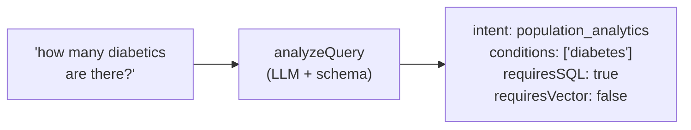

# The Query Analyzer: Intent and Entities

**Needs: yesterday's pattern fresh in mind; `OPENAI_API_KEY`**

## Today you will

- Read `analyzeQuery` — the brain that decides which retrieval engine answers each question
- Understand the production system prompt and few-shot examples that make it reliable
- Watch your Week 1 query taxonomy become executable code

## Concept

Since the very first day you've been sorting queries by hand: *is this a count, a note search, or both?* Postgres answers counts and filters; the vector index answers meaning; some questions need both, in sequence. One piece has been missing — the thing that does the sorting **automatically, per query, at runtime**.

That piece is the query analyzer, and it's yesterday's structured-output pattern pointed at a harder target. Instead of extracting urgency from an email, it extracts *retrieval strategy* from a question:



Open `lib/query-analyzer.ts`. Read it top to bottom before anything else. Notice how the whole file is the four-step pattern from yesterday, just with a richer schema.

The `QueryAnalysisSchema` is where the intelligence lives:

- **`intent`** is a 7-value enum — your informal labels, refined: `patient_lookup`, `patient_summary`, `structured_query`, `clinical_note_search`, `population_analytics`, `hybrid_query`, `general_question`.
- **`entities`** extracts the *parameters* each engine needs: patient names, conditions, lab names, numeric filters (`A1C > 9` becomes `{ field, operator, value }`).
- **`semanticQuery`** is an optimized rephrasing for vector search — the analyzer can *expand* "trouble sleeping" into "insomnia difficulty falling asleep poor sleep quality" before the geometry ever sees it.
- **`requiresSQL` / `requiresVector`** are the two booleans the router will branch on next.

### Prompting a classifier is its own genre

Scroll to `SYSTEM_PROMPT` and `FEW_SHOT_EXAMPLES`. A system prompt for a *component* reads nothing like a chatbot personality. It's a spec: what the system is, what each intent means, what the booleans control, and the judgment calls written down. Three principles are visible in the file:

1. **Define every enum value with a boundary case.** The model knows English; it doesn't know *your* line between `patient_summary` and `patient_lookup`. The prompt tells it (`patient_summary` = "summarize one patient's health"; `patient_lookup` = "find a specific patient by name or ID").
2. **Examples beat rules.** A handful of (query → exact JSON) pairs — *few-shot examples* — anchor format and judgment better than paragraphs of instruction. Read the five in `FEW_SHOT_EXAMPLES`: they spend their tokens on the *confusable* cases (the hybrid, the numeric filter), not the obvious ones.
3. **Forbid invention, explicitly.** Extractors drift toward helpfulness: a query mentioning no condition gets `conditions: ["diabetes"]` anyway because diabetes is *common*. The last line of the prompt is literally "Extract only what is actually in the query. Do not invent entities."

## Implementation

### 1. Read the analyzer as the pattern from yesterday

`analyzeQuery` is your four steps, verbatim — one `client.responses.parse()` call with `zodTextFormat(QueryAnalysisSchema, 'queryAnalysis')`, `temperature: 0`, and a final `QueryAnalysisSchema.parse(response.output_parsed)`. The system content is `SYSTEM_PROMPT` plus `FEW_SHOT_EXAMPLES`, joined. Nothing here is new machinery — it's the exact shape you built for the support-ticket extractor, aimed at medicine.

### 2. Interrogate it

```typescript
import 'dotenv/config';
import { analyzeQuery } from './lib/query-analyzer';

const queries = [
  'How many patients have high blood pressure?',
  'Find patients whose notes mention dizziness after standing up',
  'What do the notes say about sleep for patients with depression?',
  'Tell me about the patient named Smith',
  'What is the capital of France?',
];

async function main() {
  for (const q of queries) {
    const a = await analyzeQuery(q);
    console.log(`\n${q}\n  → ${a.intent} | SQL:${a.requiresSQL} Vector:${a.requiresVector}`,
      a.semanticQuery ? `\n  semantic: "${a.semanticQuery}"` : '');
  }
}
main();
```

Check each against your own judgment. The France question should land in `general_question` with both booleans false — your system knowing *what it isn't for* is a feature, not an accident. The sleep-plus-depression question should come back `hybrid_query` with `conditions: ["depression"]` **and** an expanded `semanticQuery` about sleep — hold onto that one; it's the star of the next two lessons.

### 3. One honest gap, named now

Run *"which patients are on insulin?"* through the analyzer. It will likely route it as `structured_query` (or analytics) with `medications: ["insulin"]` — and it looks perfect. But **medication filtering isn't wired to the database.** Downstream, `executeStructuredQuery` only routes on `conditions` and `numericFilters`, never `medications`. So the analyzer routes it beautifully and the system still can't answer it.

This is worth sitting with: **routing and execution are two different failure surfaces.** A correct route over a missing capability is still a wrong answer. It's why we measure the analyzer *separately* from retrieval later in the course. For now: when you want a population count you can trust, ask a **condition** question ("how many have diabetes?"), not a medication one.

### Common mistakes

- **Reading the booleans as decoration.** `requiresSQL` / `requiresVector` are the *only* thing the router looks at. `intent` is for humans and logs; the booleans are for code.
- **Expecting `semanticQuery` to echo the input.** If the analyzer's rephrasing is identical to the user's words, it's adding latency and nothing else. The prompt pushes expansion — synonyms, clinical phrasings a note might actually use.
- **Trusting a route as proof of an answer.** The insulin case above. The analyzer emitting a clean object tells you nothing about whether a capability exists behind it.
- **Skipping `temperature: 0`.** A classifier that classifies the same query differently on Tuesday is not a component, it's a coin.

## Your turn

Spend **no more than 60 minutes** here.

1. Run the interrogation battery above clean. For each query, predict the route *before* you read the JSON, then check yourself.
2. Write five of your own labeled queries (a count, a note search, a hybrid, a named-patient lookup, and one the system should refuse). Run them. Where the analyzer disagrees with your label — *who's right?* (Sometimes it's you. Update your notes either way.)
3. Hunt one misclassification: craft queries near the `hybrid` / `clinical_note_search` boundary until one routes wrong. The disciplined fix (which you'll practice for real when we start measuring) is to **add one few-shot example**, not to lengthen the rules — but for now just *find* the boundary and describe it.

## Check yourself

- Why do the booleans (`requiresSQL`, `requiresVector`) exist separately from `intent`, when intent seems to imply them?
- A query mentions no condition, but the analyzer returns `conditions: ["hypertension"]`. Name the failure mode and the two places you'd fix it.

<details>
<summary>Solution / discussion</summary>

**Booleans vs intent:** intent is for *humans and logging* (seven readable categories); the booleans are for *code* (two branch points). Deriving booleans from intent inside the router would weld a 7-way mapping into it — every new intent means touching the router. Letting the analyzer set the booleans directly keeps the router to two `if`s, and lets edge cases (an analytics question that *also* needs notes) set both without inventing an eighth intent. Redundancy at the schema level buys simplicity at the code level.

**The invented condition** is entity hallucination — the extractor "helpfully" filling a field the text doesn't support (yesterday's required-field lesson wearing medical scrubs). Fix one: the prompt — the explicit "extract only entities present in the query" line, plus a few-shot example showing a condition-free query yielding empty entities. Fix two: the schema — `.describe('Medical conditions mentioned')` sharpened to `.describe('Medical conditions explicitly mentioned in the query — empty if none are named')`. Descriptions are prompting; use both layers.

**On "who's right" in disagreement:** a common one — you label "summarize Smith's health" as a notes question; the analyzer says `patient_summary` with `requiresSQL: true`. The analyzer is right: the structured row (conditions, meds, labs) is the backbone of a summary; notes are garnish. Building the classifier sharpens the *builder's* taxonomy too.

</details>

## Further reading (optional)

- [OpenAI: structured outputs guide](https://developers.openai.com/api/docs/guides/structured-outputs) — same mechanics, now with stakes
