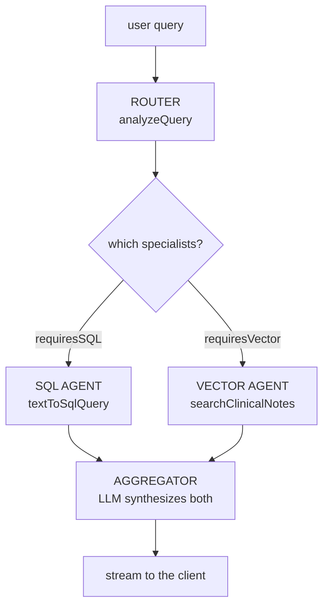

# Orchestration: Router, Parallel Agents, Aggregator

**Needs: the SQL agent from w2-02; both engines available (Postgres + the note index)**

## Today you will

- Assemble the chat agent as a small **multi-agent pipeline**, not one big function
- Run two specialist agents **in parallel** and let an aggregator synthesize the answer
- Learn the debugging loop for LLM-routed systems: behavior bug → prompt fix → re-run

## Concept

Last lesson you built the SQL agent — the thing that writes and runs the query. It's one of two specialists. Now you add the **router** that decides *which* specialists a question needs, and wire the whole thing together. Instead of one function that does everything in a line, the agent is four small pieces with clear seams:



Three ideas make this more than decoration:

- **The router is dumb, and that's the point.** All the judgment lives in the analyzer's prompt; the router just reads two booleans (`requiresSQL`, `requiresVector`) and decides which agents to run. A dumb router can't be wrong in interesting ways — when something misbehaves, you always know it's the prompt or a specialist, never the glue.
- **The specialists run in parallel.** The SQL agent and the vector agent don't depend on each other, so you fire them together with `Promise.all` and wait once. Each returns only its slice — exact facts from Postgres, relevant notes from the vector store — and neither knows the other exists.
- **The aggregator is where meaning gets made.** It's an LLM call that receives both slices as context plus the original question, and writes one grounded answer — streamed back token by token so the user sees it type. This is the only place the two retrieval worlds meet.

This is `lib/agent.ts`'s `runAgent`. Open it and read top to bottom: a `routeQuery`, a `runSqlAgent`, a `runVectorAgent`, then the orchestration that runs the two in parallel and hands the results to the aggregator.

### The debugging loop

Routing via LLM moves your bugs. A wrong answer is now usually *upstream of all your deterministic code* — the router misclassified (skipped an engine it needed), wrote a weak `semanticQuery`, or the SQL agent wrote a query over the wrong vocabulary. The loop:

```
symptom (wrong results) → inspect the ROUTER's analysis (intent? entities? booleans?)
  → analysis wrong: fix the PROMPT (usually one few-shot example)
  → analysis right: NOW suspect a specialist (SQL query, vector filter) or the aggregator
→ re-run the battery
```

The analysis object is your first stack frame. Engineers who skip it "fix" working SQL for hours.

## Implementation

Trace the pipeline with real queries — watch the router choose, both agents run, and the aggregated context that the LLM will actually see:

```typescript
import 'dotenv/config';
import { analyzeQuery } from './lib/query-analyzer';
import { textToSqlQuery } from './lib/text-to-sql';
import { searchClinicalNotes } from './lib/vector-search';
import { formatResultsForLLM } from './lib/query-executor';

async function trace(q: string) {
  const analysis = await analyzeQuery(q);                 // ROUTER
  const useSql = analysis.requiresSQL;
  const useVector = analysis.requiresVector || (!analysis.requiresSQL && !analysis.requiresVector);

  const [sql, vectorResults] = await Promise.all([        // SPECIALISTS, in parallel
    useSql ? textToSqlQuery(q) : undefined,               // SQL agent writes the query
    useVector ? searchClinicalNotes(analysis.semanticQuery || q, { topK: 10 }) : undefined,
  ]);

  console.log(`\n=== ${q}`);
  console.log('router:', analysis.intent, `SQL:${useSql} Vector:${useVector}`);
  if (sql) console.log('SQL written:', sql.sql);
  console.log('--- aggregator context (first 400 chars) ---');
  console.log(formatResultsForLLM({ analysis, sql, vectorResults }).slice(0, 400));
}

async function main() {
  await trace('How many patients have diabetes?');                     // router → SQL agent
  await trace('notes mentioning chest pain at night');                 // router → vector agent
  await trace('what do notes say about sleep for depressed patients'); // router → both, in parallel
}
main();
```

For each: confirm the router picked the agents you expected, both fired when needed, and the aggregator context contains what an LLM would need to answer. You're looking at the exact text the aggregator receives — this view is where most "why did it answer that?" mysteries resolve.

### Common mistakes

- **Debugging the SQL when the router is wrong.** If `requiresVector` came back false for a notes question, no amount of staring at Pinecone helps. Read the analysis first.
- **Running the specialists sequentially.** `await sql; await vector;` works but wastes wall-clock — they're independent, so `Promise.all` them. On a hybrid query that's the difference between one round-trip and two.
- **Letting the aggregator invent.** The aggregator must answer *only* from the two slices it's handed. If the context is empty, the honest answer is "I don't have that" — not a plausible guess. That contract is the whole next lesson thread.

## Your turn

Spend **no more than 45 minutes** here.

1. Run the trace; confirm the router's choice and read every aggregator context in full.
2. Run your own labeled query list through the pipeline. For each: which agents ran, and did it match the label you assigned before any of this existed?
3. Find one query where the router is right but the aggregator context would still mislead the LLM (data dropped, preview truncated mid-fact). Write down what you'd change — you'll want it when you harden the chat agent.

## Check yourself

- Name the four stages of the pipeline and what each is responsible for.
- Why do the SQL and vector agents run in parallel instead of one feeding the other?
- In the debugging loop, what's the first artifact you inspect, and what are the two fix-paths from there?

<details>
<summary>Solution / discussion</summary>

**The four stages:** ROUTER (`analyzeQuery` — decides which agents run), SQL AGENT (`textToSqlQuery` — writes and runs the SQL), VECTOR AGENT (`searchClinicalNotes` — meaning-matched notes), AGGREGATOR (an LLM that synthesizes both and streams the answer). Judgment lives in the router's prompt and the SQL agent's schema/grounding; dispatch and synthesis are trivial-by-inspection glue.

**Why parallel:** the two agents have no data dependency — the SQL agent doesn't need the vector agent's output or vice versa — so running them together halves the wait. (A *different* pattern, hybrid retrieval, deliberately makes vector search depend on a SQL filter; that's the next lesson, and it's a retrieval technique you reach for per-query, not the chat's default orchestration.)

**First artifact: the router's analysis** — intent, entities, booleans, `semanticQuery`. Right analysis → suspect a specialist or the aggregator. Wrong analysis → fix the prompt (usually one targeted few-shot example), then re-run the battery so the fix can't silently regress something else.

</details>

## Further reading (optional)

- Read `lib/agent.ts` once more, fast — `runAgent` is the system's table of contents, and you'll be back in it on every remaining block.
