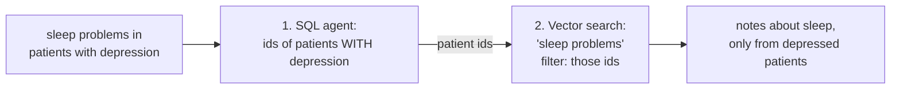

# Hybrid Queries: Facts Narrow the World, Meaning Ranks What's Left

**Needs: both engines loaded — Postgres rows and the note index; the SQL agent from w2-02**

## Today you will

- Build the hybrid pattern by hand: a structured filter → semantic search *inside* the filtered set
- Learn why the *order* of the two steps is not a style choice
- Trigger the empty-filter privacy bug on purpose, and understand why it's a leak, not a relevance glitch

## Concept

Your chat agent runs the SQL and vector agents **in parallel** and lets the aggregator merge them — that's the default, and it's right for most questions. But some questions want the two engines **in sequence**: *"What do the notes say about sleep problems for patients with depression?"* Neither engine answers it alone:

- **Postgres alone** finds the depression patients perfectly, then hits a wall — a `LIKE '%sleep%'` over note text misses "insomnia," "wakes frequently," "poor sleep hygiene."
- **The vector index alone** finds sleep-related notes beautifully — for *anyone*, including patients who've never had a depression diagnosis.

The hybrid pattern narrows with facts, then ranks the survivors by meaning:



Step 1 is a SQL query — now written by the **SQL agent** (`textToSqlQuery`) — that returns the matching patients' **ids**. Step 2 is `searchClinicalNotes` with a `patientIds` filter. Postgres is the system of record, so it owns the *fact* of who has depression; Pinecone is the derived index, so it owns the *meaning* of "sleep problems." Each engine does the one thing it's good at.

### Why SQL first, vectors second — and not the reverse?

Imagine flipping it: vector-search "sleep problems" globally, then keep only the depression patients. Two failures:

1. **The math fails quietly.** Top-50 sleep notes, filtered down to depression patients, might leave 3 — or 0 — depending on luck. To *guarantee* 10 results you'd have to over-fetch by an unknowable factor.
2. **The filter is exact; the search is fuzzy.** "Has a depression diagnosis" is a fact with a true/false answer — that's a `WHERE` clause, not a similarity score. Run the exact step first and the fuzzy step operates inside a *correct* universe.

General rule worth keeping: **exact filters narrow the world; semantic search ranks what's left.** When both kinds of constraint appear in one question, that's the order.

## Implementation

Build the hybrid by hand in a scratch script — the SQL agent for the ids, then `searchClinicalNotes` filtered to them:

```typescript
import 'dotenv/config';
import { textToSqlQuery } from './lib/text-to-sql';
import { searchClinicalNotes } from './lib/vector-search';

async function hybrid(conditionAsk: string, semanticQuery: string) {
  // Step 1: exact — ask the SQL agent for the matching patients' ids
  const { rows } = await textToSqlQuery(`the patient ids of ${conditionAsk}`);
  const patientIds = rows.map((r) => String(r.id ?? r.patientId)).filter((s) => s !== 'undefined');
  console.log(`matched patients: ${patientIds.length}`);

  if (patientIds.length === 0) return [];

  // Step 2: fuzzy — rank their notes against the question
  return searchClinicalNotes(semanticQuery, { topK: 10, patientIds });
}

async function main() {
  const results = await hybrid('patients with depression', 'trouble sleeping, insomnia, poor sleep');
  for (const r of results) {
    console.log(`${r.score.toFixed(3)} ${r.patientName} (${r.date}) — ${r.contentPreview.slice(0, 90)}…`);
  }
}
main();
```

Run it. Then run the two **control experiments** — this is the important part:

1. **Vector-only control:** the same semantic query with no `patientIds`. Compare the names — how many of the global top-10 are *not* depression patients?
2. **SQL-only control:** look at what step 1 alone would show a user — a list of patient ids, no sleep information at all.

The hybrid's value is exactly the gap between it and each control. Don't take the lesson's word for it; measure the gap.

### The empty-filter privacy bug

Notice the `if (patientIds.length === 0) return [];` guard above. It's there for a reason, and the reason is a real security bug living one level down — in how `searchClinicalNotes` treats its `patientIds` option (`lib/vector-search.ts`):

```typescript
if (patientIds && patientIds.length > 0) {
  // ...build the filter
}
// else: no filter — search EVERY patient's notes
```

Now trace a hybrid query whose condition matches **zero** patients — a real-sounding but absent condition, e.g. *"notes about sleep for patients with kuru?"* Step 1 returns `[]`. If you then pass that straight through — `patientIds?.length ? patientIds : undefined`, or just handing `[]` to a filter that treats empty as "no filter" — the vector search runs across *the entire corpus*. A query that should have matched **nobody** instead returns notes from **everybody**.

That is not a relevance bug. "Scoped to zero patients" silently became "scoped to all patients." In a medical system that's a **cross-patient data leak**: one answer, built from charts the query had no business touching. The empty array — the most innocent-looking value in the world — is the whole exploit.

The fix is to distinguish *"no filter requested"* from *"filter requested, matched nobody."* If step 1 ran and resolved to zero ids, short-circuit to empty results — return nothing — instead of falling through to an unfiltered search. That's exactly what the guard in the script does. Prove it with the kuru query: with the guard, zero notes come back; delete it and watch the leak.

### Common mistakes

- **Skipping the empty-filter check.** The #1 hybrid bug, and it's a privacy bug, not a relevance one. Trace what an empty array does at every hop.
- **Putting the semantic part into SQL or the exact part into the vector query.** "Depression" in the vector query *and* the SQL filter feels like belt-and-suspenders; it actually skews the ranking toward notes that *mention* depression rather than notes about sleep. Each constraint goes to the engine built for it, once.
- **Large id lists.** A condition matching thousands of patients makes a giant `$in` filter — legal, but slow, and a sign the structured step isn't narrowing much. If step 1 returns half the database, ask whether the question really has a structured component at all.

## Your turn

Spend **no more than 45 minutes** here.

1. Run the depression/sleep hybrid plus both controls. Record: how many of the vector-only top-10 were outside the depression cohort?
2. Trigger the empty-filter leak: remove the `length === 0` guard, run the kuru query, and confirm you get notes back from unrelated patients. Then restore the guard and describe, in one sentence, exactly which expression let the empty array become "no filter."
3. Build two more hybrids from your own labeled queries. For each: the condition ask, the semantic query, and the top-3 results.

## Check yourself

- Why does the exact step run first? Give both the math reason and the correctness reason.
- A colleague's hybrid for "anxiety patients mentioning chest pain" returns notes from patients with no anxiety diagnosis. List the two most likely bugs, in the order you'd check them.

<details>
<summary>Solution / discussion</summary>

**Order:** math reason — filtering *after* a fixed-K vector search leaves an unpredictable (possibly zero) number of results, so you can't guarantee K; correctness reason — a diagnosis is an exact true/false fact, which belongs in a `WHERE` clause, and running it first means the fuzzy search operates inside an already-correct set.

**The colleague's bug list:**
1. **Empty/missing filter** — step 1 returned `[]` (the SQL agent wrote a query over the wrong vocabulary, or matched nobody), and the empty array became "no filter." Check by logging `patientIds.length` before step 2. This is the leak from today.
2. **Post-filtering or no filtering** — the `patientIds` never reached `index.query` (wrong options key, or filtered in JS afterward). Check by logging the actual filter object handed to Pinecone.

Both bugs produce *plausible-looking results* — chest-pain notes are chest-pain notes — which is what makes hybrid bugs nastier than crashes. The fix for "plausible but wrong" is never staring harder; it's controls and counts.

**The one-sentence rule, one version:** *facts go to the database, meaning goes to the geometry, and facts run first.*

</details>

## Going further (optional): the *other* meaning of "hybrid search"

Search the term "hybrid search" outside this course and you'll mostly find a **different** technique than the one you just built — worth knowing, because an interviewer or a vendor doc will assume you mean theirs.

**What we mean by hybrid:** two *engines* — Postgres for exact facts, the vector index for meaning — picked per question. Two stores.

**What the literature usually means:** two *signals* fused inside one search — **dense** vectors (the meaning-based scores you've been using) combined with **sparse** vectors (a keyword score, classically BM25). One store, two scores added, because each catches what the other misses: dense search blurs rare exact tokens (a drug name, a lab code like `HbA1c`) into "close enough"; sparse search nails the exact token but can't connect "shortness of breath" to "dyspnea."

**Should you add sparse vectors here? Mostly no — and the reason is the architecture.** The job sparse search is famous for — matching exact terms — is the job you've handed to **Postgres**. Exact facts live in structured columns and get a `WHERE` clause; meaning-based prose lives in the vector index and gets dense search. The two-engine split already gives you the exact-token half, cleanly, with a store that can also count and join. The transferable judgment: *"hybrid" is two-of-something — but whether the second thing is another engine or another score depends on where your exact-match signal already lives.* Here it lives in Postgres, so we don't need sparse vectors.

## Further reading (optional)

- [Pinecone: metadata filtering](https://docs.pinecone.io/guides/index-data/indexing-overview#metadata) — the `patientId` filter is the hybrid hinge; this is the mechanism under it
