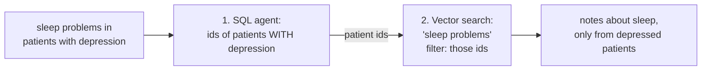

# Hybrid Queries: Facts Narrow the World, Meaning Ranks What's Left

**Needs: the full pipeline from the last lesson — both engines loaded and all four agents wired**

## Today you will

- Watch the pipeline handle a question that needs **both** engines — two specialists in parallel, one aggregator weaving the blocks
- Find the honest limit of that design: the RAG agent never learns which patients the SQL agent found
- Build the tighter alternative by hand — a **scoped** search via `patientIds` — and trigger the empty-filter privacy bug it invites

## Concept

The hybrid question is the one the selector's prompt calls out by name: *"What do the notes say about sleep problems for patients with depression?"* Neither engine answers it alone:

- **Postgres alone** finds the depression patients perfectly, then hits a wall — a `LIKE '%sleep%'` over note text misses "insomnia," "wakes frequently," "poor sleep hygiene."
- **The vector index alone** finds sleep-related notes beautifully — for *anyone*, including patients who've never had a depression diagnosis.

The division of labor is the rule worth memorizing: **exact filters narrow the world; semantic search ranks what's left.** Postgres is the system of record, so it owns the *fact* of who has depression; Pinecone is the derived index, so it owns the *meaning* of "sleep problems." Each engine does the one thing the other can't.

### How your pipeline handles it

Nothing new gets built for the hybrid case — that's the elegance. The selector sets `useSql` **and** `useRag`, the route's `Promise.all` fires both specialists at once, and the aggregator receives two text blocks:

- `## Structured data (SQL)` — the cohort: names and facts of the patients who *have* depression
- `## Relevant Clinical Notes` — the meaning: the top sleep-related notes, each tagged with a patient name

The join happens **in language, not in a database**. The aggregator reads both blocks and weaves them: which of these sleep notes belong to patients on the depression list? No id is ever passed between the agents — they run independently, and neither knows the other exists.

### The honest limit of independent agents

Now look closer at what the RAG agent actually did. `runRag` calls `searchClinicalNotes(semanticQuery, { topK: 10 })` — the global top 10 across all **21,090 notes from all 200 patients**. It has no idea the SQL agent just computed a depression cohort. So the notes block might contain three notes from cohort patients, or one, or none — the intersection is at the mercy of the global ranking, and the aggregator can only weave what it's handed. If none of the top-10 sleep notes happen to come from depressed patients, the honest answer degrades to "the records show N depression patients; the retrieved notes don't cover their sleep."

There's a privacy angle too: an **unscoped search touches everybody's charts.** Notes from patients with no connection to the question flow into the context, and the aggregator's prompt is the only thing standing between them and the user's answer.

This isn't an oversight — it's a deliberate trade. Independent agents are why the pipeline is ten lines of dumb glue: parallel, inspectable, no coupling to get wrong. The cost is that the specialists can't inform each other. Hold on to that tension; today's exercise is about *measuring* it, and the fix is a design question you'll be asked at the end.

### The tighter design: scope the search

The capability already exists one level down. `searchClinicalNotes` (`lib/vector-search.ts`) accepts a `patientIds` option and turns it into a Pinecone **metadata filter** — the search then ranks only the cohort's notes. To use it you'd run the engines **in sequence** instead of in parallel:



Why SQL first, vectors second — and not the reverse? Imagine flipping it: vector-search "sleep problems" globally, then keep only the depression patients. Two failures:

1. **The math fails quietly.** Top-50 sleep notes, filtered down to depression patients, might leave 3 — or 0 — depending on luck. To *guarantee* 10 results you'd have to over-fetch by an unknowable factor.
2. **The filter is exact; the search is fuzzy.** "Has a depression diagnosis" is a fact with a true/false answer — that's a `WHERE` clause, not a similarity score. Run the exact step first and the fuzzy step operates inside a *correct* universe.

Same rule, applied inside one search: facts narrow the world, meaning ranks what's left — and the facts run first.

## Implementation

Build the scoped hybrid by hand in a scratch script — the SQL agent for the ids, then `searchClinicalNotes` filtered to them:

```typescript
import 'dotenv/config';
import { textToSqlQuery } from './lib/agents/sql';
import { searchClinicalNotes } from './lib/vector-search';

async function hybrid(conditionAsk: string, semanticQuery: string) {
  // Step 1: exact — ask the SQL agent for the matching patients' ids
  const { rows } = await textToSqlQuery(`the patient ids of ${conditionAsk}`);
  const patientIds = rows.map((r) => String(r.id ?? r.patientId)).filter((s) => s !== 'undefined');
  console.log(`matched patients: ${patientIds.length}`);

  if (patientIds.length === 0) return [];

  // Step 2: fuzzy — rank ONLY the cohort's notes against the question
  return searchClinicalNotes(semanticQuery, { topK: 10, patientIds });
}

async function main() {
  const results = await hybrid('patients with depression', 'trouble sleeping, insomnia, poor sleep');
  for (const r of results) {
    console.log(`${r.score.toFixed(3)} ${r.patientName} (${r.date}) — ${r.contentPreview.slice(0, 90)}…`);
  }
}
main();
```

Run it. Then run the two **control experiments** — this is the important part:

1. **Unscoped control:** the same semantic query with no `patientIds` — which is *exactly what your pipeline's RAG agent does today*. Compare the names — how many of the global top-10 are *not* depression patients? That count is the measured cost of the independent-agents design.
2. **SQL-only control:** look at what step 1 alone would show a user — a list of patient ids, no sleep information at all.

The scoped hybrid's value is exactly the gap between it and each control. Don't take the lesson's word for it; measure the gap.

### The empty-filter privacy bug

Notice the `if (patientIds.length === 0) return [];` guard in the script. It's there for a reason, and the reason is a real security bug living one level down — in how `searchClinicalNotes` treats its `patientIds` option (`lib/vector-search.ts`):

```typescript
if (patientIds && patientIds.length > 0) {
  // ...build the filter
}
// else: no filter — search EVERY patient's notes
```

Now trace a scoped query whose condition matches **zero** patients — a real-sounding but absent condition, e.g. *"notes about sleep for patients with kuru?"* Step 1 returns `[]`. If you then pass that straight through — `patientIds?.length ? patientIds : undefined`, or just handing `[]` to a filter that treats empty as "no filter" — the vector search runs across *the entire corpus*. A query that should have matched **nobody** instead returns notes from **everybody**.

That is not a relevance bug. "Scoped to zero patients" silently became "scoped to all patients." In a medical system that's a **cross-patient data leak**: one answer, built from charts the query had no business touching. The empty array — the most innocent-looking value in the world — is the whole exploit.

The fix is to distinguish *"no filter requested"* from *"filter requested, matched nobody."* If step 1 ran and resolved to zero ids, short-circuit to empty results — return nothing — instead of falling through to an unfiltered search. That's exactly what the guard in the script does. Prove it with the kuru query: with the guard, zero notes come back; delete it and watch the leak.

### Common mistakes

- **Assuming the pipeline already scopes.** It doesn't — read `app/api/chat/route.ts` again: the two specialists run in parallel and never exchange ids. The `patientIds` filter is a capability of `searchClinicalNotes`, not a behavior of the chat agent. Know which system you're reasoning about.
- **Skipping the empty-filter check.** The #1 scoped-hybrid bug, and it's a privacy bug, not a relevance one. Trace what an empty array does at every hop.
- **Putting the semantic part into SQL or the exact part into the vector query.** "Depression" in the vector query *and* the SQL filter feels like belt-and-suspenders; it actually skews the ranking toward notes that *mention* depression rather than notes about sleep. Each constraint goes to the engine built for it, once.
- **Large id lists.** A condition matching half the 200 patients makes a giant `$in` filter — legal, but a sign the structured step isn't narrowing much. If step 1 barely shrinks the world, ask whether the question really has a structured component at all.

## Your turn

Spend **no more than 45 minutes** here.

1. Run the depression/sleep question through the **real pipeline** first (the trace script from the last lesson, or the chat UI with the terminal open). Read both text blocks the aggregator received. How many of the RAG block's notes belong to patients in the SQL block's cohort?
2. Run the scoped hybrid plus both controls. Record: how many of the unscoped top-10 were outside the depression cohort?
3. Trigger the empty-filter leak: remove the `length === 0` guard, run the kuru query, and confirm you get notes back from unrelated patients. Then restore the guard and describe, in one sentence, exactly which expression let the empty array become "no filter."
4. **Design question — write a paragraph, no code:** how would you wire scoping into the chat pipeline? Be honest about what it costs. Hint: `runSql` returns rendered *text* — where would the ids come from, and what happens to "the specialists run in parallel"?

## Check yourself

- Your pipeline's RAG block contains notes from patients outside the SQL cohort. Is that a bug? What design decision caused it, and what did that decision buy?
- If you do scope, why does the exact step run first? Give both the math reason and the correctness reason.
- A colleague's scoped hybrid for "anxiety patients mentioning chest pain" returns notes from patients with no anxiety diagnosis. List the two most likely bugs, in the order you'd check them.

<details>
<summary>Solution / discussion</summary>

**Not a bug — a trade.** The specialists run independently (`Promise.all`, no shared state), so the RAG agent searches all 21,090 notes with no knowledge of the cohort. What that bought: a ten-line orchestrator, parallel latency, and seams you can inspect — each block is debuggable alone. What it cost: cohort recall is hostage to the global top-10, and unrelated patients' notes enter the context.

**Order (when scoping):** math reason — filtering *after* a fixed-K vector search leaves an unpredictable (possibly zero) number of results, so you can't guarantee K; correctness reason — a diagnosis is an exact true/false fact, which belongs in a `WHERE` clause, and running it first means the fuzzy search operates inside an already-correct set.

**The colleague's bug list:**
1. **Empty/missing filter** — step 1 returned `[]` (the SQL agent wrote a query over the wrong vocabulary, or matched nobody), and the empty array became "no filter." Check by logging `patientIds.length` before step 2. This is the leak from today.
2. **Post-filtering or no filtering** — the `patientIds` never reached `index.query` (wrong options key, or filtered in JS afterward). Check by logging the actual filter object handed to Pinecone.

Both bugs produce *plausible-looking results* — chest-pain notes are chest-pain notes — which is what makes hybrid bugs nastier than crashes. The fix for "plausible but wrong" is never staring harder; it's controls and counts.

**The design question:** the honest answer starts with a contract change. Today `runSql` returns a rendered string; a scoped pipeline needs the **ids** to cross the seam, so the SQL agent must return structured data (or the route must call `textToSqlQuery` directly), and the RAG call now *waits* on the SQL call — sequence replaces parallel, for hybrid questions only. You inherit the empty-filter guard as a mandatory code path, and your debugging loop grows a hop (wrong notes might now mean wrong *ids*). Whether that's worth it depends on the question mix: for cohort-heavy questions the scoped design is clearly better; for the general case, independent-plus-aggregator is simpler and usually good enough. Systems that route between *both* strategies exist — that's the selector's job description growing, not a new idea.

**The one-sentence rule, one version:** *facts go to the database, meaning goes to the geometry, and facts run first.*

</details>

## Going further (optional): the *other* meaning of "hybrid search"

Search the term "hybrid search" outside this course and you'll mostly find a **different** technique than the one you just built — worth knowing, because an interviewer or a vendor doc will assume you mean theirs.

**What we mean by hybrid:** two *engines* — Postgres for exact facts, the vector index for meaning — picked per question. Two stores.

**What the literature usually means:** two *signals* fused inside one search — **dense** vectors (the meaning-based scores you've been using) combined with **sparse** vectors (a keyword score, classically BM25). One store, two scores added, because each catches what the other misses: dense search blurs rare exact tokens (a drug name, a lab code like `HbA1c`) into "close enough"; sparse search nails the exact token but can't connect "shortness of breath" to "dyspnea."

**Should you add sparse vectors here? Mostly no — and the reason is the architecture.** The job sparse search is famous for — matching exact terms — is the job you've handed to **Postgres**. Exact facts live in structured columns and get a `WHERE` clause; meaning-based prose lives in the vector index and gets dense search. The two-engine split already gives you the exact-token half, cleanly, with a store that can also count and join. The transferable judgment: *"hybrid" is two-of-something — but whether the second thing is another engine or another score depends on where your exact-match signal already lives.* Here it lives in Postgres, so we don't need sparse vectors.

## Further reading (optional)

- [Pinecone: metadata filtering](https://docs.pinecone.io/guides/index-data/indexing-overview#metadata) — the `patientId` filter is the scoped hybrid's hinge; this is the mechanism under it
