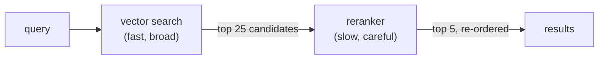

# When Cosine Lies: Reranking as a Second Opinion

**Needs: nothing new — the reranker runs on the `PINECONE_API_KEY` you already have; the loaded note index**

## Today you will

- Understand *why* cosine similarity sometimes ranks the wrong note first
- Add a second-opinion stage — a reranker — on top of your search
- Learn the funnel shape, and catch the silent fallback before it fools you

## Concept

You have almost certainly already caught the geometry lying: a note like *"the patient reports knee pain"* out-scoring *"dyspnea on exertion"* as a match for *"the patient reports shortness of breath"* — because the two sentences share a *template*, not a meaning. The root cause is structural, and worth saying precisely:

**An embedding summarizes each text *separately*, before any query exists.** Each note was compressed into its vector by the `vectorize` script, with no idea what would ever be asked of it. At query time, all the system can do is compare two pre-made summaries. Anything lost in compression — emphasis, the role of each phrase, what's boilerplate vs what's signal — is lost forever.

A **reranker** is a different kind of model with the one luxury embeddings can't have: it reads **the query and the document together, at query time**, and scores how well *this* document answers *this* query. No pre-compression. Boilerplate that matches boilerplate impresses it much less.

So why not rerank everything and skip embeddings? Cost and speed. Reading query+document together means the model does a full pass *per candidate per query* — you cannot do that across ~21,000 notes. The standard architecture is a funnel:



Cheap-and-broad finds candidates; expensive-and-careful orders them. It's the same logic as a recruiter skimming 200 résumés and carefully interviewing 6. You'll meet this funnel shape again and again in retrieval systems.

## Implementation

The reranker wrapper already exists — `rerankResults` in `lib/reranker.ts`. Read all of it, it's about twenty lines:

- It sends the query plus the candidates' text to **Pinecone's hosted reranker** — one call to `pc.inference.rerank('bge-reranker-v2-m3', query, docs, { topN, returnDocuments: false })`.
- No new account, no new key: the reranker runs on the same `PINECONE_API_KEY` as the index. (Not nothing — every extra vendor in a retrieval stack is a signup, a bill, and a failure mode.)
- The response is `[{ index, score }]` in relevance order; the wrapper maps each `index` back onto your candidates and swaps in the new score.
- **If the call fails, it returns the original order** (`results.slice(0, topN)`) — a deliberate choice: degraded search beats no search. Note what this also means: a network blip, or a typo'd model name, fails *silently* into a no-op. No error, no crash — just the same order you started with, plus one `console.error` line.

Wire the funnel in a scratch script. One adapter step: `rerankResults` speaks `lib/pinecone`'s `SearchResult` shape, so map your `searchClinicalNotes` results onto the two fields it actually uses — `content` (the text to rerank) and `score`:

```typescript
import 'dotenv/config';
import { searchClinicalNotes } from './lib/vector-search';
import { rerankResults } from './lib/reranker';

async function main() {
  const query = 'patient struggling to breathe at night';

  // Stage 1: broad — over-fetch deliberately
  const notes = await searchClinicalNotes(query, { topK: 25 });
  const candidates = notes.map((n) => ({
    id: n.id,
    score: n.score,
    content: n.contentPreview, // short notes: the preview is usually most of the note
    metadata: { source: 'note' },
  }));

  // Stage 2: careful — rerank, keep the best 5
  const reranked = await rerankResults(query, candidates, 5);

  console.log('=== vector order (top 5 of 25)');
  for (const r of candidates.slice(0, 5)) {
    console.log(`${r.score.toFixed(3)}  ${r.content.slice(0, 90)}…`);
  }
  console.log('\n=== reranked order');
  for (const r of reranked) {
    console.log(`${r.score.toFixed(3)}  ${r.content.slice(0, 90)}…`);
  }
}
main();
```

Run it on several queries. Three things to notice:

1. **The over-fetch is the point.** Stage 1 pulls 25, not 5 — the reranker can only promote what's in the candidate pool. A great note ranked #19 by cosine is *invisible* unless the funnel mouth is wide enough to include it. (Also note: `rerankResults` returns the input unchanged when `results.length <= topN` — feed it fewer candidates than you keep and it can't do anything.)
2. **The scores are from a different universe.** bge-reranker's relevance scores are normalized 0–1, but they are **not** cosine similarities; comparing a 0.91 rerank score to a 0.58 cosine score is meaningless. Within one ranked list, order is what matters.
3. **The order changes — sometimes.** On some queries the top 5 barely moves; on others a #14 jumps to #1. Which brings us to the honest question.

### Did it actually help, though?

Be very careful here. You just watched the order change and it *felt* like an improvement. But "the order changed" and "the results got better" are different claims — and the second one needs ground truth: which notes are *actually* relevant to this query? Nothing you've built so far knows that.

This is the course's spine rule arriving early: **no metric, no decision.** A reranker adds latency (one extra model call per query), cost (you pay per candidate scored), and another remote call that can fail. Whether it pays for itself **on your corpus, for your queries** is an empirical question — and you can't answer it by eyeballing three examples. Plenty of real systems measure and conclude reranking doesn't earn its place; plenty conclude it's the single best upgrade available. Yours is one measurement away from knowing which kind it is. Building that measuring instrument is a later week; today you build the machinery and, crucially, resist concluding anything from a handful of queries.

### Common mistakes

- **Reranking the same K you keep.** Fetch 5, rerank 5 → the same 5, shuffled (and here, thanks to the `length <= topN` guard, not even shuffled). The reranker's power is *promotion from depth*; without over-fetching there's no depth to promote from.
- **Comparing rerank scores to cosine scores.** Different models, different scales, different meanings. The only valid comparisons are within one ranked list.
- **Not noticing the silent fallback.** A failing rerank call — network hiccup, a mistyped model name — returns the original order, no error. If your reranked and original lists are *always identical*, suspect the fallback fired before you conclude "reranking does nothing." The only witness is the `Reranking failed, using original order` line in your server log — check it first.
- **Concluding anything from today.** Watching three queries change order is an anecdote, not a measurement. This restraint is exactly the discipline that separates measured systems from vibes-driven ones.

## Your turn

Spend **no more than 45 minutes** here.

1. Run the funnel on five queries against the note index. For each, record: did the top-3 change? Did anything jump from below #10?
2. Find one query where reranking visibly *rescued* a result — a clearly relevant note that cosine had buried. Save it; it's a candidate for the eval set you'll build later.
3. Find one query where the two orders are essentially identical. Also save it. (A good eval set needs cases where the intervention *shouldn't* matter, or it can't detect over-claiming.)

## Check yourself

- Why can a reranker judge relevance better than cosine similarity? One sentence, mentioning *when* each model sees the query.
- Why does the funnel over-fetch, and what's the tradeoff in choosing 25 vs 100 candidates?

<details>
<summary>Solution / discussion</summary>

**The one sentence:** an embedding compresses each document *before the query exists*, so matching compares two blind summaries; a reranker reads query and document *together* and scores the actual pairing.

**Over-fetch tradeoff:** wider funnels (100) give the reranker more chances to rescue buried gems but cost more (per-candidate pricing) and add latency; narrower funnels (10) are cheap but can't fix what they never see. The right width depends on how often cosine buries relevant documents *in your corpus* — a measurable question. Common production starting point: rerank 3–5× the K you intend to keep.

**Why both kinds of saved query matter:** the rescue case tests whether reranking helps where it should; the no-change case tests whether your eval can tell "helped" from "did something." An instrument that only contains cases favoring the intervention isn't an instrument — it's a sales deck.

</details>

## Further reading (optional)

- [Pinecone: rerank results](https://docs.pinecone.io/guides/search/rerank-results) — the hosted reranker behind today's second opinion
- [Anthropic: Contextual Retrieval](https://www.anthropic.com/news/contextual-retrieval) — note the headline numbers combine contextual chunks *with* reranking; production retrieval is a stack of measured techniques, not one trick
