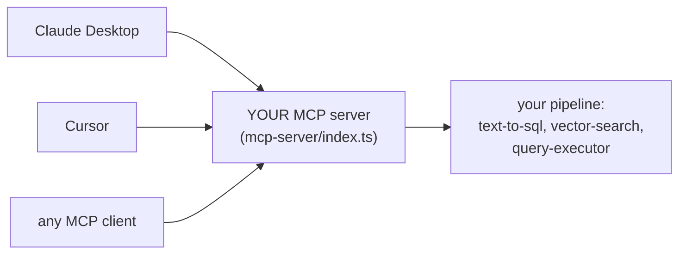

# MCP: Your RAG as a Tool for AI Assistants

**Needs: the working pipeline; nothing new to install (the MCP SDK is already a dependency)**

## Today you will

- Understand what the Model Context Protocol is and the problem it standardizes away
- Meet your system's MCP tools — thin wrappers around functions you already built
- Talk to the server from the command line, before any AI touches it

## Concept

Everything you've built answers questions through *your* chat UI. But the people you'd build this for already live in other AI tools — Claude Desktop, Cursor, a dozen assistants. Do you build a separate integration for each one?

**MCP — the Model Context Protocol** — is the industry's answer: an open standard for connecting AI applications to external systems. The analogy the spec itself uses: *USB-C for AI*. You implement one **MCP server** that exposes your system as **tools**; any MCP **client** (Claude Desktop, Cursor, and a growing list) can then discover and call them.



A **tool** in MCP is a named capability with a typed schema: name, description, parameters. The client's LLM reads the descriptions and *decides* when to call which tool — exactly like your query analyzer decides between Postgres and the vector index, except now the deciding model belongs to someone else. That inversion has a consequence worth sitting with:

**Your tool descriptions are prompts for a model you don't control.** A vague description ("search stuff") means the client model calls your tool at the wrong times with the wrong arguments — and you can't fix it by editing the client's prompt, because you don't own it. The description *is* your interface.

> **Why MCP and not a REST API?** You have API routes already — Cursor can't use them. A REST endpoint needs a human to read docs and write integration code per client. MCP's contract is machine-readable at the protocol level: the client *discovers* your tools, schemas and all, at connect time. REST serves programmers; MCP serves models. The honest cost: a young protocol, fast-moving SDKs, and a transport (today: stdio — the client literally launches your server as a subprocess and talks over stdin/stdout) that will feel unusual the first time.

## Implementation

### 1. Read the server

Open `mcp-server/index.ts`. The scaffolding is built: an `McpServer` is created, connected over a stdio transport, and three tools are registered — each with a zod parameter schema and a handler. The three:

| Tool | What it's for |
|---|---|
| `search_patients` | route a natural-language patient search through `executeQuery` |
| `query_notes` | meaning-based search over clinical notes (`searchClinicalNotes`) |
| `list_patients_by_condition` | all patients with a condition (`findPatientsByConditions`) |

All three answer *front-office* questions — search, semantic note lookup, condition counts. There's deliberately no "give me everything about one named patient" tool; why that's a security decision, not a gap, is the securing lesson. Look at how a tool is declared with `registerTool`:

```typescript
server.registerTool(
  'query_notes',
  {
    description: 'Search clinical notes using semantic search. Use this for finding relevant medical notes, symptoms, treatments, or clinical observations.',
    inputSchema: {
      query: z.string().describe('Semantic search query (e.g., "chest pain", "breathing problems", "diabetes management")'),
      patientId: z.string().optional().describe('Optional: limit to specific patient ID'),
      topK: z.number().optional().default(5).describe('Number of results to return'),
    },
  },
  async ({ query, patientId, topK }) => { /* calls searchClinicalNotes, formats the result */ }
);
```

Zod again — the same schema-as-contract idea from the structured-outputs work, pointed the other direction: there, a schema constrained what a model *produced*; here it constrains what a model *sends you*.

Every handler is thin, because the hard parts already live in `lib/`. The MCP-specific requirement is the return shape: tools return `{ content: [{ type: 'text', text: '...' }] }` — *text*, for a model to read. Notice the `formatVectorResults` helper at the bottom of the file, and that every return path runs names through `obscureName` (or `formatResultsForLLM(result, true)`): the well-shaped text exists because the consumer is a language model, not a parser — and the obscuring exists because this is a front-office channel that never emits a real name. More on that in two lessons.

### 2. Smoke-test without a client

The server speaks JSON-RPC over stdio, so you can talk to it with a pipe — no AI required:

```bash
echo '{"jsonrpc":"2.0","id":1,"method":"tools/list","params":{}}' | npx ts-node mcp-server/index.ts
```

You should get back a JSON listing of your three tools with their schemas — proof the contract is discoverable. This is exactly what Claude Desktop sees at connect time. (The official `npx @modelcontextprotocol/inspector mcp-server/index.ts` gives you a friendlier UI for the same thing; the pipe version teaches you what's actually moving.)

### Common mistakes

- **Tool descriptions written for humans.** "Gets patient data" tells a model nothing about *when to choose this tool over the other four*. Write descriptions like analyzer few-shots: what it's for, what it's not for, an example argument.
- **`console.log` in a stdio server.** Stdout *is the protocol channel* — a stray log line corrupts the JSON-RPC stream and the client disconnects with a cryptic error. Use `console.error` (stderr) for debugging; the server's startup line already does (`console.error('Medical RAG MCP server running')`).
- **Tools that all do everything.** If `search_patients` also searches notes, the client model can't learn the division of labor — overlapping tools produce erratic tool choice. Sharp boundaries; one job each.
- **Forgetting the server has no session.** Each tool call arrives bare — no conversation history, no "the patient we discussed." Stateless by design; the *client* carries context and passes ids explicitly.

## Your turn

Spend **no more than 45 minutes** here.

1. Run the `tools/list` pipe and confirm all three tools come back with schemas. Then do one `tools/call` round-trip against `query_notes` (the inspector makes this painless) and read the formatted text it returns — note the names come back as pseudonyms.
2. Read each tool's description as if it were a few-shot example — then have a colleague (or an AI assistant in a fresh session) read *only* the three descriptions and predict which tool handles: "is anyone on insulin?", "notes about dizziness for patient X", "who has hypertension?". Wrong predictions = description bugs.
3. In your notes: which one of your existing `lib/` functions would make the *worst* MCP tool for this channel, and why? (Think about what a remote model can and can't be trusted to call — and what would leak a real identity.)

## Check yourself

- What does the client model read to decide which of your tools to call — and what's the implication for how you write it?
- Why must a stdio MCP server never write logs to stdout?

<details>
<summary>Solution / discussion</summary>

**Tool-choice inputs:** the name, the description, and the parameter schemas (including every `.describe()`). That whole surface is a prompt to a foreign model — version it, review it, and test it like one. The colleague-prediction exercise is a real technique: tool descriptions have *evals* too, and "can a fresh model route correctly from descriptions alone" is the metric.

**The worst-tool question** has a few good answers: anything destructive or stateful (a `deleteAllChunks` — a remote model should never hold that trigger), anything requiring multi-step context the protocol doesn't carry, or anything that would hand back a *fully identified* patient chart (`getPatientSummary` returns real name, dates, and every observation — which is exactly why there's no `get_patient` tool on this server). The pattern behind all three: **a tool grants an external model agency; grant the minimum that serves the use case.** That last one is the setup for the securing lesson: notice this server can only answer *front-office* questions, and even those come back with names obscured. That isn't an accident — it's what makes a door you leave open to any assistant safe to leave open. Hold that thought.

**stdout discipline:** stdio transport means the protocol and your process share one pipe. Anything non-JSON-RPC on stdout is, to the client, protocol corruption. It's the same lesson as metadata-vs-text from the chunking work — channels have contracts.

</details>

## Further reading (optional)

- [modelcontextprotocol.io](https://modelcontextprotocol.io/) — the spec and its ecosystem; skim "Architecture" to see what the SDK handled for you today
</content>
</invoke>
