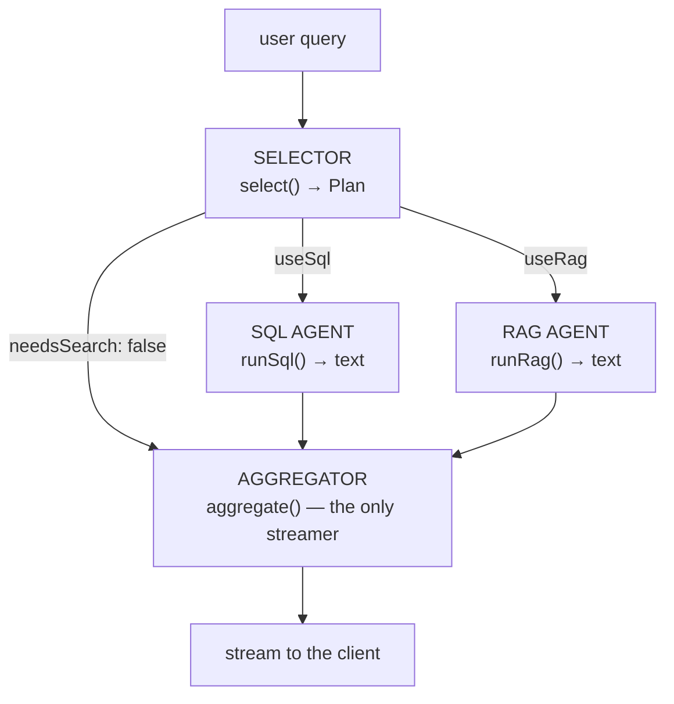

# Orchestration: the Route Is the Pipeline

**Needs: the selector and SQL agent from the last two lessons; both engines available (Postgres + the note index)**

## Today you will

- Implement the last specialist — the **RAG agent** — and wire all four agents into the chat route
- Run the two specialists **in parallel** and let the aggregator stream the one answer
- Learn the debugging loop for LLM-routed systems: read the **plan** first

## Concept

You have a selector that plans and a SQL agent that retrieves facts. Today you add the RAG agent (a thin wrapper over the vector search you built in the first block) and assemble the pipeline. There is no orchestrator class, no framework, no `Agent` abstraction — **the route is the orchestrator.** `app/api/chat/route.ts` is four numbered steps, and each step is one agent from `lib/agents/`:



Four ideas make this more than decoration:

- **The router is dumb, and that's the point.** All the judgment lives in the selector's prompt; the route just reads the plan's booleans and decides which specialists to run. Dumb glue can't be wrong in interesting ways — when something misbehaves, you always know it's the selector's prompt or a specialist, never the wiring.
- **The specialists run in parallel.** The SQL agent and the RAG agent don't depend on each other, so you fire them together with `Promise.all` and wait once. Each returns only its slice — exact facts from Postgres, relevant notes from the vector store — and neither knows the other exists.
- **Specialists return text; only the aggregator streams.** `runSql` and `runRag` each hand back a plain string — a rendered context block. Strings compose (join two of them with a newline), log cleanly, and can be inspected mid-pipeline; a stream can do none of that, and there's exactly one stream a chat client can consume anyway. So the aggregator — `aggregate()` in `lib/agents/aggregator.ts`, provided — is the single place that calls `streamText` (via `openaiProvider` from `lib/openai.ts`, so every LLM call in the repo goes through one client configuration). It takes the text blocks, prepends `AGGREGATOR_PROMPT` — the grounding contract: *answer only from the retrieved data* — and streams one answer.
- **The short-circuit is a real path.** When the selector says `needsSearch: false` — a greeting, "what's a normal A1C range?" — the route runs **zero** specialists and calls the aggregator with no context. `aggregate` notices and swaps in `GENERAL_PROMPT`, which answers from general knowledge and explicitly refuses to guess about patients it didn't look up. Skipping retrieval isn't just cheaper; stuffing irrelevant patient records into a small-talk answer is how leaks and hallucinated groundings start.

One more passenger worth knowing about: the finished route also checks each message for **scheduling intent** (`detectSchedulingIntent`), and when a real patient is named it swaps the aggregator's system prompt for `SCHEDULING_SYSTEM_PROMPT` and attaches the proposed action to the response as an `X-Scheduling-Action` **header**. Why a header? The response body is a token stream of prose — there's no place in it for structured data the UI must parse reliably. Side-channel data rides the headers; the stream stays pure text. You'll build the scheduling flow itself later in the course; today just notice the seam it plugs into.

### The debugging loop

Routing via LLM moves your bugs. A wrong answer is now usually *upstream of all your deterministic code* — the selector misrouted (skipped an engine it needed), wrote a weak `semanticQuery`, or the SQL agent wrote a query over the wrong vocabulary. The loop:

```
symptom (wrong answer) → inspect the PLAN (useSql? useRag? semanticQuery?)
  → plan wrong: fix the SELECTOR's prompt (usually one sentence or example)
  → plan right: read the specialists' text blocks — they ARE the aggregator's context
    → block wrong: fix that specialist (SQL vocabulary, semanticQuery phrasing)
    → blocks right: NOW suspect the aggregator's prompt
→ re-run the battery
```

The plan is your first stack frame. Engineers who skip it "fix" working SQL for hours.

## Implementation

### 1. Implement the RAG agent — `lib/agents/rag.ts`

The easiest agent in the pipeline, on purpose: `runRag(semanticQuery)` calls `searchClinicalNotes(semanticQuery, { topK: 10 })` and renders the hits into a text block — a heading per note (patient, type, date), the score, and the content preview. Two things to get right: pass the **selector's `semanticQuery`**, not the raw question (that expansion is why the field exists), and when nothing comes back, return a block that *says* "none found" — an empty string looks to the aggregator like "no notes were requested," which is a different claim.

### 2. Wire the route — `app/api/chat/route.ts`

The stub parses the request for you; the pipeline is your task, and it reads exactly like the diagram:

1. `const plan = await select(query, messages)` — the selector decides.
2. If `plan.needsSearch`, run the specialists the plan calls for **in parallel** — `Promise.all` over `plan.useSql ? runSql(query, messages) : undefined` and `plan.useRag ? runRag(plan.semanticQuery) : undefined`. If not, skip retrieval entirely: both texts stay `undefined`.
3. `const stream = aggregate({ query, history: messages, sqlText, ragText })` and `return stream.toTextStreamResponse()`.

That's the whole orchestrator. If your version is much longer than ten lines of logic, you're re-adding judgment that belongs in the agents.

### 3. Trace it

Before trusting the streaming UI, watch the seams in a scratch script:

```typescript
import 'dotenv/config';
import { select } from './lib/agents/selector';
import { runSql } from './lib/agents/sql';
import { runRag } from './lib/agents/rag';

async function trace(q: string) {
  console.log(`\n=== ${q}`);
  const plan = await select(q);                        // SELECTOR
  console.log('plan:', plan);
  if (!plan.needsSearch) return console.log('(short-circuit — aggregator answers directly)');

  const [sqlText, ragText] = await Promise.all([       // SPECIALISTS, in parallel
    plan.useSql ? runSql(q) : undefined,
    plan.useRag ? runRag(plan.semanticQuery) : undefined,
  ]);
  if (sqlText) console.log('--- SQL block ---\n' + sqlText);
  if (ragText) console.log('--- RAG block (first 400 chars) ---\n' + ragText.slice(0, 400));
}

async function main() {
  await trace('How many patients have diabetes?');                          // → SQL agent
  await trace('notes mentioning chest pain at night');                      // → RAG agent
  await trace('what do the notes say about sleep for depressed patients');  // → both, in parallel
  await trace("what's a normal A1C range?");                                // → neither (short-circuit)
}
main();
```

For each: confirm the plan picked the specialists you expected, both fired when needed, and the blocks contain what an LLM would need to answer. You're looking at the exact text the aggregator receives — this view is where most "why did it answer that?" mysteries resolve. Then `npm run dev`, open the chat, and run the same four questions end to end — the fourth should answer instantly (no retrieval round-trip) and decline to guess about specific patients.

### Common mistakes

- **Debugging the SQL when the plan is wrong.** If `useRag` came back false for a notes question, no amount of staring at Pinecone helps. Read the plan first.
- **Running the specialists sequentially.** `await runSql(...); await runRag(...);` works but wastes wall-clock — they're independent, so `Promise.all` them. On a hybrid question that's the difference between one round-trip and two.
- **Streaming from a specialist.** If `runSql` returns a stream, the route can't merge it with the RAG agent's output or hand both to the aggregator. Text composes; streams don't. One streamer, at the end.
- **Treating the short-circuit as an error path.** `needsSearch: false` with a helpful general answer is the system working. Forcing retrieval on every message burns two LLM calls to decorate "hello" with someone's chart.
- **Letting the aggregator invent.** The aggregator must answer *only* from the blocks it's handed. If the context is empty or says "0 rows," the honest answer is "there are none" — not a plausible guess. That contract is the whole next lesson thread.

## Your turn

Spend **no more than 45 minutes** here.

1. Run the trace; confirm every plan and read every specialist block in full.
2. Run your own labeled query list through the pipeline. For each: which specialists ran, and did it match the label you assigned before any of this existed? Fix misroutes in the selector's prompt and re-run the whole list.
3. Find one query where the plan is right but a specialist's block would still mislead the aggregator (a preview truncated mid-fact, a "0 rows" that's really a vocabulary miss). Write down what you'd change — you'll want it when you harden the chat agent.

```quiz
[
  {
    "q": "Why do runSql and runRag return plain text while only the aggregator streams?",
    "options": [
      "Streaming from the specialists would double the token cost of every hybrid question",
      "Text composes, logs cleanly, and can be inspected mid-pipeline; a stream is consume-once and merge-never — and the client can only render one stream anyway",
      "The models the specialists use don't support streaming output"
    ],
    "answer": 1,
    "explain": "Intermediate results need to be joined into one context, logged at the seam, and reused elsewhere later. Strings do all three. The one component that talks to the client — the aggregator — is the one that streams."
  },
  {
    "q": "The selector returns needsSearch: false for 'what's a normal A1C range?'. What should the route do?",
    "options": [
      "Treat it as a misroute and default to the RAG agent so the answer is at least grounded in something",
      "Return a canned refusal — the system only answers questions about these patient records",
      "Run zero specialists and let the aggregator answer under GENERAL_PROMPT — the short-circuit is a legitimate path, not an error"
    ],
    "answer": 2,
    "explain": "Forcing retrieval on every message burns two LLM calls to decorate a general question with someone's chart — which is how leaks and hallucinated groundings start. GENERAL_PROMPT answers from general knowledge and refuses to guess about patients it didn't look up."
  },
  {
    "q": "The chat gives a wrong answer. What do you inspect first?",
    "options": [
      "The generated SQL — that's where most retrieval bugs live",
      "The selector's plan — if the route was wrong, no downstream component ever saw the right data",
      "The aggregator's prompt — it wrote the final answer, so it owns the mistake"
    ],
    "answer": 1,
    "explain": "The plan is your first stack frame. If useRag came back false for a notes question, no amount of staring at Pinecone or the SQL helps — engineers who skip the plan 'fix' working code for hours. Plan wrong: fix the selector. Plan right: read the specialists' blocks next."
  }
]
```

## Check yourself

- Name the four agents and what each is responsible for. Where does the orchestration itself live?
- Why do the specialists return text while only the aggregator streams?
- In the debugging loop, what's the first artifact you inspect, and what are the two fix-paths from there?

<details>
<summary>Solution / discussion</summary>

**The four agents:** SELECTOR (`select` — reads the question, returns the `Plan`), SQL AGENT (`runSql` — writes, validates, runs one `SELECT`, renders rows to text), RAG AGENT (`runRag` — meaning-matched notes, rendered to text), AGGREGATOR (`aggregate` — the only `streamText` call, grounded by `AGGREGATOR_PROMPT`, or `GENERAL_PROMPT` on the short-circuit). The orchestration lives in the route — `app/api/chat/route.ts` — as plain control flow. The finished core:

```typescript
// 2. SELECTOR — decide what to run.
const plan = await select(query, messages);

// 3. Call 0, 1, or 2 specialists (each returns text). Skipped on short-circuit.
const [sqlText, ragText] = plan.needsSearch
  ? await Promise.all([
      plan.useSql ? runSql(query, messages) : undefined,
      plan.useRag ? runRag(plan.semanticQuery) : undefined,
    ])
  : [undefined, undefined];

// 4. Aggregator streams the answer.
const stream = aggregate({ query, history: messages, sqlText, ragText });
return stream.toTextStreamResponse();
```

(The deployed route adds the scheduling check around this — `detectSchedulingIntent` before the selector, the `SCHEDULING_SYSTEM_PROMPT` override into `aggregate`, and the `X-Scheduling-Action` header on the way out.)

**Text vs stream:** intermediate results need to be composable (joined into one context), inspectable (logged at the seam), and reusable (the same `runRag` block can serve MCP later). Strings are all three; a stream is consume-once and merge-never. The client can only render one stream, so the one component that talks to the client — the aggregator — is the one that streams.

**First artifact: the plan** — `useSql`, `useRag`, `needsSearch`, `semanticQuery`. Wrong plan → fix the selector's prompt (usually one targeted sentence), then re-run the battery so the fix can't silently regress something else. Right plan → read the specialists' text blocks, because they are *literally* the aggregator's context; only when the blocks are right do you suspect the aggregator itself.

</details>

## Further reading (optional)

- Read `app/api/chat/route.ts` once more, fast — it's the system's table of contents, and you'll be back in it on every remaining block.
