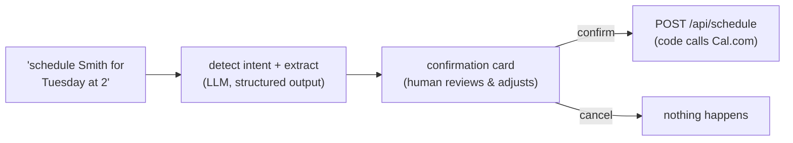

# Human-in-the-Loop: The Scheduling Flow

**Needs: the working pipeline. A free Cal.com account (`CAL_API_KEY`, `CAL_EVENT_TYPE_ID` in `.env`) only if you want a *real* booking — the propose→approve flow demos without it.**

## Today you will

- Give the system its first ability to *act* on the world — booking appointments
- Build the human-in-the-loop pattern: AI proposes, human approves, code executes
- Read the intent detection (structured outputs again), the existence check, and the confirmation card

## Concept

Everything so far *reads*. Today the system gets its first *write*: booking an appointment on a real calendar. And the moment an AI system can act, a design question outranks all others:

**Does the AI act, or does the AI propose?**

The pattern you'll build — **human-in-the-loop (HITL)** — answers: propose. The model detects that the user wants to schedule, extracts the details, and *suggests* the action; a human reviews the actual parameters and clicks confirm; only then does deterministic code call the calendar API.



Why a human gate here, when no gate guards your *search* tools? Weigh any action on two axes: **reversibility** and **cost of being wrong**. A bad search result costs a shrug and a rephrase. A hallucinated appointment books a real slot, emails a real (synthetic, today) patient, and silently corrupts a clinic's day. Low-stakes-reversible → automate freely; consequential-irreversible → human gate. You already *saw* this pattern from the other side: Claude Desktop asked your approval before every MCP tool call. Today you build the gate yourself.

Notice also *where the boundary sits*: the LLM's authority ends at **proposing structured parameters**. The thing that talks to Cal.com is ordinary code, triggered by a human click, with the human-approved values. The model never holds the trigger.

## Implementation

Three pieces, all provided on the solution branch — read them as a working example of the pattern, then probe it. The chat UI's confirmation card is already built. How the proposal reaches it is worth noticing: the chat route (`app/api/chat/route.ts`) runs `detectSchedulingIntent` on every turn, and — only if the named patient actually exists (`findPatientByName` in `lib/patients.ts`) — attaches the proposed action as an `X-Scheduling-Action` response header. The UI reads the header off the response and renders the card next to the streamed answer. Two gates before any card even appears: the model must detect intent, and the patient must be real.

### 1. Intent detection — `lib/scheduling.ts`

`detectSchedulingIntent(query, conversationHistory)` is the structured-outputs pattern you already know, pointed at scheduling. The zod schema:

```typescript
const SchedulingIntentSchema = z.object({
  isSchedulingRequest: z.boolean().describe('Whether this is a request to schedule an appointment'),
  patientName: z.string().nullable().describe('Name of the patient to schedule'),
  suggestedDate: z.string().nullable().describe('Suggested date in YYYY-MM-DD format'),
  suggestedTime: z.string().nullable().describe('Suggested time in HH:MM format (24h)'),
  reason: z.string().nullable().describe('Reason for the appointment if mentioned'),
});
```

Two things to notice. First, the nullable fields: `patientName` is `.nullable()` so the model has a way to say *"I don't know"* — **do not invent a patient.** Second, the date trap: **"next Tuesday" needs today's date**, and the model doesn't reliably know it. The system prompt injects `Today's date is ${todayStr}` and demands resolved `YYYY-MM-DD` output — the code owns the calendar math, not the model.

### 2. The action — `lib/calendar.ts` and `app/api/schedule/route.ts`

`scheduleAppointment(request)` in `lib/calendar.ts` is one Cal.com API call (`POST ${CAL_API_BASE}/bookings?apiKey=...`). `isCalConfigured()` guards it — the route returns a 503 when Cal.com isn't set up rather than crashing. The route handler receives the *confirmed* values from the UI (the card's current state, not the model's raw extraction) and books. After a successful booking there's one optional extra: if Retell is configured, the route places a best-effort confirmation phone call (`callToConfirmAppointment`) — wrapped so a failed call never undoes a successful booking.

Run the loop in the chat UI: *"schedule Abe for next Tuesday at 2pm"* → a card appears with extracted values → adjust the time → confirm.

> **What gates this route is the confirmation, not a login.** There's no auth check in front of `/api/schedule` — the gate is the human click on the card. That's the whole point of the pattern: the action is held back not by *who* you are but by *the requirement that a person approve the actual parameters*. The only thing that stops a real booking is configuration: `isCalConfigured()` guards `scheduleAppointment`, so without `CAL_API_KEY` + `CAL_EVENT_TYPE_ID` the route returns a clean **503** rather than booking. The propose → approve *flow* is fully built and worth watching regardless — the model's proposal, the confirmation card, the extraction all work. If you want a real booking end-to-end, set the two Cal.com env vars and confirm the card.

### Common mistakes

- **Letting the model's output reach the API directly.** If the confirm button posts the *model's* extraction rather than the *card's current values*, the human gate is decoration — the user's edits vanish and the model effectively booked. The card state, not the model output, is the source of truth.
- **Defaulting instead of asking.** No patient name extracted? The wrong move is scheduling for a guessed patient; the right move is `patientName: null` and a card that demands a human fill it. Nullable schema fields are how the model says "I don't know" — honor them end to end.
- **Leaving the write path off your observability plan.** When you wire tracing next week, the write path goes first: reads get traced for debugging, *writes* get traced for accountability. "Which appointments did the system book last week, triggered by whom?" must be answerable.
- **Date math in the model.** If `detectSchedulingIntent` shows flaky dates, resist prompt-tinkering toward calendar arithmetic. Resolve relative dates in code — deterministic work belongs in deterministic layers.

## Your turn

Spend **no more than 45 minutes** here.

1. Trigger the flow in the chat UI and watch the card appear with extracted values — then open the network tab and find the `X-Scheduling-Action` header on the chat response, the proposal in transit. (Without Cal.com configured the confirm returns a clean 503 — expected; the proposal step is what you're studying.) If you have Cal.com configured, book one real appointment.
2. Probe the gate: try to schedule with no patient name; with a made-up patient (the `findPatientByName` check should mean no card appears at all); with a date in the past; while mid-conversation about a *different* patient (`detectSchedulingIntent` reads the last 4 messages — does that help or grab the wrong name from history?). Record behaviors in your failure notes — these are new bait categories for a system that can act.
3. In your notes: list two more actions this system might someday take (refill request? referral letter?) and, for each, place it on the reversibility/cost grid — gate, or no gate?

## Check yourself

- State the HITL boundary in one sentence: what is the LLM allowed to produce, and what is it never allowed to touch?
- Why should the schedule route re-validate `patientName` and `dateTime`, when the UI already required them?

<details>
<summary>Solution / discussion</summary>

**The boundary:** the LLM produces a *proposal* — structured, nullable-where-unknown parameters for a human to review; it never holds the trigger that causes the external effect. (MCP taught you the same shape from the client side; the confirmation card is your version of Claude Desktop's approval prompt.)

**Re-validation at the route:** the route is an HTTP endpoint, and the UI is only its *polite* caller — anything that can POST can hit it with missing or malformed fields. Validation at the boundary belongs to the boundary; trusting upstream callers is how "the UI validates it" becomes a postmortem sentence. The confirmation card is a UX gate, not a security boundary — the route re-validates because the card can be bypassed by anything that speaks HTTP.

**The history-contamination probe** (scheduling while discussing another patient) is the subtle one — extraction over conversation history can grab a *contextually present but wrong* name with full confidence. If you caught it: that's a few-shot example for the scheduling prompt *and* a permanent battery case. If you didn't catch it — it's in the battery now, which is the entire point of keeping one.

**The reversibility grid** for the two futures: a refill *request* that a pharmacist reviews is a proposal already — light gate. A referral letter sent under a clinician's name is consequential and reputational — hard gate, probably sign-off stronger than one click. The grid generalizes: the question is never "can the model do it," it's "what does wrong cost, and who absorbs it."

</details>

## Further reading (optional)

- [Cal.com API documentation](https://cal.com/docs/api-reference) — the booking endpoint behind today's one consequential function call
