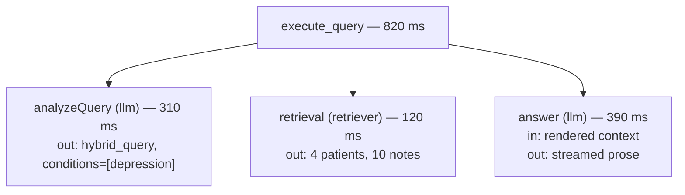

# Observability: A Debugger for the Past

**Needs: a free LangSmith account (smith.langchain.com); `LANGSMITH_API_KEY` + `LANGSMITH_PROJECT` in `.env`**

## Today you will

- Make the `traced` wrapper real, so every step of a request reports what it did, with timings
- See one whole request — analysis, retrieval, rendered context, answer — as a single inspectable tree
- Count, from a real trace, how many LLM calls one chat turn actually makes (the answer surprises most people)

## Concept

Your assistant already answers questions. Ask it about a patient's shortness of breath and prose streams back. But two questions have no answer you can defend yet. The first: **why did it answer *that*?** You can't set a breakpoint on a request that already finished and streamed to a user. You can't `console.log` your way through a model call you'll never run again with the same result.

That was fine while you were building — one developer, one bug at a time, a print statement added and deleted. It does not survive a real system, where the question isn't "why did *my* query misbehave just now" but **"why did query #4,217 yesterday return nonsense, how slow are we, and what is it costing?"**

**Observability** for an LLM pipeline means recording, for every request, a **trace**: the tree of steps that ran, each with its inputs, outputs, duration, and errors.



Why this matters *more* for an LLM system than an ordinary service: classic bugs reproduce. Same input, same crash, attach a debugger. LLM-pipeline failures are **statistical and silent** — the analyzer misroutes 4% of queries, retrieval quietly returns weak matches, the renderer truncates the one fact that mattered. You cannot attach a debugger to yesterday. A trace is that debugger for the past.

One field on a trace pays for the whole setup by itself: **what did the model actually receive?** In the agent block you printed the rendered context by hand, once, to answer that. The trace stores it for every request, forever, searchable. Most "the AI hallucinated!" reports die in thirty seconds once you can read the exact context the model was handed — half the time the answer was wrong because the *context* was wrong, and that's a retrieval bug wearing the model's hat.

### Tracing is not logging

Logging is lines. A trace is a **tree** — each step's inputs, outputs, duration, and error, nested under the request that spawned them, and it stores the exact text the model saw. That last part is what logging can't do: it turns "the assistant lied" into "retrieval handed it the wrong context" without a guess.

## Implementation

### 1. Make `traced` real

Open `lib/langsmith.ts`. The client, the project config, and `isLangSmithEnabled()` are provided. The `traced` wrapper is where the work is. Its contract has four moves and two rules baked into them:

- If LangSmith isn't enabled (no key set), **run the function directly** — observability must never break the pipeline it observes.
- Create a `RunTree` with the step's name, run type, and inputs; post it.
- Run the function; end the run with its outputs; patch it.
- On error: end the run with the error, patch it, **and re-throw** — a trace records failures, it doesn't swallow them.

The shape you're aiming for:

```typescript
export async function traced<T>(
  name: string,
  fn: () => Promise<T>,
  options?: {
    runType?: 'llm' | 'chain' | 'tool' | 'retriever';
    inputs?: Record<string, unknown>;
    metadata?: Record<string, unknown>;
  }
): Promise<T> {
  if (!isLangSmithEnabled()) {
    return fn();
  }

  const run = new RunTree({
    name,
    run_type: options?.runType || 'chain',
    project_name: LANGSMITH_PROJECT,
    inputs: options?.inputs,
    extra: options?.metadata ? { metadata: options.metadata } : undefined,
  });

  try {
    await run.postRun();
    const result = await fn();
    await run.end({ outputs: { result } });
    await run.patchRun();
    return result;
  } catch (error) {
    await run.end({ error: String(error) });
    await run.patchRun();
    throw error; // record, then re-throw
  }
}
```

### The two rules

Both rules are one idea seen from two sides: **a trace is a witness, not a participant.**

1. **Re-throw the wrapped error.** When the function you wrapped throws, record it on the run — then let it reach the caller. Swallow it and return `undefined`, and every downstream bug becomes "why is this undefined" instead of the real stack trace. You'd be hiding the exact crash you built this tool to see.
2. **Never throw your *own* error.** If LangSmith is down, the key is bad, or the trace-post fails, the request must still answer. The no-key early return and failure-isolated posting mean observability degrades to nothing rather than taking production down with it. The witness reports the crime; it never commits one.

Note what's *already wired*: `lib/agent.ts` wraps `executeQuery` in `traced("execute_query", …)` — the day you met it. The call site was waiting for a real wrapper; you're lighting up existing plumbing, not adding new plumbing.

```typescript
// lib/agent.ts — already there
const queryResult = await traced(
  "execute_query",
  () => executeQuery(query, { vectorTopK: 10 }),
  { runType: "chain", inputs: { query } }
);
```

### 2. Generate and read traces

Run the app and have a few real conversations — include one hybrid question (a condition filter *and* a note question, like *"what do the notes say about sleep for patients with depression?"*) so the tree has an analysis → retrieval → answer shape worth reading.

```bash
npm run dev
```

Then open your project in LangSmith and read one trace top to bottom.


<!-- TODO: capture screenshot -->

For one hybrid query, find:

- **The analysis** the analyzer produced — the intent and extracted entities. The first stack frame of every answer.
- **The retrieval** — how many patients and notes came back.
- **The rendered context** — the model's *actual* input. Read it. This is the field that pays for the setup.
- **The timing** of each step, and which one ate the wall-clock (usually an LLM call, not the database).

### 3. Count the LLM calls

Here's the misconception to kill: *one chat turn is one call to the model.* It isn't. Walk the tree and count the LLM boxes. You'll find **two** — an **analyzer** (which decides intent and which engines to use) and an **answerer** (which writes the grounded prose) — plus an embedding call on the search path. Most people guess one. That gap is exactly why you must be able to see inside: you can't debug calls you didn't know were happening, and you can't price them either.

### 4. Widen the net (optional)

`traced` is generic — wrap more of the pipeline and watch the tree grow boxes. Good next candidates: `analyzeQuery` with `runType: 'llm'`, `searchClinicalNotes` with `runType: 'retriever'`. One wrap each. The goal is a trace where every box in the architecture diagram from the first day reports for duty.

### Common mistakes

- **A wrapper that can crash the request.** If LangSmith is down or the key is bad and your wrapper throws, observability just took production with it. Catch tracing errors, log them, return the function's result anyway.
- **Swallowing the function's error instead of re-throwing.** Record it on the run, then throw. Return `undefined` and you've traded a real stack trace for a mystery.
- **Tracing secrets.** Inputs and outputs go to a third-party service. Query text and rendered context — yes, that's the point. API keys, connection strings, anything from `.env` — never. Audit what your `inputs` objects contain before you ship.
- **Reading timings off one trace.** A single 820 ms trace tells you nothing about whether 820 ms is normal — latency questions need project-level aggregates, not one anecdote. (One run is an anecdote. You'll hear that again with evals.)

## Your turn

Spend **no more than 60 minutes** here.

1. Make `traced` real. Verify the no-key fallback: unset `LANGSMITH_API_KEY`, run the app, confirm it still answers — untraced. Then restore the key and confirm traces appear.
2. Trace five queries, including one hybrid. Do the step-2 read-through on the hybrid one.
3. Answer three questions in your notes, **with numbers**: Which step is slowest? What did the model receive for one query — and was it what you assumed? How many LLM calls did one chat turn make? (Count them in the trace.)

## Check yourself

You're done when you can answer these without scrolling up:

- Why must `traced` re-throw the wrapped error, and why must it never throw its *own* error?
- A user reports a wrong answer from three days ago. List your steps, in order, with tracing in place.

<details>
<summary>Solution / discussion</summary>

**The two rules, one principle:** a trace is a witness, not a participant. It must report the crime — re-throw the wrapped error *after* recording it, so the caller still sees the real failure — and it must never commit one — its own failures (no key, dead endpoint, failed post) degrade to console noise, never to a request failure. Break the first and every bug becomes an `undefined`. Break the second and your observability tool becomes an outage.

**The three-day-old bug, in order:** find the trace (search by time / user / query text) → read the analysis (misroute? wrong entities?) → read the rendered context (was the truth even in there?) → read the answer against the context (did the model ignore good context, or faithfully use bad context?). Each step exonerates or convicts one stage. Without tracing that's four guesses; with it, four lookups.

**Counting the calls** almost always lands on 2 per turn — analyzer plus answerer — plus embeddings on the search path. Seeing it *in the trace* is what makes the cost conversation concrete later: every one of those boxes is money.

</details>

## Further reading (optional)

- [LangSmith docs: observability](https://docs.langchain.com/langsmith/observability) — the project-level views (latency percentiles, token usage) that a single trace can't show
