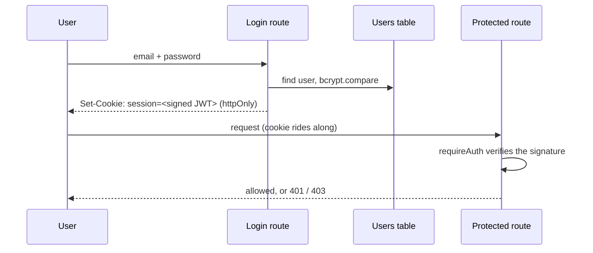

# RBAC I — Sessions, Login, and the Auth Guard

**Needs: `docs/CHALLENGE-RBAC.md`; the failing RBAC test specs on your branch; `AUTH_SECRET` in `.env`**

## Today you will

- Add real human authentication — login, sessions, password hashing — to a system that has had none
- Implement the guard that every protected route will pass through
- Make the first batch of long-standing failing tests turn green

## Concept

The assistant works. It routes questions, searches by meaning, refuses what it shouldn't. So why isn't it done?

Because it has no idea *who is asking*. "Look up this patient" is a great answer for that patient's doctor and a privacy leak for anyone else who can reach the endpoint. A medical assistant that can't tell a doctor from a stranger isn't a finished system — it's an open door with a good search engine behind it. This final stretch closes the door.

Earlier in the course you secured the *machine* front door — the MCP server's API keys, one presented on every call, process talking to process. Today you build the *human* front door. It's a different problem: a person logs in once and carries a session; a key is handed over on every request. Both answer "who is this," but for different kinds of caller.

Remember running the test suite early on and seeing `24 failed`? Those failures have been your progress bar the whole course. A chunk of them are auth tests — written before you, waiting. Today you start clearing them. The tests are the spec: you don't invent the behavior, you discover it by making them pass.

The pieces of human auth, and why each exists:

| Piece | Job | If you skip it |
|---|---|---|
| Password hashing | Store a one-way hash, never the password | A database leak hands attackers every password |
| Login endpoint | Verify credentials, issue a session | No way to establish identity |
| Session token (JWT) | A signed, expiring proof of "who" | Re-authenticate on every request |
| httpOnly cookie | Hold the token where page scripts cannot read it | A single XSS bug steals the session |
| The auth guard | One reusable "is this caller allowed" check | Auth logic copy-pasted into every route, drifting |

Two design commitments worth stating before the challenge spells them out:

- **Identical errors for "unknown email" and "wrong password."** If the two differ, an attacker learns which emails are real by reading your error messages — free account enumeration. Same 401, same body, both cases.
- **The token never appears in a response body.** It lives in an httpOnly cookie, set by the server, unreadable by JavaScript. Putting a session token in JSON is handing it to any script on the page.



## Implementation

The full spec is `docs/CHALLENGE-RBAC.md`, Parts 1–3 today (Part 4 comes next). The shape:

### 1. Sessions — `lib/auth.ts`

Three functions sit as stubs that `throw new Error('Not implemented')`. Implement them with `jose` (JWT) and the patterns the challenge describes:

- `createSessionToken(session)` — sign `{ userId, role }` HS256, ~8h expiry (a hospital shift), secret from `AUTH_SECRET`
- `getSession(request)` — parse the cookie, verify, return the session or `null`. Never throw — a tampered or missing token is `null`, not a crash
- `requireAuth(request, allowedRoles?)` — the guard. No session, throw `AuthError(401)`; wrong role, `AuthError(403)`. Those are different failures and get different codes

The solution is compact — the whole of `lib/auth.ts` is about 50 lines. `getSession` reads the `session` cookie out of a header that may carry many cookies (`theme=dark; session=…; tracking=no`), verifies it, and returns `null` on any failure:

```typescript
export async function getSession(request: Request): Promise<Session | null> {
  const cookieHeader = request.headers.get('cookie') ?? '';
  const match = cookieHeader.match(new RegExp(`(?:^|;\\s*)${SESSION_COOKIE}=([^;]+)`));
  if (!match) return null;

  try {
    const { payload } = await jwtVerify(match[1], secretKey());
    return { userId: payload.userId as string, role: payload.role as Role };
  } catch {
    return null;
  }
}
```

`requireAuth` is the enforcer built on top of it — it throws where `getSession` returns `null`:

```typescript
export async function requireAuth(request: Request, allowedRoles?: Role[]): Promise<Session> {
  const session = await getSession(request);
  if (!session) throw new AuthError(401, 'Authentication required');
  if (allowedRoles && !allowedRoles.includes(session.role)) {
    throw new AuthError(403, 'Insufficient permissions');
  }
  return session;
}
```

### 2. Login — `app/api/auth/login/route.ts`

Validate the body (zod `.parse()`, per the repo's route conventions), look the user up, `bcrypt.compare` the password, and on success set the httpOnly cookie. Unknown-email and wrong-password return the identical 401. The `User` model and `Role` enum are already in `prisma/schema.prisma`. Seed a couple of users first with `scripts/seed-users.ts` — one DOCTOR, one STAFF, bcrypt-hashed passwords — so you can try it in a browser.

### 3. The guard goes on

`requireAuth(request)` at the top of a protected route, inside the try, before any work. Catch `AuthError` and return its status. Because the auth check runs before body parsing, a 401 wins over a 400 — an unauthenticated caller never even learns whether their body was valid. The pattern is one line per route, which is the entire point of a reusable guard.

### 4. Watch the number drop

```bash
npm run test:run
```

The auth-related failures flip to passing. The count that has read `24 failed` for weeks starts falling — and *that* is the feedback loop. You aren't guessing whether auth works; the specs tell you, case by case. To isolate today's specs:

```bash
npx vitest run lib/auth.test.ts app/api/auth/login/route.test.ts
```

### Common mistakes

- **A `requireAuth` that throws inside `getSession`.** Reading a session must tolerate garbage — bad cookies arrive constantly (expired, tampered, absent). `getSession` returns `null` on all of them; only `requireAuth` throws, and only deliberately.
- **Distinguishable login failures.** A 404 for unknown email and 401 for bad password is account enumeration with extra steps. The test for this exists; do not "fix" it by making the messages helpful.
- **Token in the body "just for debugging."** It ends up logged, screenshotted, committed. The cookie is the only place it goes. (If a test asserts the body has no token, that's why.)
- **`AUTH_SECRET` missing from `.env`.** `jose` throws at sign time and every auth test fails opaquely. The challenge added it to `.env.example`; copy it over with a real random value.

## Your turn

The challenge Parts 1–3 are the your-turn. Additionally, in your notes: the failing-test count before you started and after, and the one test whose *expected behavior* surprised you (there's usually one — often the identical-errors rule, which feels user-hostile until you see it as a security control).

## Check yourself

You're done when you can answer these without scrolling up:

- Why must `getSession` return `null` rather than throw, while `requireAuth` does the opposite?
- Your login returns 404 for unknown emails and 401 for wrong passwords. Describe the attack this enables.

<details>
<summary>Solution / discussion</summary>

**The null/throw split** is a separation of *reading* from *enforcing*. `getSession` is a question — "is anyone logged in?" — whose honest answer for a bad cookie is "no" (`null`), not an exception; plenty of callers want to behave differently for logged-out users without wrapping every read in try/catch. `requireAuth` is a *demand* — "you must be logged in (with this role) to proceed" — and the only way to halt a request mid-flight is to throw, caught at the route boundary and turned into 401/403. One reports, one enforces; conflating them either crashes on every expired cookie or lets unauthenticated requests slip past a guard that "returned null" and got ignored.

**The enumeration attack:** an attacker submits `victim@hospital.com` with a junk password. A 404 means "no such user" — the email is not registered. A 401 means "wrong password" — the email *is* registered. Iterate a list of emails and you've sorted the world into "has an account here" and "doesn't," which for a medical system is itself sensitive (it reveals who's a patient) and the first step of credential stuffing. Identical responses close the oracle. This is the quiet lesson: security sometimes means making your system *less* helpful on purpose, and you can't tell which cases those are without thinking like the attacker — which is exactly what the next lesson and the poisoned-document homework train.

</details>

## Further reading (optional)

- [OWASP: authentication cheat sheet](https://cheatsheetseries.owasp.org/cheatsheets/Authentication_Cheat_Sheet.html) — the section on "incorrect and correct response discrepancies" is today's enumeration lesson, formalized
</content>
</invoke>
